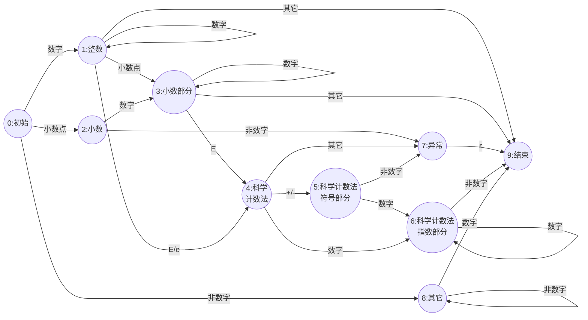
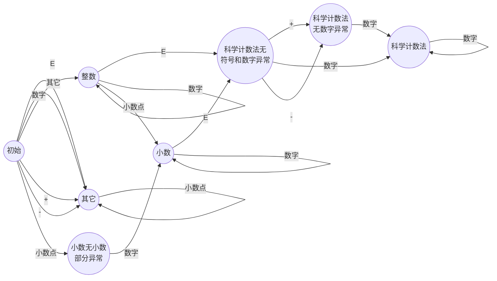

```mermaid
graph LR
0((0:初始))
1((1:整数))
2((2:小数))
3((3:小数部分))
4((4:科学<br>计数法))
5((5:科学计数法<br>符号部分))
6((6:科学计数法<br>指数部分))
7((7:异常))
8((8:其它))
9((9:结束))

0 --数字--> 1
0 --非数字--> 8
0 --小数点--> 2

3 --E--> 4
1 --数字--> 1
1 --小数点--> 3
1 --E/e--> 4
1 --其它--> 9

2 --数字--> 3
2 --非数字--> 7

3 --数字--> 3
3 --其它--> 9

4 --"+/-"--> 5
4 --其它--> 7

7 --ε--> 9

5 --数字--> 6
5 --非数字--> 7
4 --数字--> 6

6 --数字--> 6
6 --非数字--> 9

8 --数字--> 9
8 --非数字--> 8
```

```mermaid
graph LR
整数((整数))
整数 --"E"--> 科学计数法无符号和数字异常
整数 --"数字"--> 整数
整数 --"小数点"--> 小数
初始((初始))
初始 --"E"--> 其它
初始 --"其它"--> 其它
初始 --"数字"--> 整数
初始 --"+"--> 其它
初始 --"-"--> 其它
初始 --"小数点"--> 小数无小数部分异常
科学计数法无数字异常((科学计数法<br>无数字异常))
科学计数法无数字异常 --"数字"--> 科学计数法
科学计数法((科学计数法))
科学计数法 --"数字"--> 科学计数法
科学计数法无符号和数字异常((科学计数法无<br>符号和数字异常))
科学计数法无符号和数字异常 --"+"--> 科学计数法无数字异常
科学计数法无符号和数字异常 --"数字"--> 科学计数法
科学计数法无符号和数字异常 --"-"--> 科学计数法无数字异常
小数无小数部分异常((小数无小数<br>部分异常))
小数无小数部分异常 --"数字"--> 小数
其它((其它))
其它 --"E"--> 其它
其它 --"其它"--> 其它
其它 --"+"--> 其它
其它 --"-"--> 其它
其它 --"小数点"--> 其它
小数((小数))
小数 --"E"--> 科学计数法无符号和数字异常
小数 --"数字"--> 小数
```
