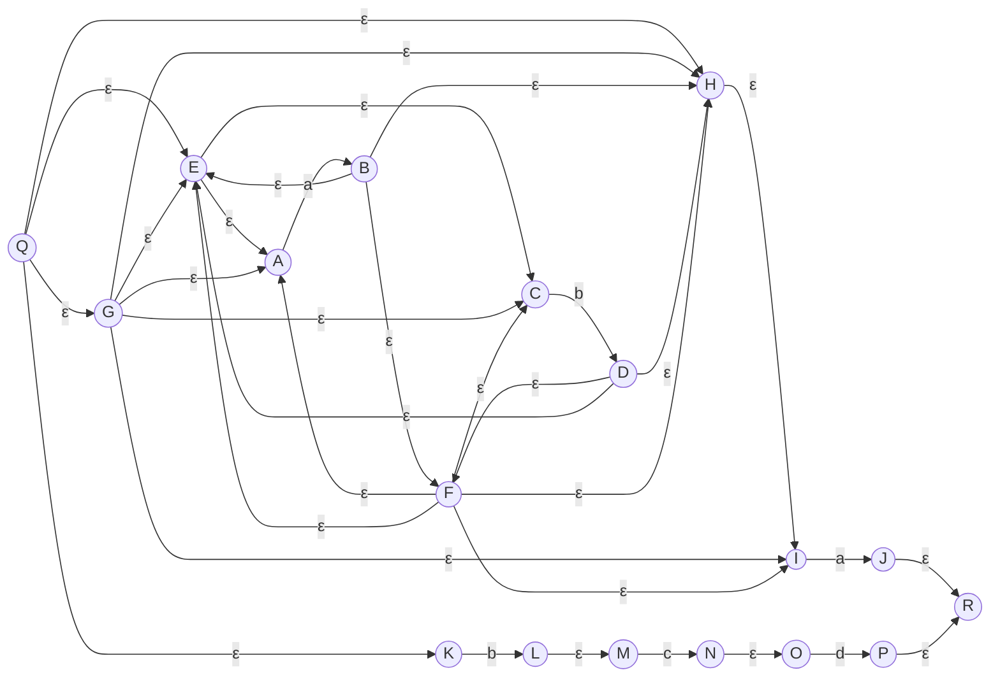
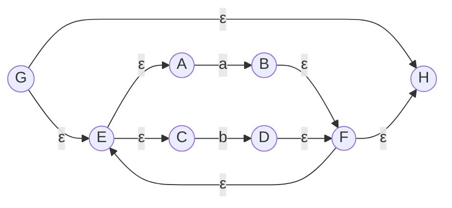

```mermaid
graph LR
Q((Q))
Q --ε--> H
Q --ε--> K
Q --ε--> E
Q --ε--> G
H((H))
H --ε--> I
K((K))
K --b--> L
E((E))
E --ε--> A
E --ε--> C
G((G))
G --ε--> H
G --ε--> A
G --ε--> I
G --ε--> C
G --ε--> E
I((I))
I --a--> J
L((L))
L --ε--> M
A((A))
A --a--> B
C((C))
C --b--> D
J((J))
J --ε--> R
M((M))
M --c--> N
B((B))
B --ε--> F
B --ε--> H
B --ε--> E
D((D))
D --ε--> F
D --ε--> H
D --ε--> E
R((R))
N((N))
N --ε--> O
F((F))
F --ε--> H
F --ε--> A
F --ε--> I
F --ε--> C
F --ε--> E
O((O))
O --d--> P
P((P))
P --ε--> R
```

```mermaid
graph LR
G((G))
G --ε--> H
G --ε--> E
H((H))
E((E))
E --ε--> A
E --ε--> C
A((A))
A --a--> B
C((C))
C --b--> D
B((B))
B --ε--> F
D((D))
D --ε--> F
F((F))
F --ε--> H
F --ε--> E
```