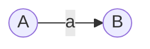
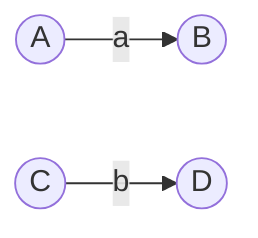
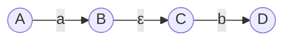
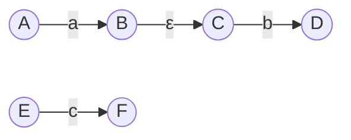
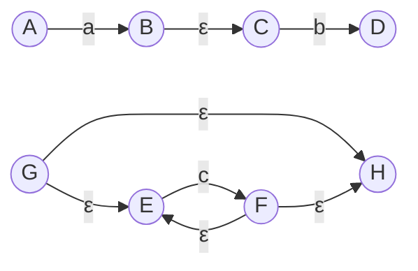
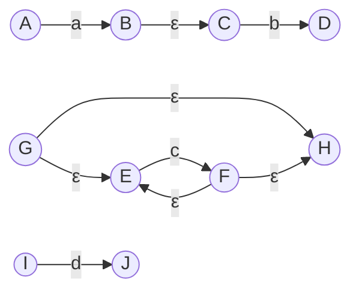
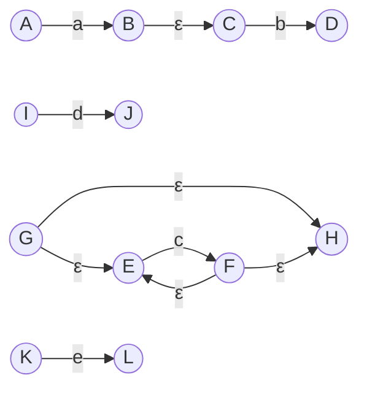
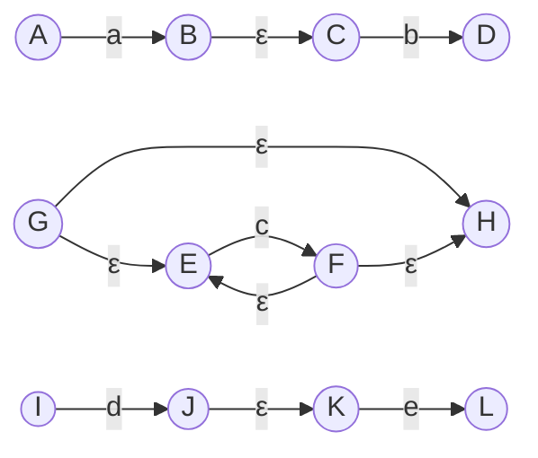
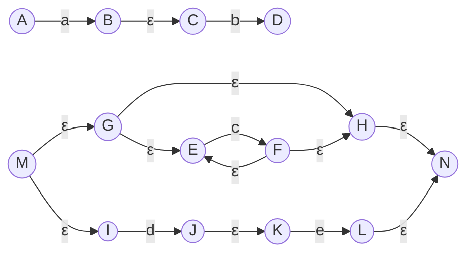
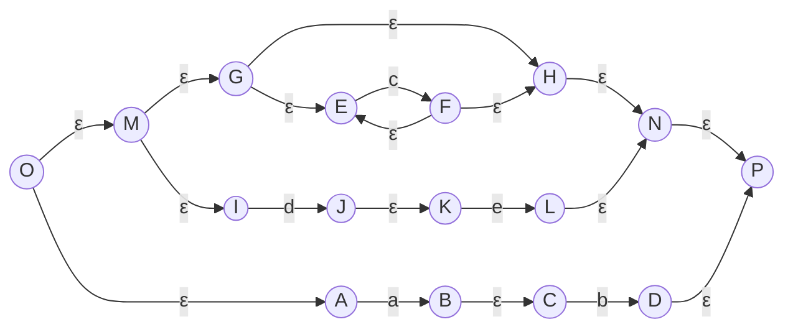

1、
符号栈：空

```mermaid
graph LR
A((A))
A --a--> B
B((B))
```
2、
符号栈：· 

```mermaid
graph LR
A((A))
A --a--> B
B((B))
C((C))
C --b--> D
D((D))
```
3、
符号栈：空

```mermaid
graph LR
A((A))
A --a--> B
B((B))
B --ε--> C
C((C))
C --b--> D
D((D))
```
4、
符号栈：| 

```mermaid
graph LR
A((A))
A --a--> B
B((B))
B --ε--> C
C((C))
C --b--> D
D((D))
E((E))
E --c--> F
F((F))
```
5、
符号栈：| 

```mermaid
graph LR
A((A))
A --a--> B
B((B))
B --ε--> C
C((C))
C --b--> D
D((D))
G((G))
G --ε--> H
G --ε--> E
H((H))
E((E))
E --c--> F
F((F))
F --ε--> H
F --ε--> E
```
6、
符号栈：| | 

```mermaid
graph LR
A((A))
A --a--> B
B((B))
B --ε--> C
C((C))
C --b--> D
D((D))
G((G))
G --ε--> H
G --ε--> E
H((H))
E((E))
E --c--> F
F((F))
F --ε--> H
F --ε--> E
I((I))
I --d--> J
J((J))
```
7、
符号栈：| | · 

```mermaid
graph LR
A((A))
A --a--> B
B((B))
B --ε--> C
C((C))
C --b--> D
D((D))
G((G))
G --ε--> H
G --ε--> E
H((H))
E((E))
E --c--> F
F((F))
F --ε--> H
F --ε--> E
I((I))
I --d--> J
J((J))
K((K))
K --e--> L
L((L))
```
8、
符号栈：| | 

```mermaid
graph LR
A((A))
A --a--> B
B((B))
B --ε--> C
C((C))
C --b--> D
D((D))
G((G))
G --ε--> H
G --ε--> E
H((H))
E((E))
E --c--> F
F((F))
F --ε--> H
F --ε--> E
I((I))
I --d--> J
J((J))
J --ε--> K
K((K))
K --e--> L
L((L))
```
9、
符号栈：| 

```mermaid
graph LR
A((A))
A --a--> B
B((B))
B --ε--> C
C((C))
C --b--> D
D((D))
M((M))
M --ε--> G
M --ε--> I
G((G))
G --ε--> H
G --ε--> E
I((I))
I --d--> J
H((H))
H --ε--> N
E((E))
E --c--> F
J((J))
J --ε--> K
N((N))
F((F))
F --ε--> H
F --ε--> E
K((K))
K --e--> L
L((L))
L --ε--> N
```
10、
符号栈：空

```mermaid
graph LR
O((O))
O --ε--> M
O --ε--> A
M((M))
M --ε--> G
M --ε--> I
A((A))
A --a--> B
G((G))
G --ε--> H
G --ε--> E
I((I))
I --d--> J
B((B))
B --ε--> C
H((H))
H --ε--> N
E((E))
E --c--> F
J((J))
J --ε--> K
C((C))
C --b--> D
N((N))
N --ε--> P
F((F))
F --ε--> H
F --ε--> E
K((K))
K --e--> L
D((D))
D --ε--> P
P((P))
L((L))
L --ε--> N
```
