1、
符号栈：空
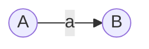
2、
符号栈：· 
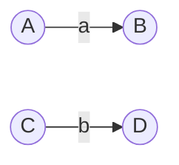
3、
符号栈：· · ( 
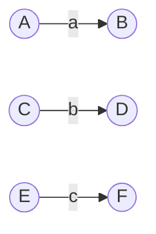
4、
符号栈：· · ( | 
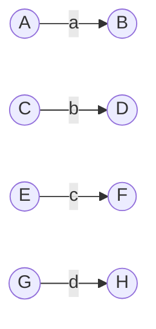
5、
符号栈：· · ( | · 
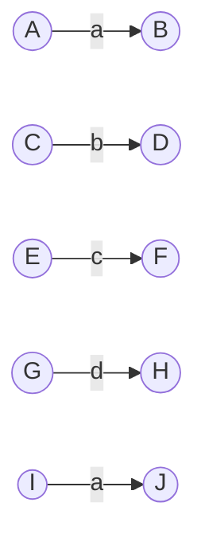
6、
符号栈：· · ( | 
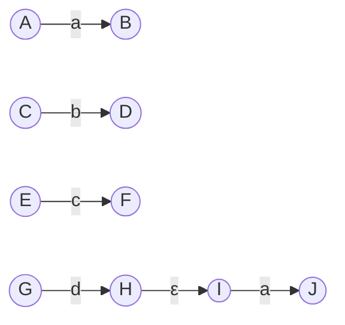
7、
符号栈：· · ( 
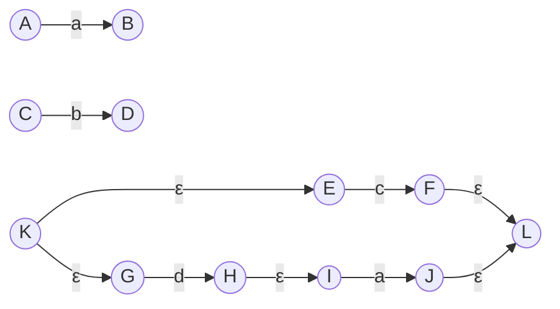
8、
符号栈：· · 
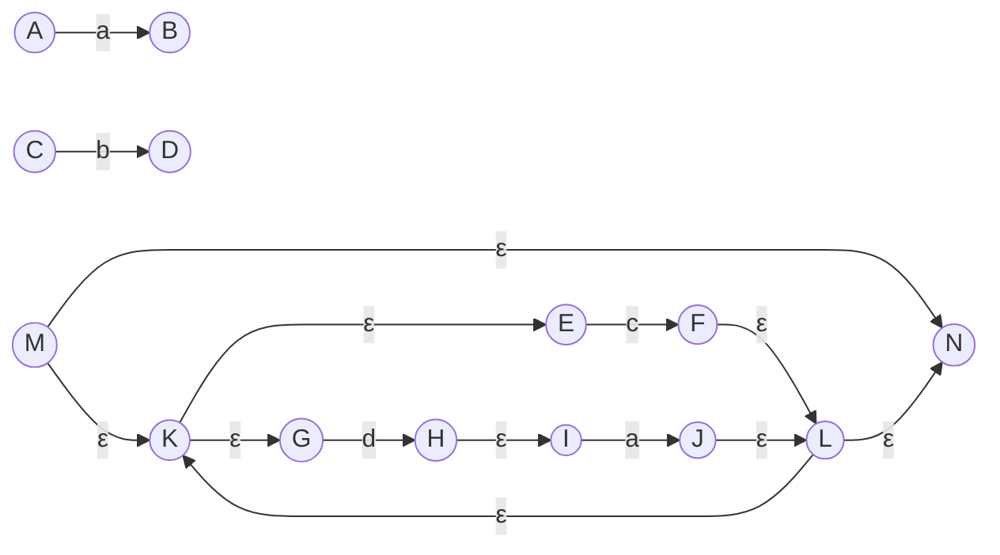
9、
符号栈：· 
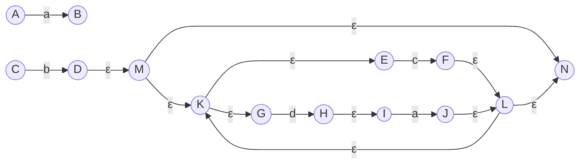
10、
符号栈：空
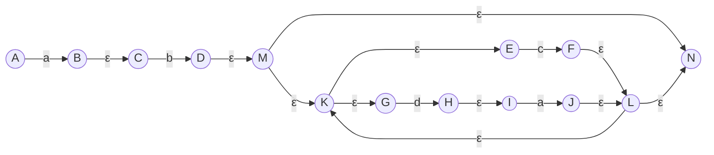
11、
符号栈：| 
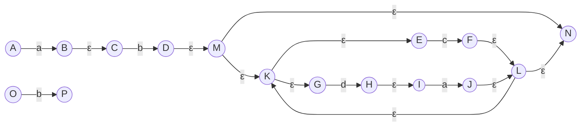
12、
符号栈：| · ( 
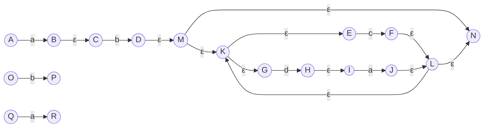
13、
符号栈：| · ( | 
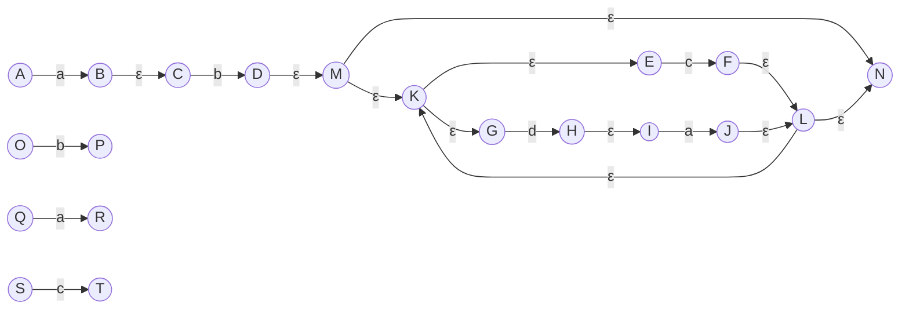
14、
符号栈：| · ( 
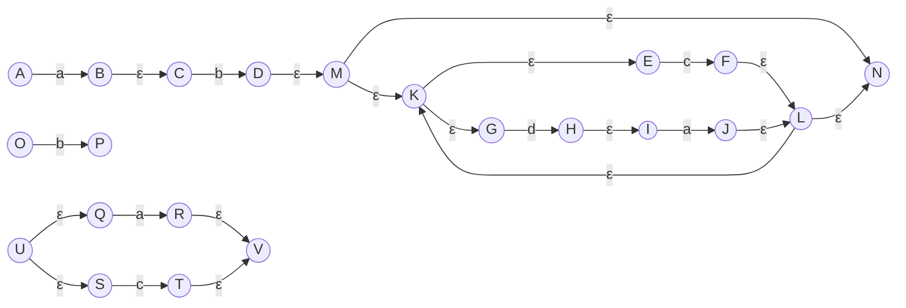
15、
符号栈：| 
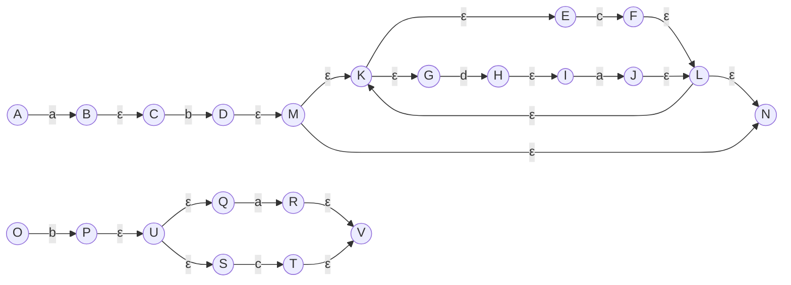
16、
符号栈：空
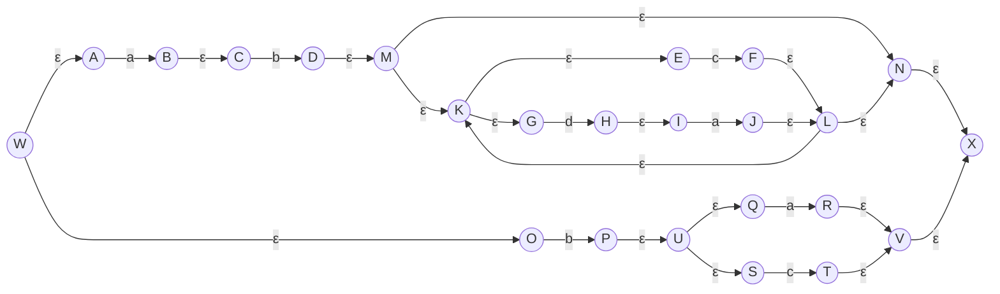
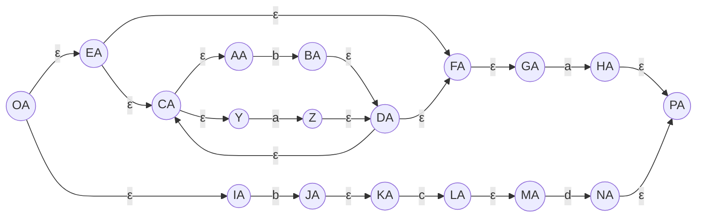
