1、
符号栈：( ( 
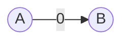
2、
符号栈：( ( | 
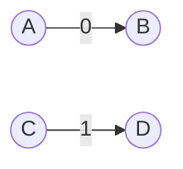
3、
符号栈：( ( 
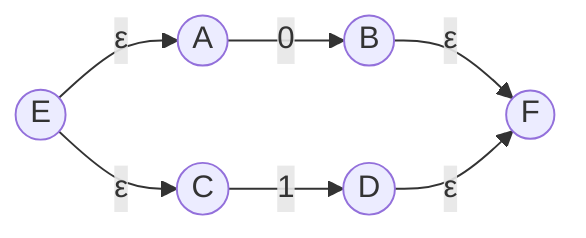
4、
符号栈：( · ( 
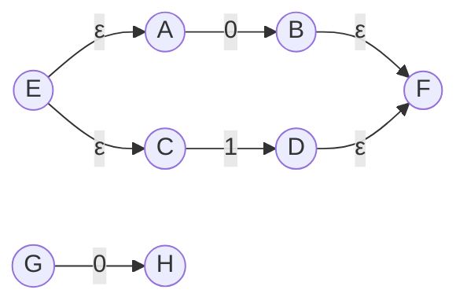
5、
符号栈：( · ( | 
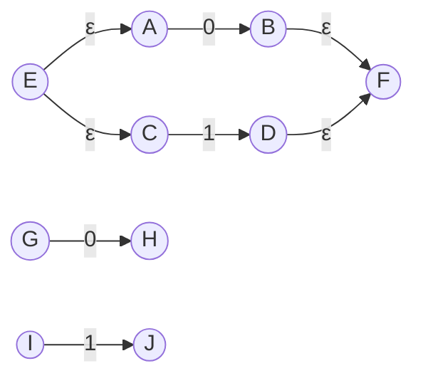
6、
符号栈：( · ( 
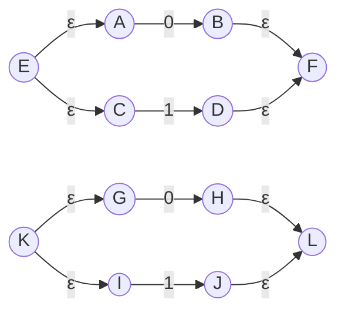
7、
符号栈：( 
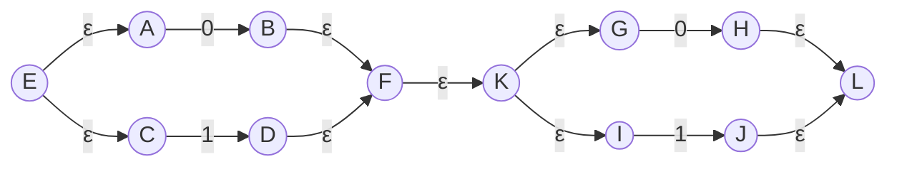
8、
符号栈：空
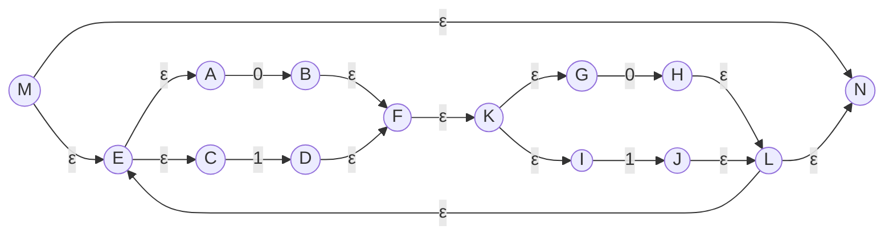
9、
符号栈：| ( ( 
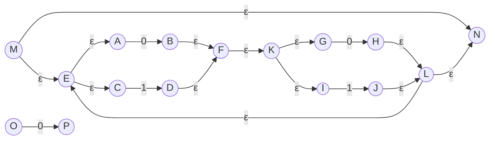
10、
符号栈：| ( ( | 
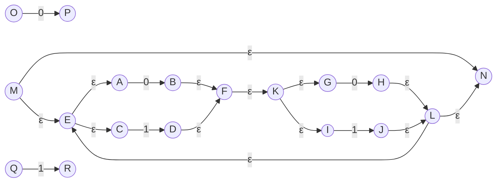
11、
符号栈：| ( ( 
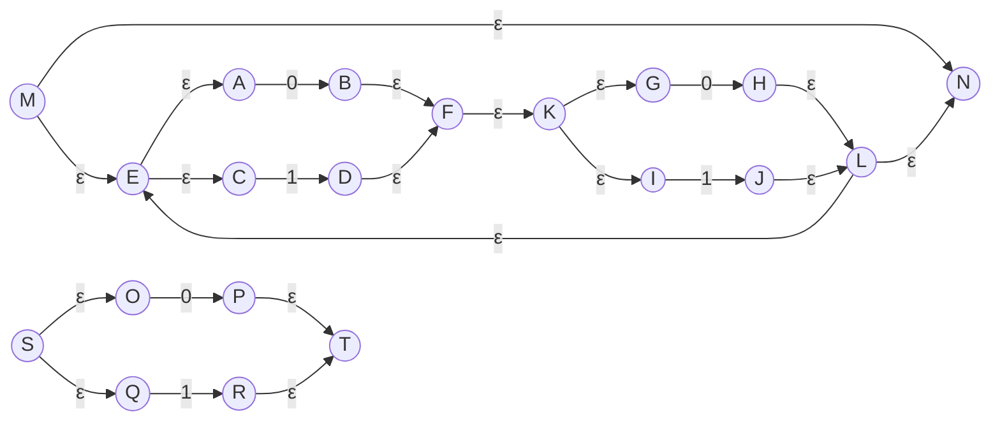
12、
符号栈：| ( · ( 
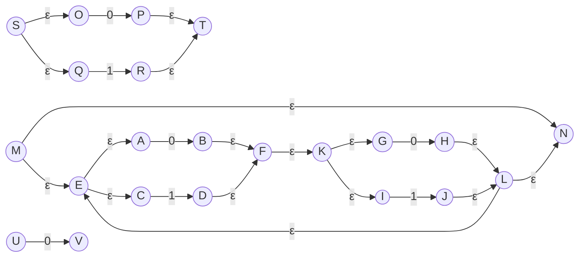
13、
符号栈：| ( · ( | 
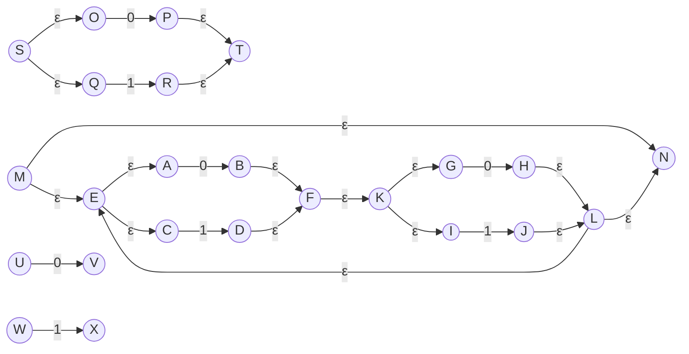
14、
符号栈：| ( · ( 
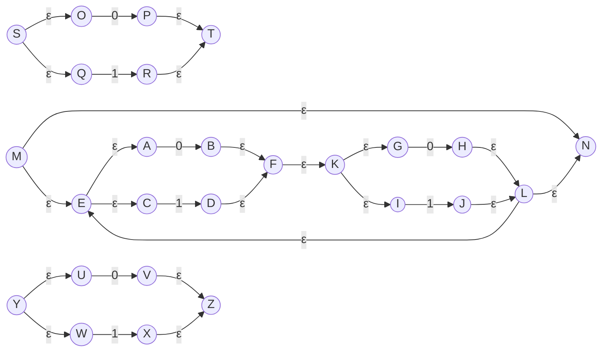
15、
符号栈：| ( · · ( 
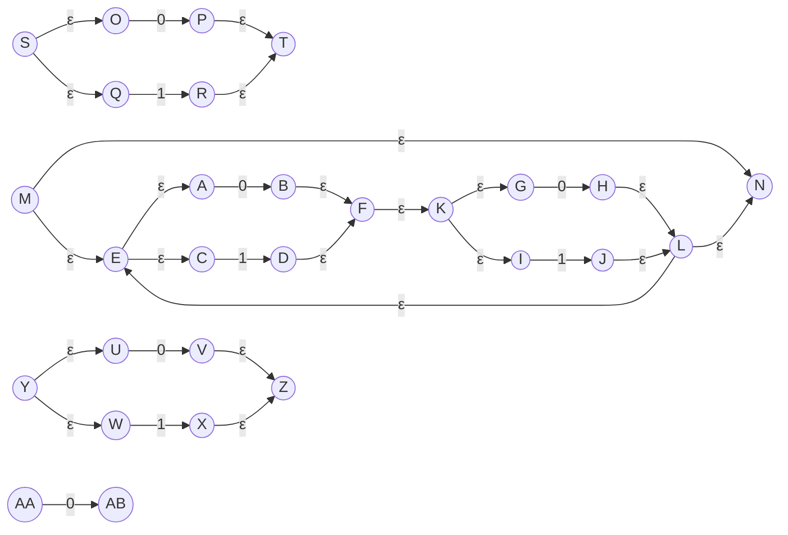
16、
符号栈：| ( · · ( | 
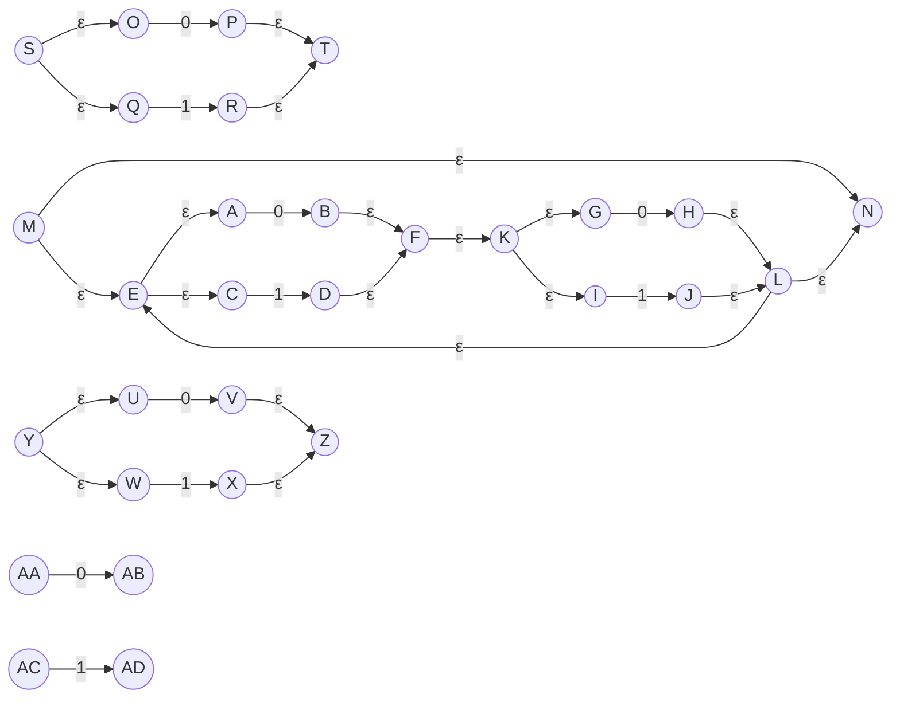
17、
符号栈：| ( · · ( 
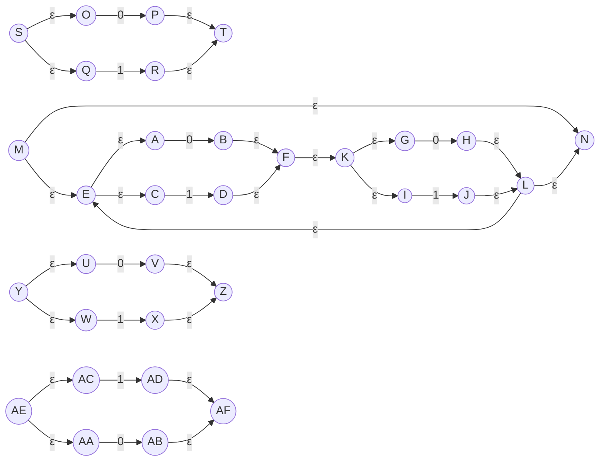
18、
符号栈：| ( · 
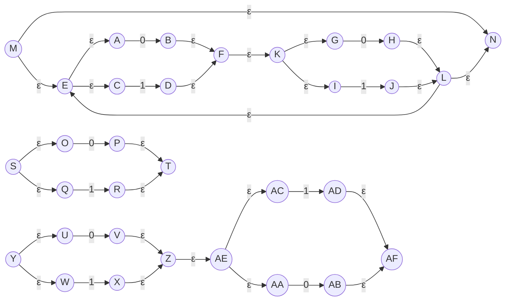
19、
符号栈：| ( 
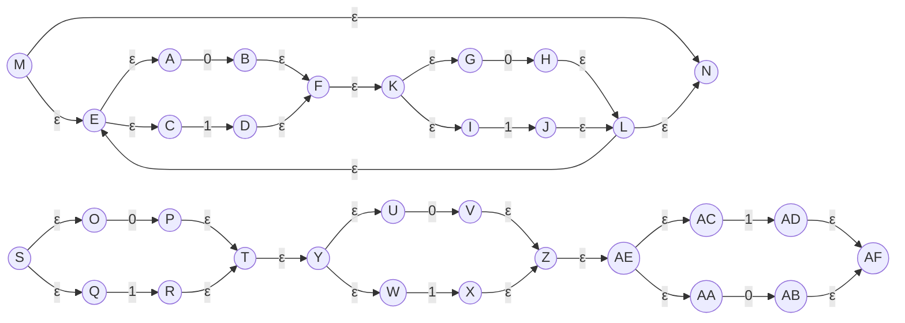
20、
符号栈：| 
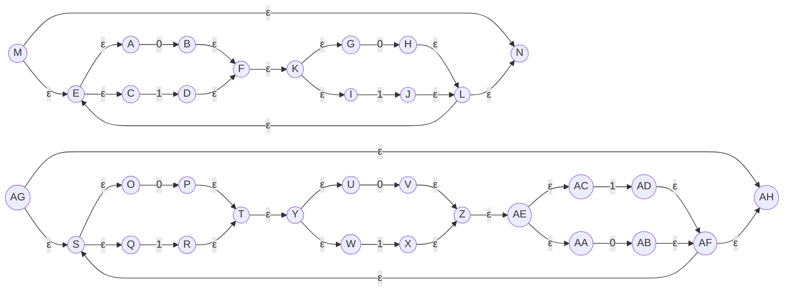
21、
符号栈：空
```mermaid
graph LR
AI((AI))
AI --ε--> M
AI --ε--> AG
M((M))
M --ε--> N
M --ε--> E
AG((AG))
AG --ε--> S
AG --ε--> AH
N((N))
N --ε--> AJ
E((E))
E --ε--> A
E --ε--> C
S((S))
S --ε--> O
S --ε--> Q
AH((AH))
AH --ε--> AJ
AJ((AJ))
A((A))
A --0--> B
C((C))
C --1--> D
O((O))
O --0--> P
Q((Q))
Q --1--> R
B((B))
B --ε--> F
D((D))
D --ε--> F
P((P))
P --ε--> T
R((R))
R --ε--> T
F((F))
F --ε--> K
T((T))
T --ε--> Y
K((K))
K --ε--> G
K --ε--> I
Y((Y))
Y --ε--> U
Y --ε--> W
G((G))
G --0--> H
I((I))
I --1--> J
U((U))
U --0--> V
W((W))
W --1--> X
H((H))
H --ε--> L
J((J))
J --ε--> L
V((V))
V --ε--> Z
X((X))
X --ε--> Z
L((L))
L --ε--> N
L --ε--> E
Z((Z))
Z --ε--> AE
AE((AE))
AE --ε--> AC
AE --ε--> AA
AC((AC))
AC --1--> AD
AA((AA))
AA --0--> AB
AD((AD))
AD --ε--> AF
AB((AB))
AB --ε--> AF
AF((AF))
AF --ε--> S
AF --ε--> AH
```
