1、
符号栈：空
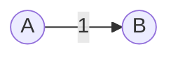
```mermaid
graph LR
A((A))
A --1--> B
B((B))
```
2、
符号栈：空
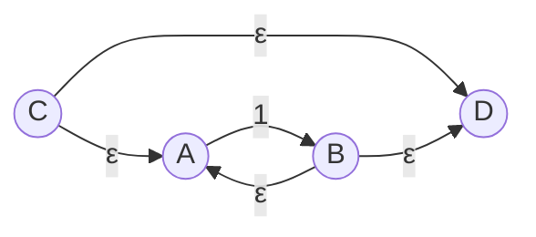
```mermaid
graph LR
C((C))
C --ε--> D
C --ε--> A
D((D))
A((A))
A --1--> B
B((B))
B --ε--> D
B --ε--> A
```
3、
符号栈：· 
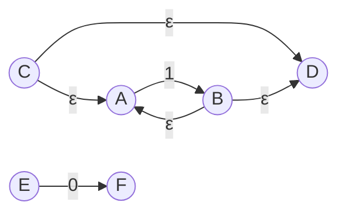
```mermaid
graph LR
C((C))
C --ε--> D
C --ε--> A
D((D))
A((A))
A --1--> B
B((B))
B --ε--> D
B --ε--> A
E((E))
E --0--> F
F((F))
```
4、
符号栈：· · ( 
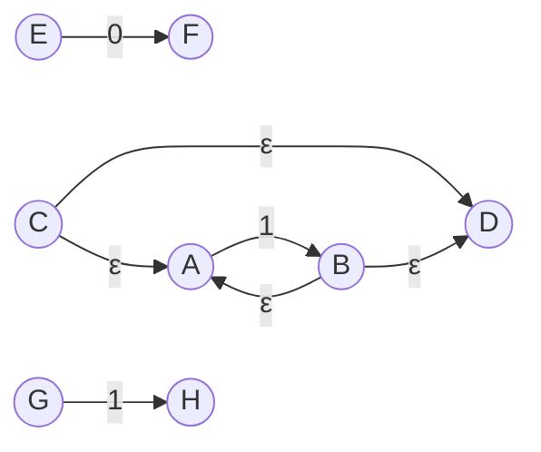
```mermaid
graph LR
C((C))
C --ε--> D
C --ε--> A
D((D))
A((A))
A --1--> B
B((B))
B --ε--> D
B --ε--> A
E((E))
E --0--> F
F((F))
G((G))
G --1--> H
H((H))
```
5、
符号栈：· · ( · 
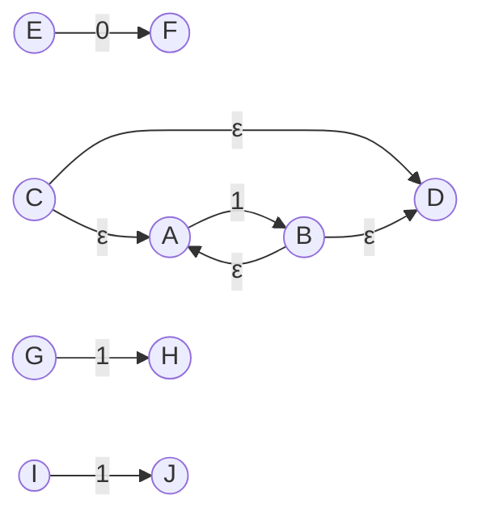
```mermaid
graph LR
C((C))
C --ε--> D
C --ε--> A
D((D))
A((A))
A --1--> B
B((B))
B --ε--> D
B --ε--> A
E((E))
E --0--> F
F((F))
G((G))
G --1--> H
H((H))
I((I))
I --1--> J
J((J))
```
6、
符号栈：· · ( · 
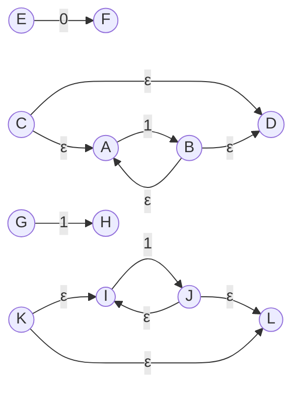
```mermaid
graph LR
C((C))
C --ε--> D
C --ε--> A
D((D))
A((A))
A --1--> B
B((B))
B --ε--> D
B --ε--> A
E((E))
E --0--> F
F((F))
G((G))
G --1--> H
H((H))
K((K))
K --ε--> I
K --ε--> L
I((I))
I --1--> J
L((L))
J((J))
J --ε--> I
J --ε--> L
```
7、
符号栈：· · ( · · 
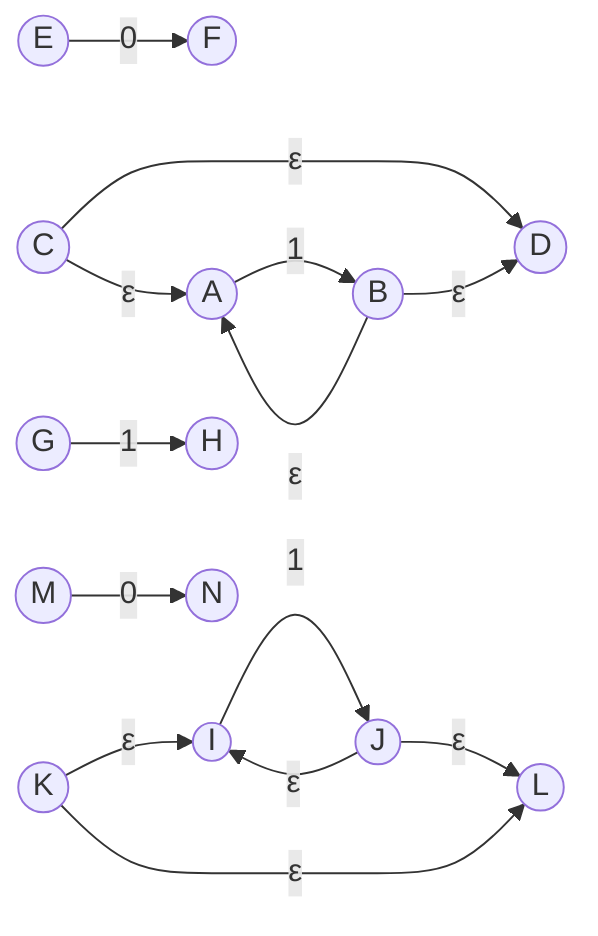
```mermaid
graph LR
C((C))
C --ε--> D
C --ε--> A
D((D))
A((A))
A --1--> B
B((B))
B --ε--> D
B --ε--> A
E((E))
E --0--> F
F((F))
G((G))
G --1--> H
H((H))
K((K))
K --ε--> I
K --ε--> L
I((I))
I --1--> J
L((L))
J((J))
J --ε--> I
J --ε--> L
M((M))
M --0--> N
N((N))
```
8、
符号栈：· · ( · 
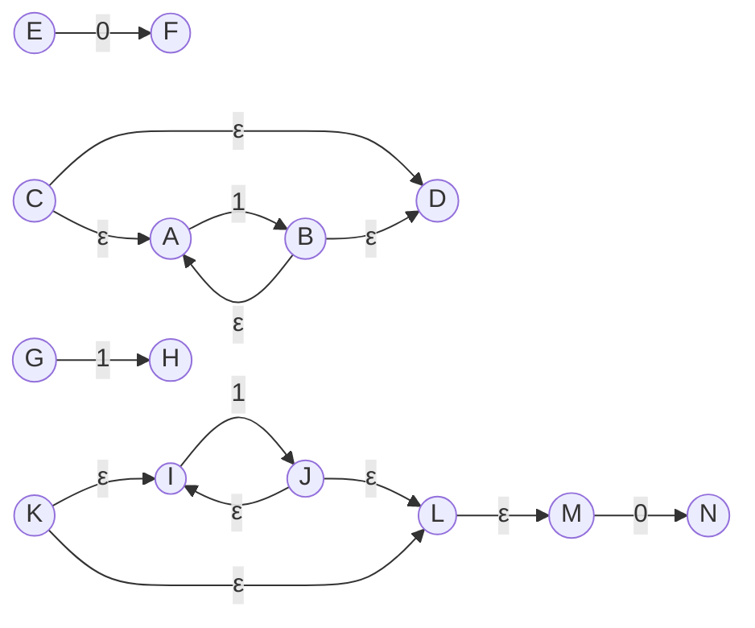
```mermaid
graph LR
C((C))
C --ε--> D
C --ε--> A
D((D))
A((A))
A --1--> B
B((B))
B --ε--> D
B --ε--> A
E((E))
E --0--> F
F((F))
G((G))
G --1--> H
H((H))
K((K))
K --ε--> I
K --ε--> L
I((I))
I --1--> J
L((L))
L --ε--> M
J((J))
J --ε--> I
J --ε--> L
M((M))
M --0--> N
N((N))
```
9、
符号栈：· · ( 
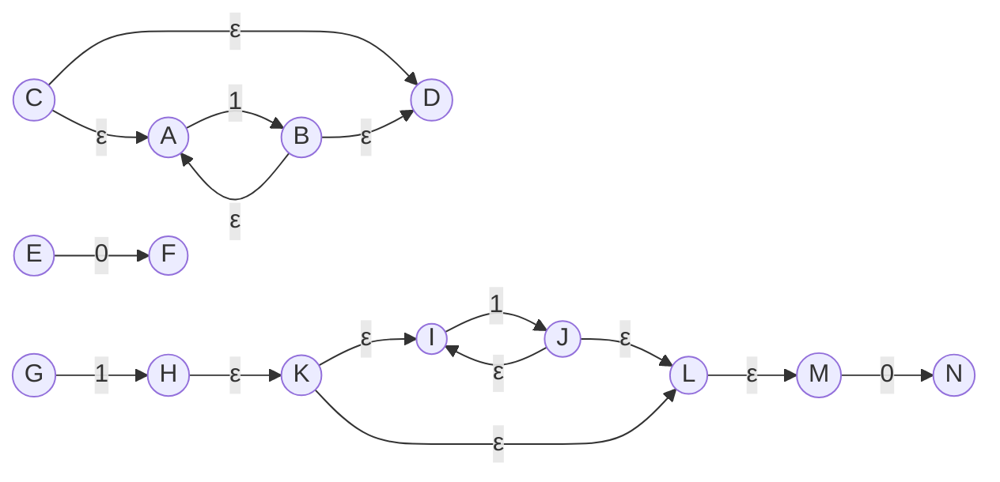
```mermaid
graph LR
C((C))
C --ε--> D
C --ε--> A
D((D))
A((A))
A --1--> B
B((B))
B --ε--> D
B --ε--> A
E((E))
E --0--> F
F((F))
G((G))
G --1--> H
H((H))
H --ε--> K
K((K))
K --ε--> I
K --ε--> L
I((I))
I --1--> J
L((L))
L --ε--> M
J((J))
J --ε--> I
J --ε--> L
M((M))
M --0--> N
N((N))
```
10、
符号栈：· · 
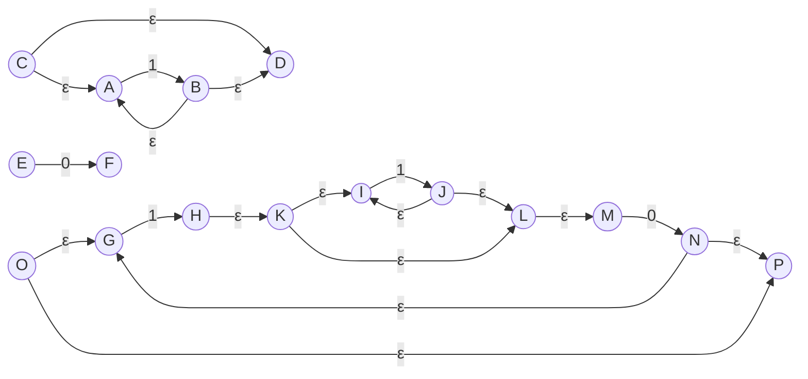
```mermaid
graph LR
C((C))
C --ε--> D
C --ε--> A
D((D))
A((A))
A --1--> B
B((B))
B --ε--> D
B --ε--> A
E((E))
E --0--> F
F((F))
O((O))
O --ε--> G
O --ε--> P
G((G))
G --1--> H
P((P))
H((H))
H --ε--> K
K((K))
K --ε--> I
K --ε--> L
I((I))
I --1--> J
L((L))
L --ε--> M
J((J))
J --ε--> I
J --ε--> L
M((M))
M --0--> N
N((N))
N --ε--> G
N --ε--> P
```
11、
符号栈：· · · 
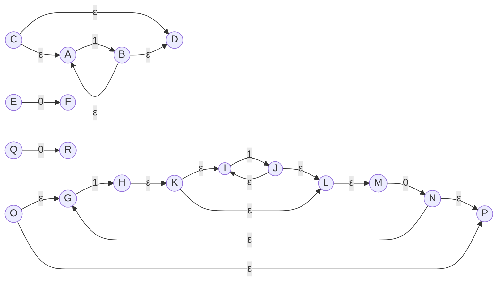
```mermaid
graph LR
C((C))
C --ε--> D
C --ε--> A
D((D))
A((A))
A --1--> B
B((B))
B --ε--> D
B --ε--> A
E((E))
E --0--> F
F((F))
O((O))
O --ε--> G
O --ε--> P
G((G))
G --1--> H
P((P))
H((H))
H --ε--> K
K((K))
K --ε--> I
K --ε--> L
I((I))
I --1--> J
L((L))
L --ε--> M
J((J))
J --ε--> I
J --ε--> L
M((M))
M --0--> N
N((N))
N --ε--> G
N --ε--> P
Q((Q))
Q --0--> R
R((R))
```
12、
符号栈：· · · · ( ( 
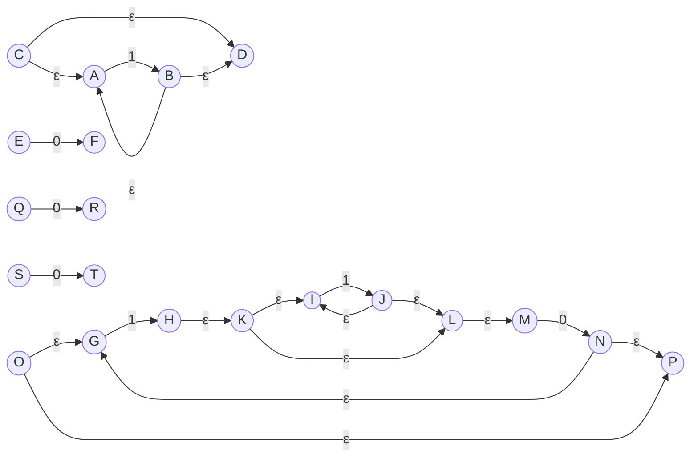
```mermaid
graph LR
C((C))
C --ε--> D
C --ε--> A
D((D))
A((A))
A --1--> B
B((B))
B --ε--> D
B --ε--> A
E((E))
E --0--> F
F((F))
O((O))
O --ε--> G
O --ε--> P
G((G))
G --1--> H
P((P))
H((H))
H --ε--> K
K((K))
K --ε--> I
K --ε--> L
I((I))
I --1--> J
L((L))
L --ε--> M
J((J))
J --ε--> I
J --ε--> L
M((M))
M --0--> N
N((N))
N --ε--> G
N --ε--> P
Q((Q))
Q --0--> R
R((R))
S((S))
S --0--> T
T((T))
```
13、
符号栈：· · · · ( ( · 
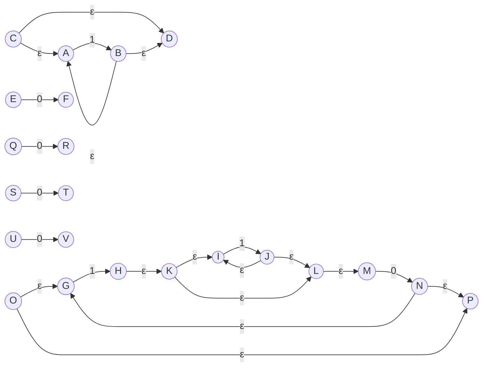
```mermaid
graph LR
C((C))
C --ε--> D
C --ε--> A
D((D))
A((A))
A --1--> B
B((B))
B --ε--> D
B --ε--> A
E((E))
E --0--> F
F((F))
O((O))
O --ε--> G
O --ε--> P
G((G))
G --1--> H
P((P))
H((H))
H --ε--> K
K((K))
K --ε--> I
K --ε--> L
I((I))
I --1--> J
L((L))
L --ε--> M
J((J))
J --ε--> I
J --ε--> L
M((M))
M --0--> N
N((N))
N --ε--> G
N --ε--> P
Q((Q))
Q --0--> R
R((R))
S((S))
S --0--> T
T((T))
U((U))
U --0--> V
V((V))
```
14、
符号栈：· · · · ( ( · 
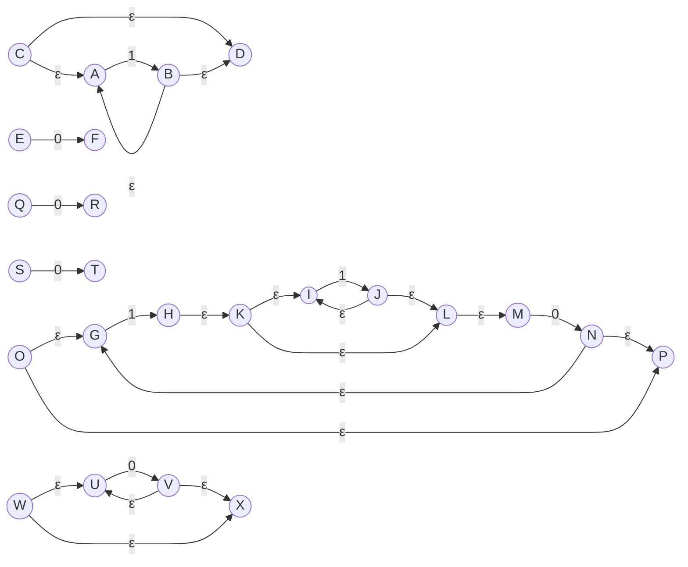
```mermaid
graph LR
C((C))
C --ε--> D
C --ε--> A
D((D))
A((A))
A --1--> B
B((B))
B --ε--> D
B --ε--> A
E((E))
E --0--> F
F((F))
O((O))
O --ε--> G
O --ε--> P
G((G))
G --1--> H
P((P))
H((H))
H --ε--> K
K((K))
K --ε--> I
K --ε--> L
I((I))
I --1--> J
L((L))
L --ε--> M
J((J))
J --ε--> I
J --ε--> L
M((M))
M --0--> N
N((N))
N --ε--> G
N --ε--> P
Q((Q))
Q --0--> R
R((R))
S((S))
S --0--> T
T((T))
W((W))
W --ε--> U
W --ε--> X
U((U))
U --0--> V
X((X))
V((V))
V --ε--> U
V --ε--> X
```
15、
符号栈：· · · · ( ( · · 
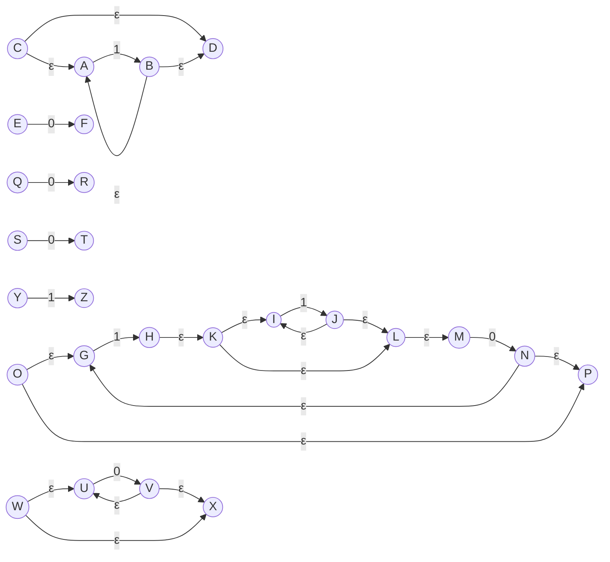
```mermaid
graph LR
C((C))
C --ε--> D
C --ε--> A
D((D))
A((A))
A --1--> B
B((B))
B --ε--> D
B --ε--> A
E((E))
E --0--> F
F((F))
O((O))
O --ε--> G
O --ε--> P
G((G))
G --1--> H
P((P))
H((H))
H --ε--> K
K((K))
K --ε--> I
K --ε--> L
I((I))
I --1--> J
L((L))
L --ε--> M
J((J))
J --ε--> I
J --ε--> L
M((M))
M --0--> N
N((N))
N --ε--> G
N --ε--> P
Q((Q))
Q --0--> R
R((R))
S((S))
S --0--> T
T((T))
W((W))
W --ε--> U
W --ε--> X
U((U))
U --0--> V
X((X))
V((V))
V --ε--> U
V --ε--> X
Y((Y))
Y --1--> Z
Z((Z))
```
16、
符号栈：· · · · ( ( · · · 
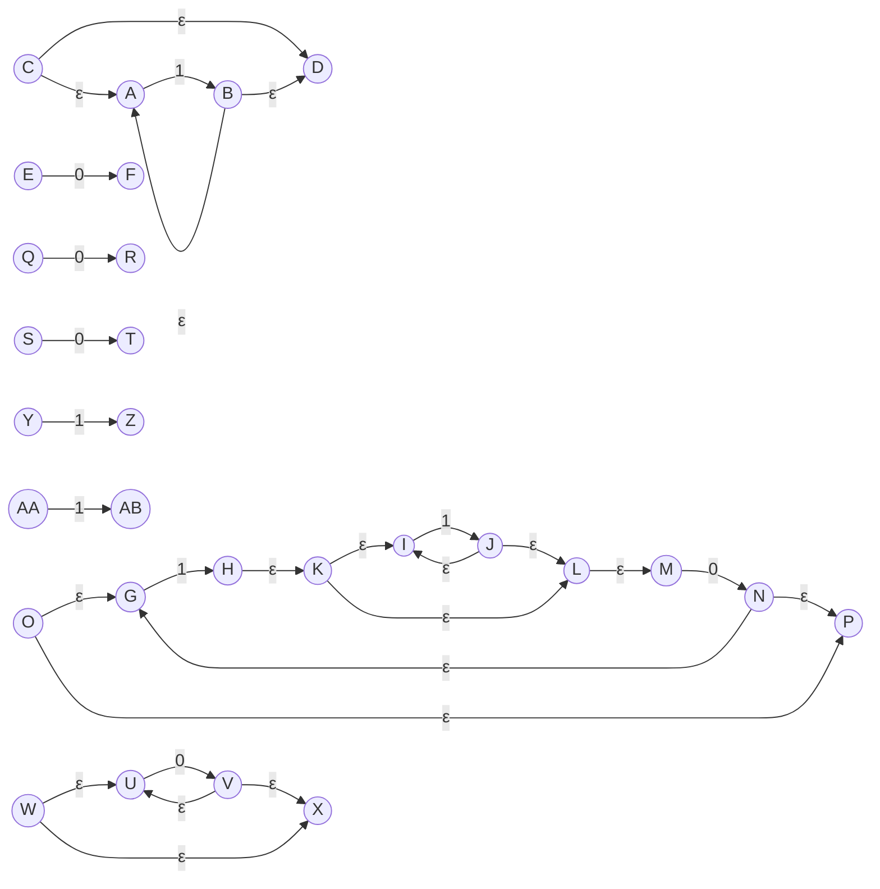
```mermaid
graph LR
C((C))
C --ε--> D
C --ε--> A
D((D))
A((A))
A --1--> B
B((B))
B --ε--> D
B --ε--> A
E((E))
E --0--> F
F((F))
O((O))
O --ε--> G
O --ε--> P
G((G))
G --1--> H
P((P))
H((H))
H --ε--> K
K((K))
K --ε--> I
K --ε--> L
I((I))
I --1--> J
L((L))
L --ε--> M
J((J))
J --ε--> I
J --ε--> L
M((M))
M --0--> N
N((N))
N --ε--> G
N --ε--> P
Q((Q))
Q --0--> R
R((R))
S((S))
S --0--> T
T((T))
W((W))
W --ε--> U
W --ε--> X
U((U))
U --0--> V
X((X))
V((V))
V --ε--> U
V --ε--> X
Y((Y))
Y --1--> Z
Z((Z))
AA((AA))
AA --1--> AB
AB((AB))
```
17、
符号栈：· · · · ( ( · · · · 
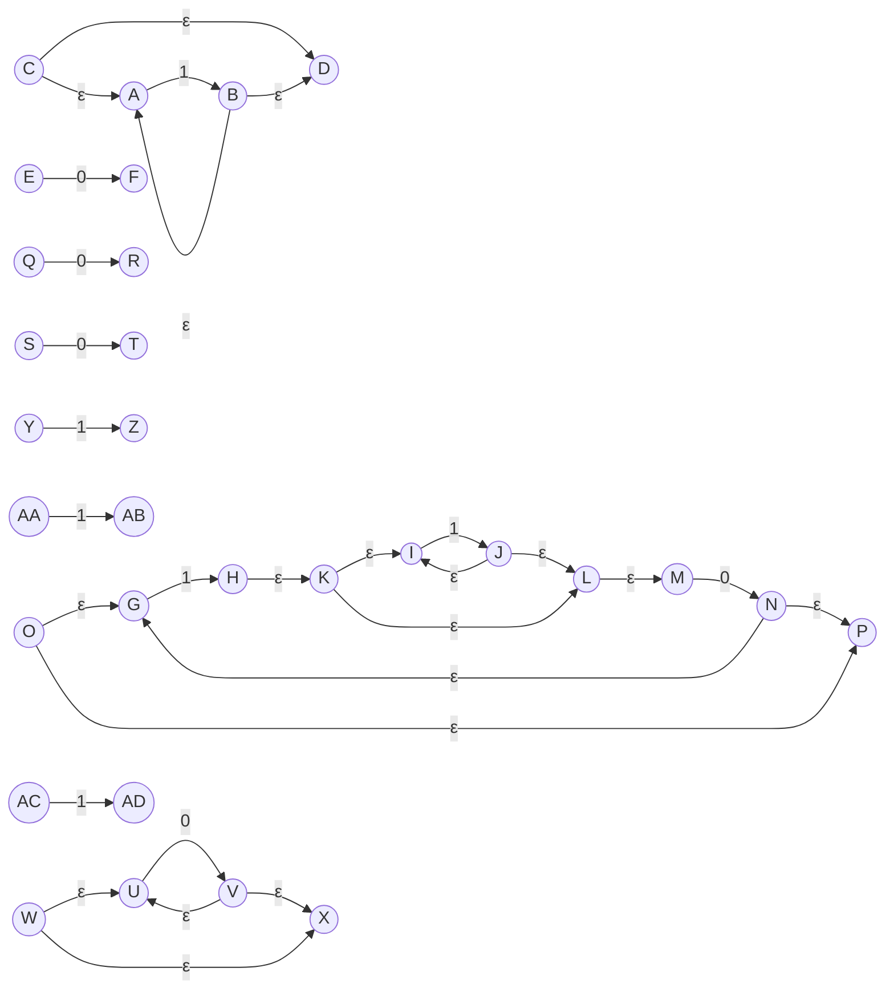
```mermaid
graph LR
C((C))
C --ε--> D
C --ε--> A
D((D))
A((A))
A --1--> B
B((B))
B --ε--> D
B --ε--> A
E((E))
E --0--> F
F((F))
O((O))
O --ε--> G
O --ε--> P
G((G))
G --1--> H
P((P))
H((H))
H --ε--> K
K((K))
K --ε--> I
K --ε--> L
I((I))
I --1--> J
L((L))
L --ε--> M
J((J))
J --ε--> I
J --ε--> L
M((M))
M --0--> N
N((N))
N --ε--> G
N --ε--> P
Q((Q))
Q --0--> R
R((R))
S((S))
S --0--> T
T((T))
W((W))
W --ε--> U
W --ε--> X
U((U))
U --0--> V
X((X))
V((V))
V --ε--> U
V --ε--> X
Y((Y))
Y --1--> Z
Z((Z))
AA((AA))
AA --1--> AB
AB((AB))
AC((AC))
AC --1--> AD
AD((AD))
```
18、
符号栈：· · · · ( ( · · · · 
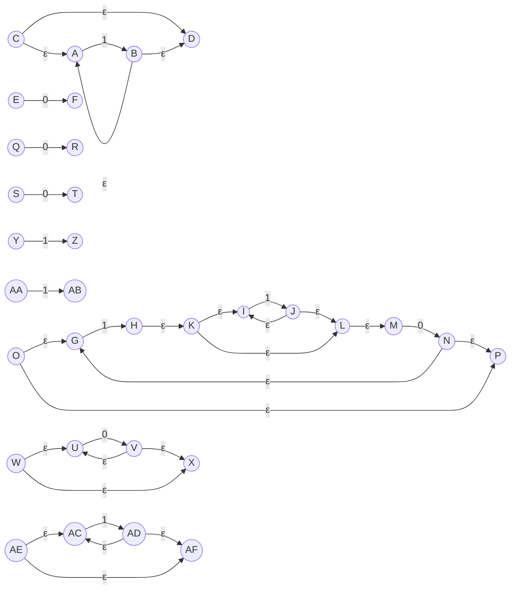
```mermaid
graph LR
C((C))
C --ε--> D
C --ε--> A
D((D))
A((A))
A --1--> B
B((B))
B --ε--> D
B --ε--> A
E((E))
E --0--> F
F((F))
O((O))
O --ε--> G
O --ε--> P
G((G))
G --1--> H
P((P))
H((H))
H --ε--> K
K((K))
K --ε--> I
K --ε--> L
I((I))
I --1--> J
L((L))
L --ε--> M
J((J))
J --ε--> I
J --ε--> L
M((M))
M --0--> N
N((N))
N --ε--> G
N --ε--> P
Q((Q))
Q --0--> R
R((R))
S((S))
S --0--> T
T((T))
W((W))
W --ε--> U
W --ε--> X
U((U))
U --0--> V
X((X))
V((V))
V --ε--> U
V --ε--> X
Y((Y))
Y --1--> Z
Z((Z))
AA((AA))
AA --1--> AB
AB((AB))
AE((AE))
AE --ε--> AC
AE --ε--> AF
AC((AC))
AC --1--> AD
AF((AF))
AD((AD))
AD --ε--> AC
AD --ε--> AF
```
19、
符号栈：· · · · ( ( · · · · · 
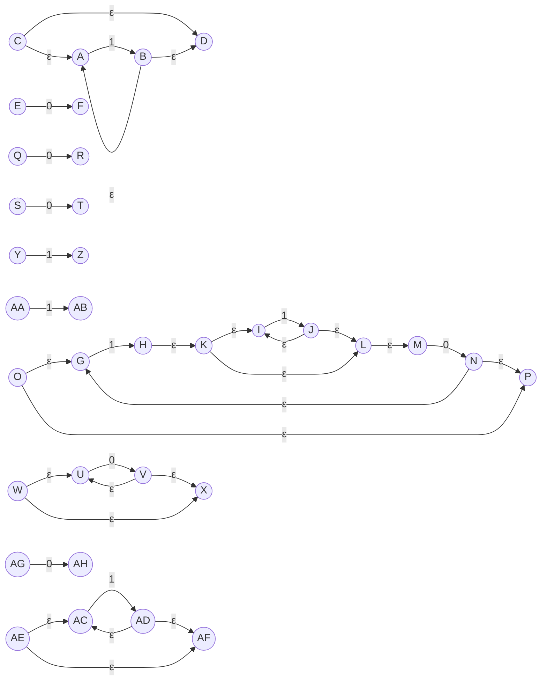
```mermaid
graph LR
C((C))
C --ε--> D
C --ε--> A
D((D))
A((A))
A --1--> B
B((B))
B --ε--> D
B --ε--> A
E((E))
E --0--> F
F((F))
O((O))
O --ε--> G
O --ε--> P
G((G))
G --1--> H
P((P))
H((H))
H --ε--> K
K((K))
K --ε--> I
K --ε--> L
I((I))
I --1--> J
L((L))
L --ε--> M
J((J))
J --ε--> I
J --ε--> L
M((M))
M --0--> N
N((N))
N --ε--> G
N --ε--> P
Q((Q))
Q --0--> R
R((R))
S((S))
S --0--> T
T((T))
W((W))
W --ε--> U
W --ε--> X
U((U))
U --0--> V
X((X))
V((V))
V --ε--> U
V --ε--> X
Y((Y))
Y --1--> Z
Z((Z))
AA((AA))
AA --1--> AB
AB((AB))
AE((AE))
AE --ε--> AC
AE --ε--> AF
AC((AC))
AC --1--> AD
AF((AF))
AD((AD))
AD --ε--> AC
AD --ε--> AF
AG((AG))
AG --0--> AH
AH((AH))
```
20、
符号栈：· · · · ( ( · · · · 
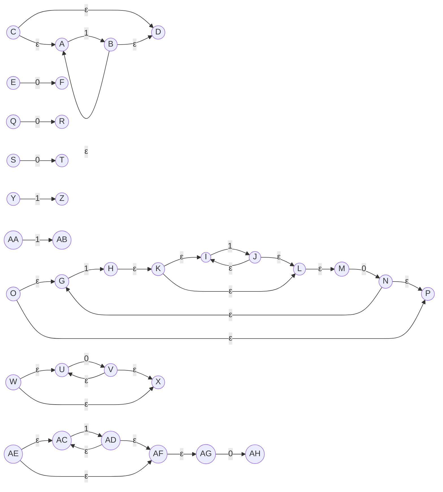
```mermaid
graph LR
C((C))
C --ε--> D
C --ε--> A
D((D))
A((A))
A --1--> B
B((B))
B --ε--> D
B --ε--> A
E((E))
E --0--> F
F((F))
O((O))
O --ε--> G
O --ε--> P
G((G))
G --1--> H
P((P))
H((H))
H --ε--> K
K((K))
K --ε--> I
K --ε--> L
I((I))
I --1--> J
L((L))
L --ε--> M
J((J))
J --ε--> I
J --ε--> L
M((M))
M --0--> N
N((N))
N --ε--> G
N --ε--> P
Q((Q))
Q --0--> R
R((R))
S((S))
S --0--> T
T((T))
W((W))
W --ε--> U
W --ε--> X
U((U))
U --0--> V
X((X))
V((V))
V --ε--> U
V --ε--> X
Y((Y))
Y --1--> Z
Z((Z))
AA((AA))
AA --1--> AB
AB((AB))
AE((AE))
AE --ε--> AC
AE --ε--> AF
AC((AC))
AC --1--> AD
AF((AF))
AF --ε--> AG
AD((AD))
AD --ε--> AC
AD --ε--> AF
AG((AG))
AG --0--> AH
AH((AH))
```
21、
符号栈：· · · · ( ( · · · 
```mermaid
graph LR
C((C))
C --ε--> D
C --ε--> A
D((D))
A((A))
A --1--> B
B((B))
B --ε--> D
B --ε--> A
E((E))
E --0--> F
F((F))
O((O))
O --ε--> G
O --ε--> P
G((G))
G --1--> H
P((P))
H((H))
H --ε--> K
K((K))
K --ε--> I
K --ε--> L
I((I))
I --1--> J
L((L))
L --ε--> M
J((J))
J --ε--> I
J --ε--> L
M((M))
M --0--> N
N((N))
N --ε--> G
N --ε--> P
Q((Q))
Q --0--> R
R((R))
S((S))
S --0--> T
T((T))
W((W))
W --ε--> U
W --ε--> X
U((U))
U --0--> V
X((X))
V((V))
V --ε--> U
V --ε--> X
Y((Y))
Y --1--> Z
Z((Z))
AA((AA))
AA --1--> AB
AB((AB))
AB --ε--> AE
AE((AE))
AE --ε--> AC
AE --ε--> AF
AC((AC))
AC --1--> AD
AF((AF))
AF --ε--> AG
AD((AD))
AD --ε--> AC
AD --ε--> AF
AG((AG))
AG --0--> AH
AH((AH))
```
22、
符号栈：· · · · ( ( · · 
```mermaid
graph LR
C((C))
C --ε--> D
C --ε--> A
D((D))
A((A))
A --1--> B
B((B))
B --ε--> D
B --ε--> A
E((E))
E --0--> F
F((F))
O((O))
O --ε--> G
O --ε--> P
G((G))
G --1--> H
P((P))
H((H))
H --ε--> K
K((K))
K --ε--> I
K --ε--> L
I((I))
I --1--> J
L((L))
L --ε--> M
J((J))
J --ε--> I
J --ε--> L
M((M))
M --0--> N
N((N))
N --ε--> G
N --ε--> P
Q((Q))
Q --0--> R
R((R))
S((S))
S --0--> T
T((T))
W((W))
W --ε--> U
W --ε--> X
U((U))
U --0--> V
X((X))
V((V))
V --ε--> U
V --ε--> X
Y((Y))
Y --1--> Z
Z((Z))
Z --ε--> AA
AA((AA))
AA --1--> AB
AB((AB))
AB --ε--> AE
AE((AE))
AE --ε--> AC
AE --ε--> AF
AC((AC))
AC --1--> AD
AF((AF))
AF --ε--> AG
AD((AD))
AD --ε--> AC
AD --ε--> AF
AG((AG))
AG --0--> AH
AH((AH))
```
23、
符号栈：· · · · ( ( · 
```mermaid
graph LR
C((C))
C --ε--> D
C --ε--> A
D((D))
A((A))
A --1--> B
B((B))
B --ε--> D
B --ε--> A
E((E))
E --0--> F
F((F))
O((O))
O --ε--> G
O --ε--> P
G((G))
G --1--> H
P((P))
H((H))
H --ε--> K
K((K))
K --ε--> I
K --ε--> L
I((I))
I --1--> J
L((L))
L --ε--> M
J((J))
J --ε--> I
J --ε--> L
M((M))
M --0--> N
N((N))
N --ε--> G
N --ε--> P
Q((Q))
Q --0--> R
R((R))
S((S))
S --0--> T
T((T))
W((W))
W --ε--> U
W --ε--> X
U((U))
U --0--> V
X((X))
X --ε--> Y
V((V))
V --ε--> U
V --ε--> X
Y((Y))
Y --1--> Z
Z((Z))
Z --ε--> AA
AA((AA))
AA --1--> AB
AB((AB))
AB --ε--> AE
AE((AE))
AE --ε--> AC
AE --ε--> AF
AC((AC))
AC --1--> AD
AF((AF))
AF --ε--> AG
AD((AD))
AD --ε--> AC
AD --ε--> AF
AG((AG))
AG --0--> AH
AH((AH))
```
24、
符号栈：· · · · ( ( 
```mermaid
graph LR
C((C))
C --ε--> D
C --ε--> A
D((D))
A((A))
A --1--> B
B((B))
B --ε--> D
B --ε--> A
E((E))
E --0--> F
F((F))
O((O))
O --ε--> G
O --ε--> P
G((G))
G --1--> H
P((P))
H((H))
H --ε--> K
K((K))
K --ε--> I
K --ε--> L
I((I))
I --1--> J
L((L))
L --ε--> M
J((J))
J --ε--> I
J --ε--> L
M((M))
M --0--> N
N((N))
N --ε--> G
N --ε--> P
Q((Q))
Q --0--> R
R((R))
S((S))
S --0--> T
T((T))
T --ε--> W
W((W))
W --ε--> U
W --ε--> X
U((U))
U --0--> V
X((X))
X --ε--> Y
V((V))
V --ε--> U
V --ε--> X
Y((Y))
Y --1--> Z
Z((Z))
Z --ε--> AA
AA((AA))
AA --1--> AB
AB((AB))
AB --ε--> AE
AE((AE))
AE --ε--> AC
AE --ε--> AF
AC((AC))
AC --1--> AD
AF((AF))
AF --ε--> AG
AD((AD))
AD --ε--> AC
AD --ε--> AF
AG((AG))
AG --0--> AH
AH((AH))
```
25、
符号栈：· · · · ( ( | 
```mermaid
graph LR
C((C))
C --ε--> D
C --ε--> A
D((D))
A((A))
A --1--> B
B((B))
B --ε--> D
B --ε--> A
E((E))
E --0--> F
F((F))
O((O))
O --ε--> G
O --ε--> P
G((G))
G --1--> H
P((P))
H((H))
H --ε--> K
K((K))
K --ε--> I
K --ε--> L
I((I))
I --1--> J
L((L))
L --ε--> M
J((J))
J --ε--> I
J --ε--> L
M((M))
M --0--> N
N((N))
N --ε--> G
N --ε--> P
Q((Q))
Q --0--> R
R((R))
S((S))
S --0--> T
T((T))
T --ε--> W
W((W))
W --ε--> U
W --ε--> X
U((U))
U --0--> V
X((X))
X --ε--> Y
V((V))
V --ε--> U
V --ε--> X
Y((Y))
Y --1--> Z
Z((Z))
Z --ε--> AA
AA((AA))
AA --1--> AB
AB((AB))
AB --ε--> AE
AE((AE))
AE --ε--> AC
AE --ε--> AF
AC((AC))
AC --1--> AD
AF((AF))
AF --ε--> AG
AD((AD))
AD --ε--> AC
AD --ε--> AF
AG((AG))
AG --0--> AH
AH((AH))
AI((AI))
AI --0--> AJ
AJ((AJ))
```
26、
符号栈：· · · · ( ( | · 
```mermaid
graph LR
C((C))
C --ε--> D
C --ε--> A
D((D))
A((A))
A --1--> B
B((B))
B --ε--> D
B --ε--> A
E((E))
E --0--> F
F((F))
O((O))
O --ε--> G
O --ε--> P
G((G))
G --1--> H
P((P))
H((H))
H --ε--> K
K((K))
K --ε--> I
K --ε--> L
I((I))
I --1--> J
L((L))
L --ε--> M
J((J))
J --ε--> I
J --ε--> L
M((M))
M --0--> N
N((N))
N --ε--> G
N --ε--> P
Q((Q))
Q --0--> R
R((R))
S((S))
S --0--> T
T((T))
T --ε--> W
W((W))
W --ε--> U
W --ε--> X
U((U))
U --0--> V
X((X))
X --ε--> Y
V((V))
V --ε--> U
V --ε--> X
Y((Y))
Y --1--> Z
Z((Z))
Z --ε--> AA
AA((AA))
AA --1--> AB
AB((AB))
AB --ε--> AE
AE((AE))
AE --ε--> AC
AE --ε--> AF
AC((AC))
AC --1--> AD
AF((AF))
AF --ε--> AG
AD((AD))
AD --ε--> AC
AD --ε--> AF
AG((AG))
AG --0--> AH
AH((AH))
AI((AI))
AI --0--> AJ
AJ((AJ))
AK((AK))
AK --0--> AL
AL((AL))
```
27、
符号栈：· · · · ( ( | · 
```mermaid
graph LR
C((C))
C --ε--> D
C --ε--> A
D((D))
A((A))
A --1--> B
B((B))
B --ε--> D
B --ε--> A
E((E))
E --0--> F
F((F))
O((O))
O --ε--> G
O --ε--> P
G((G))
G --1--> H
P((P))
H((H))
H --ε--> K
K((K))
K --ε--> I
K --ε--> L
I((I))
I --1--> J
L((L))
L --ε--> M
J((J))
J --ε--> I
J --ε--> L
M((M))
M --0--> N
N((N))
N --ε--> G
N --ε--> P
Q((Q))
Q --0--> R
R((R))
S((S))
S --0--> T
T((T))
T --ε--> W
W((W))
W --ε--> U
W --ε--> X
U((U))
U --0--> V
X((X))
X --ε--> Y
V((V))
V --ε--> U
V --ε--> X
Y((Y))
Y --1--> Z
Z((Z))
Z --ε--> AA
AA((AA))
AA --1--> AB
AB((AB))
AB --ε--> AE
AE((AE))
AE --ε--> AC
AE --ε--> AF
AC((AC))
AC --1--> AD
AF((AF))
AF --ε--> AG
AD((AD))
AD --ε--> AC
AD --ε--> AF
AG((AG))
AG --0--> AH
AH((AH))
AI((AI))
AI --0--> AJ
AJ((AJ))
AM((AM))
AM --ε--> AN
AM --ε--> AK
AN((AN))
AK((AK))
AK --0--> AL
AL((AL))
AL --ε--> AN
AL --ε--> AK
```
28、
符号栈：· · · · ( ( | · · 
```mermaid
graph LR
C((C))
C --ε--> D
C --ε--> A
D((D))
A((A))
A --1--> B
B((B))
B --ε--> D
B --ε--> A
E((E))
E --0--> F
F((F))
O((O))
O --ε--> G
O --ε--> P
G((G))
G --1--> H
P((P))
H((H))
H --ε--> K
K((K))
K --ε--> I
K --ε--> L
I((I))
I --1--> J
L((L))
L --ε--> M
J((J))
J --ε--> I
J --ε--> L
M((M))
M --0--> N
N((N))
N --ε--> G
N --ε--> P
Q((Q))
Q --0--> R
R((R))
S((S))
S --0--> T
T((T))
T --ε--> W
W((W))
W --ε--> U
W --ε--> X
U((U))
U --0--> V
X((X))
X --ε--> Y
V((V))
V --ε--> U
V --ε--> X
Y((Y))
Y --1--> Z
Z((Z))
Z --ε--> AA
AA((AA))
AA --1--> AB
AB((AB))
AB --ε--> AE
AE((AE))
AE --ε--> AC
AE --ε--> AF
AC((AC))
AC --1--> AD
AF((AF))
AF --ε--> AG
AD((AD))
AD --ε--> AC
AD --ε--> AF
AG((AG))
AG --0--> AH
AH((AH))
AI((AI))
AI --0--> AJ
AJ((AJ))
AM((AM))
AM --ε--> AN
AM --ε--> AK
AN((AN))
AK((AK))
AK --0--> AL
AL((AL))
AL --ε--> AN
AL --ε--> AK
AO((AO))
AO --1--> AP
AP((AP))
```
29、
符号栈：· · · · ( ( | · · · 
```mermaid
graph LR
C((C))
C --ε--> D
C --ε--> A
D((D))
A((A))
A --1--> B
B((B))
B --ε--> D
B --ε--> A
E((E))
E --0--> F
F((F))
O((O))
O --ε--> G
O --ε--> P
G((G))
G --1--> H
P((P))
H((H))
H --ε--> K
K((K))
K --ε--> I
K --ε--> L
I((I))
I --1--> J
L((L))
L --ε--> M
J((J))
J --ε--> I
J --ε--> L
M((M))
M --0--> N
N((N))
N --ε--> G
N --ε--> P
Q((Q))
Q --0--> R
R((R))
S((S))
S --0--> T
T((T))
T --ε--> W
W((W))
W --ε--> U
W --ε--> X
U((U))
U --0--> V
X((X))
X --ε--> Y
V((V))
V --ε--> U
V --ε--> X
Y((Y))
Y --1--> Z
Z((Z))
Z --ε--> AA
AA((AA))
AA --1--> AB
AB((AB))
AB --ε--> AE
AE((AE))
AE --ε--> AC
AE --ε--> AF
AC((AC))
AC --1--> AD
AF((AF))
AF --ε--> AG
AD((AD))
AD --ε--> AC
AD --ε--> AF
AG((AG))
AG --0--> AH
AH((AH))
AI((AI))
AI --0--> AJ
AJ((AJ))
AM((AM))
AM --ε--> AN
AM --ε--> AK
AN((AN))
AK((AK))
AK --0--> AL
AL((AL))
AL --ε--> AN
AL --ε--> AK
AO((AO))
AO --1--> AP
AP((AP))
AQ((AQ))
AQ --0--> AR
AR((AR))
```
30、
符号栈：· · · · ( ( | · · 
```mermaid
graph LR
C((C))
C --ε--> D
C --ε--> A
D((D))
A((A))
A --1--> B
B((B))
B --ε--> D
B --ε--> A
E((E))
E --0--> F
F((F))
O((O))
O --ε--> G
O --ε--> P
G((G))
G --1--> H
P((P))
H((H))
H --ε--> K
K((K))
K --ε--> I
K --ε--> L
I((I))
I --1--> J
L((L))
L --ε--> M
J((J))
J --ε--> I
J --ε--> L
M((M))
M --0--> N
N((N))
N --ε--> G
N --ε--> P
Q((Q))
Q --0--> R
R((R))
S((S))
S --0--> T
T((T))
T --ε--> W
W((W))
W --ε--> U
W --ε--> X
U((U))
U --0--> V
X((X))
X --ε--> Y
V((V))
V --ε--> U
V --ε--> X
Y((Y))
Y --1--> Z
Z((Z))
Z --ε--> AA
AA((AA))
AA --1--> AB
AB((AB))
AB --ε--> AE
AE((AE))
AE --ε--> AC
AE --ε--> AF
AC((AC))
AC --1--> AD
AF((AF))
AF --ε--> AG
AD((AD))
AD --ε--> AC
AD --ε--> AF
AG((AG))
AG --0--> AH
AH((AH))
AI((AI))
AI --0--> AJ
AJ((AJ))
AM((AM))
AM --ε--> AN
AM --ε--> AK
AN((AN))
AK((AK))
AK --0--> AL
AL((AL))
AL --ε--> AN
AL --ε--> AK
AO((AO))
AO --1--> AP
AP((AP))
AP --ε--> AQ
AQ((AQ))
AQ --0--> AR
AR((AR))
```
31、
符号栈：· · · · ( ( | · 
```mermaid
graph LR
C((C))
C --ε--> D
C --ε--> A
D((D))
A((A))
A --1--> B
B((B))
B --ε--> D
B --ε--> A
E((E))
E --0--> F
F((F))
O((O))
O --ε--> G
O --ε--> P
G((G))
G --1--> H
P((P))
H((H))
H --ε--> K
K((K))
K --ε--> I
K --ε--> L
I((I))
I --1--> J
L((L))
L --ε--> M
J((J))
J --ε--> I
J --ε--> L
M((M))
M --0--> N
N((N))
N --ε--> G
N --ε--> P
Q((Q))
Q --0--> R
R((R))
S((S))
S --0--> T
T((T))
T --ε--> W
W((W))
W --ε--> U
W --ε--> X
U((U))
U --0--> V
X((X))
X --ε--> Y
V((V))
V --ε--> U
V --ε--> X
Y((Y))
Y --1--> Z
Z((Z))
Z --ε--> AA
AA((AA))
AA --1--> AB
AB((AB))
AB --ε--> AE
AE((AE))
AE --ε--> AC
AE --ε--> AF
AC((AC))
AC --1--> AD
AF((AF))
AF --ε--> AG
AD((AD))
AD --ε--> AC
AD --ε--> AF
AG((AG))
AG --0--> AH
AH((AH))
AI((AI))
AI --0--> AJ
AJ((AJ))
AM((AM))
AM --ε--> AN
AM --ε--> AK
AN((AN))
AN --ε--> AO
AK((AK))
AK --0--> AL
AO((AO))
AO --1--> AP
AL((AL))
AL --ε--> AN
AL --ε--> AK
AP((AP))
AP --ε--> AQ
AQ((AQ))
AQ --0--> AR
AR((AR))
```
32、
符号栈：· · · · ( ( | 
```mermaid
graph LR
C((C))
C --ε--> D
C --ε--> A
D((D))
A((A))
A --1--> B
B((B))
B --ε--> D
B --ε--> A
E((E))
E --0--> F
F((F))
O((O))
O --ε--> G
O --ε--> P
G((G))
G --1--> H
P((P))
H((H))
H --ε--> K
K((K))
K --ε--> I
K --ε--> L
I((I))
I --1--> J
L((L))
L --ε--> M
J((J))
J --ε--> I
J --ε--> L
M((M))
M --0--> N
N((N))
N --ε--> G
N --ε--> P
Q((Q))
Q --0--> R
R((R))
S((S))
S --0--> T
T((T))
T --ε--> W
W((W))
W --ε--> U
W --ε--> X
U((U))
U --0--> V
X((X))
X --ε--> Y
V((V))
V --ε--> U
V --ε--> X
Y((Y))
Y --1--> Z
Z((Z))
Z --ε--> AA
AA((AA))
AA --1--> AB
AB((AB))
AB --ε--> AE
AE((AE))
AE --ε--> AC
AE --ε--> AF
AC((AC))
AC --1--> AD
AF((AF))
AF --ε--> AG
AD((AD))
AD --ε--> AC
AD --ε--> AF
AG((AG))
AG --0--> AH
AH((AH))
AI((AI))
AI --0--> AJ
AJ((AJ))
AJ --ε--> AM
AM((AM))
AM --ε--> AN
AM --ε--> AK
AN((AN))
AN --ε--> AO
AK((AK))
AK --0--> AL
AO((AO))
AO --1--> AP
AL((AL))
AL --ε--> AN
AL --ε--> AK
AP((AP))
AP --ε--> AQ
AQ((AQ))
AQ --0--> AR
AR((AR))
```
33、
符号栈：· · · · ( ( | | 
```mermaid
graph LR
C((C))
C --ε--> D
C --ε--> A
D((D))
A((A))
A --1--> B
B((B))
B --ε--> D
B --ε--> A
E((E))
E --0--> F
F((F))
O((O))
O --ε--> G
O --ε--> P
G((G))
G --1--> H
P((P))
H((H))
H --ε--> K
K((K))
K --ε--> I
K --ε--> L
I((I))
I --1--> J
L((L))
L --ε--> M
J((J))
J --ε--> I
J --ε--> L
M((M))
M --0--> N
N((N))
N --ε--> G
N --ε--> P
Q((Q))
Q --0--> R
R((R))
S((S))
S --0--> T
T((T))
T --ε--> W
W((W))
W --ε--> U
W --ε--> X
U((U))
U --0--> V
X((X))
X --ε--> Y
V((V))
V --ε--> U
V --ε--> X
Y((Y))
Y --1--> Z
Z((Z))
Z --ε--> AA
AA((AA))
AA --1--> AB
AB((AB))
AB --ε--> AE
AE((AE))
AE --ε--> AC
AE --ε--> AF
AC((AC))
AC --1--> AD
AF((AF))
AF --ε--> AG
AD((AD))
AD --ε--> AC
AD --ε--> AF
AG((AG))
AG --0--> AH
AH((AH))
AI((AI))
AI --0--> AJ
AJ((AJ))
AJ --ε--> AM
AM((AM))
AM --ε--> AN
AM --ε--> AK
AN((AN))
AN --ε--> AO
AK((AK))
AK --0--> AL
AO((AO))
AO --1--> AP
AL((AL))
AL --ε--> AN
AL --ε--> AK
AP((AP))
AP --ε--> AQ
AQ((AQ))
AQ --0--> AR
AR((AR))
AS((AS))
AS --1--> AT
AT((AT))
```
34、
符号栈：· · · · ( ( | | · 
```mermaid
graph LR
C((C))
C --ε--> D
C --ε--> A
D((D))
A((A))
A --1--> B
B((B))
B --ε--> D
B --ε--> A
E((E))
E --0--> F
F((F))
O((O))
O --ε--> G
O --ε--> P
G((G))
G --1--> H
P((P))
H((H))
H --ε--> K
K((K))
K --ε--> I
K --ε--> L
I((I))
I --1--> J
L((L))
L --ε--> M
J((J))
J --ε--> I
J --ε--> L
M((M))
M --0--> N
N((N))
N --ε--> G
N --ε--> P
Q((Q))
Q --0--> R
R((R))
S((S))
S --0--> T
T((T))
T --ε--> W
W((W))
W --ε--> U
W --ε--> X
U((U))
U --0--> V
X((X))
X --ε--> Y
V((V))
V --ε--> U
V --ε--> X
Y((Y))
Y --1--> Z
Z((Z))
Z --ε--> AA
AA((AA))
AA --1--> AB
AB((AB))
AB --ε--> AE
AE((AE))
AE --ε--> AC
AE --ε--> AF
AC((AC))
AC --1--> AD
AF((AF))
AF --ε--> AG
AD((AD))
AD --ε--> AC
AD --ε--> AF
AG((AG))
AG --0--> AH
AH((AH))
AI((AI))
AI --0--> AJ
AJ((AJ))
AJ --ε--> AM
AM((AM))
AM --ε--> AN
AM --ε--> AK
AN((AN))
AN --ε--> AO
AK((AK))
AK --0--> AL
AO((AO))
AO --1--> AP
AL((AL))
AL --ε--> AN
AL --ε--> AK
AP((AP))
AP --ε--> AQ
AQ((AQ))
AQ --0--> AR
AR((AR))
AS((AS))
AS --1--> AT
AT((AT))
AU((AU))
AU --1--> AV
AV((AV))
```
35、
符号栈：· · · · ( ( | | · 
```mermaid
graph LR
C((C))
C --ε--> D
C --ε--> A
D((D))
A((A))
A --1--> B
B((B))
B --ε--> D
B --ε--> A
E((E))
E --0--> F
F((F))
O((O))
O --ε--> G
O --ε--> P
G((G))
G --1--> H
P((P))
H((H))
H --ε--> K
K((K))
K --ε--> I
K --ε--> L
I((I))
I --1--> J
L((L))
L --ε--> M
J((J))
J --ε--> I
J --ε--> L
M((M))
M --0--> N
N((N))
N --ε--> G
N --ε--> P
Q((Q))
Q --0--> R
R((R))
S((S))
S --0--> T
T((T))
T --ε--> W
W((W))
W --ε--> U
W --ε--> X
U((U))
U --0--> V
X((X))
X --ε--> Y
V((V))
V --ε--> U
V --ε--> X
Y((Y))
Y --1--> Z
Z((Z))
Z --ε--> AA
AA((AA))
AA --1--> AB
AB((AB))
AB --ε--> AE
AE((AE))
AE --ε--> AC
AE --ε--> AF
AC((AC))
AC --1--> AD
AF((AF))
AF --ε--> AG
AD((AD))
AD --ε--> AC
AD --ε--> AF
AG((AG))
AG --0--> AH
AH((AH))
AI((AI))
AI --0--> AJ
AJ((AJ))
AJ --ε--> AM
AM((AM))
AM --ε--> AN
AM --ε--> AK
AN((AN))
AN --ε--> AO
AK((AK))
AK --0--> AL
AO((AO))
AO --1--> AP
AL((AL))
AL --ε--> AN
AL --ε--> AK
AP((AP))
AP --ε--> AQ
AQ((AQ))
AQ --0--> AR
AR((AR))
AS((AS))
AS --1--> AT
AT((AT))
AW((AW))
AW --ε--> AU
AW --ε--> AX
AU((AU))
AU --1--> AV
AX((AX))
AV((AV))
AV --ε--> AU
AV --ε--> AX
```
36、
符号栈：· · · · ( ( | | · · 
```mermaid
graph LR
C((C))
C --ε--> D
C --ε--> A
D((D))
A((A))
A --1--> B
B((B))
B --ε--> D
B --ε--> A
E((E))
E --0--> F
F((F))
O((O))
O --ε--> G
O --ε--> P
G((G))
G --1--> H
P((P))
H((H))
H --ε--> K
K((K))
K --ε--> I
K --ε--> L
I((I))
I --1--> J
L((L))
L --ε--> M
J((J))
J --ε--> I
J --ε--> L
M((M))
M --0--> N
N((N))
N --ε--> G
N --ε--> P
Q((Q))
Q --0--> R
R((R))
S((S))
S --0--> T
T((T))
T --ε--> W
W((W))
W --ε--> U
W --ε--> X
U((U))
U --0--> V
X((X))
X --ε--> Y
V((V))
V --ε--> U
V --ε--> X
Y((Y))
Y --1--> Z
Z((Z))
Z --ε--> AA
AA((AA))
AA --1--> AB
AB((AB))
AB --ε--> AE
AE((AE))
AE --ε--> AC
AE --ε--> AF
AC((AC))
AC --1--> AD
AF((AF))
AF --ε--> AG
AD((AD))
AD --ε--> AC
AD --ε--> AF
AG((AG))
AG --0--> AH
AH((AH))
AI((AI))
AI --0--> AJ
AJ((AJ))
AJ --ε--> AM
AM((AM))
AM --ε--> AN
AM --ε--> AK
AN((AN))
AN --ε--> AO
AK((AK))
AK --0--> AL
AO((AO))
AO --1--> AP
AL((AL))
AL --ε--> AN
AL --ε--> AK
AP((AP))
AP --ε--> AQ
AQ((AQ))
AQ --0--> AR
AR((AR))
AS((AS))
AS --1--> AT
AT((AT))
AW((AW))
AW --ε--> AU
AW --ε--> AX
AU((AU))
AU --1--> AV
AX((AX))
AV((AV))
AV --ε--> AU
AV --ε--> AX
AY((AY))
AY --0--> AZ
AZ((AZ))
```
37、
符号栈：· · · · ( ( | | · 
```mermaid
graph LR
C((C))
C --ε--> D
C --ε--> A
D((D))
A((A))
A --1--> B
B((B))
B --ε--> D
B --ε--> A
E((E))
E --0--> F
F((F))
O((O))
O --ε--> G
O --ε--> P
G((G))
G --1--> H
P((P))
H((H))
H --ε--> K
K((K))
K --ε--> I
K --ε--> L
I((I))
I --1--> J
L((L))
L --ε--> M
J((J))
J --ε--> I
J --ε--> L
M((M))
M --0--> N
N((N))
N --ε--> G
N --ε--> P
Q((Q))
Q --0--> R
R((R))
S((S))
S --0--> T
T((T))
T --ε--> W
W((W))
W --ε--> U
W --ε--> X
U((U))
U --0--> V
X((X))
X --ε--> Y
V((V))
V --ε--> U
V --ε--> X
Y((Y))
Y --1--> Z
Z((Z))
Z --ε--> AA
AA((AA))
AA --1--> AB
AB((AB))
AB --ε--> AE
AE((AE))
AE --ε--> AC
AE --ε--> AF
AC((AC))
AC --1--> AD
AF((AF))
AF --ε--> AG
AD((AD))
AD --ε--> AC
AD --ε--> AF
AG((AG))
AG --0--> AH
AH((AH))
AI((AI))
AI --0--> AJ
AJ((AJ))
AJ --ε--> AM
AM((AM))
AM --ε--> AN
AM --ε--> AK
AN((AN))
AN --ε--> AO
AK((AK))
AK --0--> AL
AO((AO))
AO --1--> AP
AL((AL))
AL --ε--> AN
AL --ε--> AK
AP((AP))
AP --ε--> AQ
AQ((AQ))
AQ --0--> AR
AR((AR))
AS((AS))
AS --1--> AT
AT((AT))
AW((AW))
AW --ε--> AU
AW --ε--> AX
AU((AU))
AU --1--> AV
AX((AX))
AX --ε--> AY
AV((AV))
AV --ε--> AU
AV --ε--> AX
AY((AY))
AY --0--> AZ
AZ((AZ))
```
38、
符号栈：· · · · ( ( | | 
```mermaid
graph LR
C((C))
C --ε--> D
C --ε--> A
D((D))
A((A))
A --1--> B
B((B))
B --ε--> D
B --ε--> A
E((E))
E --0--> F
F((F))
O((O))
O --ε--> G
O --ε--> P
G((G))
G --1--> H
P((P))
H((H))
H --ε--> K
K((K))
K --ε--> I
K --ε--> L
I((I))
I --1--> J
L((L))
L --ε--> M
J((J))
J --ε--> I
J --ε--> L
M((M))
M --0--> N
N((N))
N --ε--> G
N --ε--> P
Q((Q))
Q --0--> R
R((R))
S((S))
S --0--> T
T((T))
T --ε--> W
W((W))
W --ε--> U
W --ε--> X
U((U))
U --0--> V
X((X))
X --ε--> Y
V((V))
V --ε--> U
V --ε--> X
Y((Y))
Y --1--> Z
Z((Z))
Z --ε--> AA
AA((AA))
AA --1--> AB
AB((AB))
AB --ε--> AE
AE((AE))
AE --ε--> AC
AE --ε--> AF
AC((AC))
AC --1--> AD
AF((AF))
AF --ε--> AG
AD((AD))
AD --ε--> AC
AD --ε--> AF
AG((AG))
AG --0--> AH
AH((AH))
AI((AI))
AI --0--> AJ
AJ((AJ))
AJ --ε--> AM
AM((AM))
AM --ε--> AN
AM --ε--> AK
AN((AN))
AN --ε--> AO
AK((AK))
AK --0--> AL
AO((AO))
AO --1--> AP
AL((AL))
AL --ε--> AN
AL --ε--> AK
AP((AP))
AP --ε--> AQ
AQ((AQ))
AQ --0--> AR
AR((AR))
AS((AS))
AS --1--> AT
AT((AT))
AT --ε--> AW
AW((AW))
AW --ε--> AU
AW --ε--> AX
AU((AU))
AU --1--> AV
AX((AX))
AX --ε--> AY
AV((AV))
AV --ε--> AU
AV --ε--> AX
AY((AY))
AY --0--> AZ
AZ((AZ))
```
39、
符号栈：· · · · ( ( | 
```mermaid
graph LR
C((C))
C --ε--> D
C --ε--> A
D((D))
A((A))
A --1--> B
B((B))
B --ε--> D
B --ε--> A
E((E))
E --0--> F
F((F))
O((O))
O --ε--> G
O --ε--> P
G((G))
G --1--> H
P((P))
H((H))
H --ε--> K
K((K))
K --ε--> I
K --ε--> L
I((I))
I --1--> J
L((L))
L --ε--> M
J((J))
J --ε--> I
J --ε--> L
M((M))
M --0--> N
N((N))
N --ε--> G
N --ε--> P
Q((Q))
Q --0--> R
R((R))
S((S))
S --0--> T
T((T))
T --ε--> W
W((W))
W --ε--> U
W --ε--> X
U((U))
U --0--> V
X((X))
X --ε--> Y
V((V))
V --ε--> U
V --ε--> X
Y((Y))
Y --1--> Z
Z((Z))
Z --ε--> AA
AA((AA))
AA --1--> AB
AB((AB))
AB --ε--> AE
AE((AE))
AE --ε--> AC
AE --ε--> AF
AC((AC))
AC --1--> AD
AF((AF))
AF --ε--> AG
AD((AD))
AD --ε--> AC
AD --ε--> AF
AG((AG))
AG --0--> AH
AH((AH))
BA((BA))
BA --ε--> AS
BA --ε--> AI
AS((AS))
AS --1--> AT
AI((AI))
AI --0--> AJ
AT((AT))
AT --ε--> AW
AJ((AJ))
AJ --ε--> AM
AW((AW))
AW --ε--> AU
AW --ε--> AX
AM((AM))
AM --ε--> AN
AM --ε--> AK
AU((AU))
AU --1--> AV
AX((AX))
AX --ε--> AY
AN((AN))
AN --ε--> AO
AK((AK))
AK --0--> AL
AV((AV))
AV --ε--> AU
AV --ε--> AX
AY((AY))
AY --0--> AZ
AO((AO))
AO --1--> AP
AL((AL))
AL --ε--> AN
AL --ε--> AK
AZ((AZ))
AZ --ε--> BB
AP((AP))
AP --ε--> AQ
BB((BB))
AQ((AQ))
AQ --0--> AR
AR((AR))
AR --ε--> BB
```
40、
符号栈：· · · · ( ( 
```mermaid
graph LR
C((C))
C --ε--> D
C --ε--> A
D((D))
A((A))
A --1--> B
B((B))
B --ε--> D
B --ε--> A
E((E))
E --0--> F
F((F))
O((O))
O --ε--> G
O --ε--> P
G((G))
G --1--> H
P((P))
H((H))
H --ε--> K
K((K))
K --ε--> I
K --ε--> L
I((I))
I --1--> J
L((L))
L --ε--> M
J((J))
J --ε--> I
J --ε--> L
M((M))
M --0--> N
N((N))
N --ε--> G
N --ε--> P
Q((Q))
Q --0--> R
R((R))
BC((BC))
BC --ε--> BA
BC --ε--> S
BA((BA))
BA --ε--> AS
BA --ε--> AI
S((S))
S --0--> T
AS((AS))
AS --1--> AT
AI((AI))
AI --0--> AJ
T((T))
T --ε--> W
AT((AT))
AT --ε--> AW
AJ((AJ))
AJ --ε--> AM
W((W))
W --ε--> U
W --ε--> X
AW((AW))
AW --ε--> AU
AW --ε--> AX
AM((AM))
AM --ε--> AN
AM --ε--> AK
U((U))
U --0--> V
X((X))
X --ε--> Y
AU((AU))
AU --1--> AV
AX((AX))
AX --ε--> AY
AN((AN))
AN --ε--> AO
AK((AK))
AK --0--> AL
V((V))
V --ε--> U
V --ε--> X
Y((Y))
Y --1--> Z
AV((AV))
AV --ε--> AU
AV --ε--> AX
AY((AY))
AY --0--> AZ
AO((AO))
AO --1--> AP
AL((AL))
AL --ε--> AN
AL --ε--> AK
Z((Z))
Z --ε--> AA
AZ((AZ))
AZ --ε--> BB
AP((AP))
AP --ε--> AQ
AA((AA))
AA --1--> AB
BB((BB))
BB --ε--> BD
AQ((AQ))
AQ --0--> AR
AB((AB))
AB --ε--> AE
BD((BD))
AR((AR))
AR --ε--> BB
AE((AE))
AE --ε--> AC
AE --ε--> AF
AC((AC))
AC --1--> AD
AF((AF))
AF --ε--> AG
AD((AD))
AD --ε--> AC
AD --ε--> AF
AG((AG))
AG --0--> AH
AH((AH))
AH --ε--> BD
```
41、
符号栈：· · · · ( · ( 
```mermaid
graph LR
C((C))
C --ε--> D
C --ε--> A
D((D))
A((A))
A --1--> B
B((B))
B --ε--> D
B --ε--> A
E((E))
E --0--> F
F((F))
O((O))
O --ε--> G
O --ε--> P
G((G))
G --1--> H
P((P))
H((H))
H --ε--> K
K((K))
K --ε--> I
K --ε--> L
I((I))
I --1--> J
L((L))
L --ε--> M
J((J))
J --ε--> I
J --ε--> L
M((M))
M --0--> N
N((N))
N --ε--> G
N --ε--> P
Q((Q))
Q --0--> R
R((R))
BC((BC))
BC --ε--> BA
BC --ε--> S
BA((BA))
BA --ε--> AS
BA --ε--> AI
S((S))
S --0--> T
AS((AS))
AS --1--> AT
AI((AI))
AI --0--> AJ
T((T))
T --ε--> W
AT((AT))
AT --ε--> AW
AJ((AJ))
AJ --ε--> AM
W((W))
W --ε--> U
W --ε--> X
AW((AW))
AW --ε--> AU
AW --ε--> AX
AM((AM))
AM --ε--> AN
AM --ε--> AK
U((U))
U --0--> V
X((X))
X --ε--> Y
AU((AU))
AU --1--> AV
AX((AX))
AX --ε--> AY
AN((AN))
AN --ε--> AO
AK((AK))
AK --0--> AL
V((V))
V --ε--> U
V --ε--> X
Y((Y))
Y --1--> Z
AV((AV))
AV --ε--> AU
AV --ε--> AX
AY((AY))
AY --0--> AZ
AO((AO))
AO --1--> AP
AL((AL))
AL --ε--> AN
AL --ε--> AK
Z((Z))
Z --ε--> AA
AZ((AZ))
AZ --ε--> BB
AP((AP))
AP --ε--> AQ
AA((AA))
AA --1--> AB
BB((BB))
BB --ε--> BD
AQ((AQ))
AQ --0--> AR
AB((AB))
AB --ε--> AE
BD((BD))
AR((AR))
AR --ε--> BB
AE((AE))
AE --ε--> AC
AE --ε--> AF
AC((AC))
AC --1--> AD
AF((AF))
AF --ε--> AG
AD((AD))
AD --ε--> AC
AD --ε--> AF
AG((AG))
AG --0--> AH
AH((AH))
AH --ε--> BD
BE((BE))
BE --1--> BF
BF((BF))
```
42、
符号栈：· · · · ( · ( · 
```mermaid
graph LR
C((C))
C --ε--> D
C --ε--> A
D((D))
A((A))
A --1--> B
B((B))
B --ε--> D
B --ε--> A
E((E))
E --0--> F
F((F))
O((O))
O --ε--> G
O --ε--> P
G((G))
G --1--> H
P((P))
H((H))
H --ε--> K
K((K))
K --ε--> I
K --ε--> L
I((I))
I --1--> J
L((L))
L --ε--> M
J((J))
J --ε--> I
J --ε--> L
M((M))
M --0--> N
N((N))
N --ε--> G
N --ε--> P
Q((Q))
Q --0--> R
R((R))
BC((BC))
BC --ε--> BA
BC --ε--> S
BA((BA))
BA --ε--> AS
BA --ε--> AI
S((S))
S --0--> T
AS((AS))
AS --1--> AT
AI((AI))
AI --0--> AJ
T((T))
T --ε--> W
AT((AT))
AT --ε--> AW
AJ((AJ))
AJ --ε--> AM
W((W))
W --ε--> U
W --ε--> X
AW((AW))
AW --ε--> AU
AW --ε--> AX
AM((AM))
AM --ε--> AN
AM --ε--> AK
U((U))
U --0--> V
X((X))
X --ε--> Y
AU((AU))
AU --1--> AV
AX((AX))
AX --ε--> AY
AN((AN))
AN --ε--> AO
AK((AK))
AK --0--> AL
V((V))
V --ε--> U
V --ε--> X
Y((Y))
Y --1--> Z
AV((AV))
AV --ε--> AU
AV --ε--> AX
AY((AY))
AY --0--> AZ
AO((AO))
AO --1--> AP
AL((AL))
AL --ε--> AN
AL --ε--> AK
Z((Z))
Z --ε--> AA
AZ((AZ))
AZ --ε--> BB
AP((AP))
AP --ε--> AQ
AA((AA))
AA --1--> AB
BB((BB))
BB --ε--> BD
AQ((AQ))
AQ --0--> AR
AB((AB))
AB --ε--> AE
BD((BD))
AR((AR))
AR --ε--> BB
AE((AE))
AE --ε--> AC
AE --ε--> AF
AC((AC))
AC --1--> AD
AF((AF))
AF --ε--> AG
AD((AD))
AD --ε--> AC
AD --ε--> AF
AG((AG))
AG --0--> AH
AH((AH))
AH --ε--> BD
BE((BE))
BE --1--> BF
BF((BF))
BG((BG))
BG --1--> BH
BH((BH))
```
43、
符号栈：· · · · ( · ( · 
```mermaid
graph LR
C((C))
C --ε--> D
C --ε--> A
D((D))
A((A))
A --1--> B
B((B))
B --ε--> D
B --ε--> A
E((E))
E --0--> F
F((F))
O((O))
O --ε--> G
O --ε--> P
G((G))
G --1--> H
P((P))
H((H))
H --ε--> K
K((K))
K --ε--> I
K --ε--> L
I((I))
I --1--> J
L((L))
L --ε--> M
J((J))
J --ε--> I
J --ε--> L
M((M))
M --0--> N
N((N))
N --ε--> G
N --ε--> P
Q((Q))
Q --0--> R
R((R))
BC((BC))
BC --ε--> BA
BC --ε--> S
BA((BA))
BA --ε--> AS
BA --ε--> AI
S((S))
S --0--> T
AS((AS))
AS --1--> AT
AI((AI))
AI --0--> AJ
T((T))
T --ε--> W
AT((AT))
AT --ε--> AW
AJ((AJ))
AJ --ε--> AM
W((W))
W --ε--> U
W --ε--> X
AW((AW))
AW --ε--> AU
AW --ε--> AX
AM((AM))
AM --ε--> AN
AM --ε--> AK
U((U))
U --0--> V
X((X))
X --ε--> Y
AU((AU))
AU --1--> AV
AX((AX))
AX --ε--> AY
AN((AN))
AN --ε--> AO
AK((AK))
AK --0--> AL
V((V))
V --ε--> U
V --ε--> X
Y((Y))
Y --1--> Z
AV((AV))
AV --ε--> AU
AV --ε--> AX
AY((AY))
AY --0--> AZ
AO((AO))
AO --1--> AP
AL((AL))
AL --ε--> AN
AL --ε--> AK
Z((Z))
Z --ε--> AA
AZ((AZ))
AZ --ε--> BB
AP((AP))
AP --ε--> AQ
AA((AA))
AA --1--> AB
BB((BB))
BB --ε--> BD
AQ((AQ))
AQ --0--> AR
AB((AB))
AB --ε--> AE
BD((BD))
AR((AR))
AR --ε--> BB
AE((AE))
AE --ε--> AC
AE --ε--> AF
AC((AC))
AC --1--> AD
AF((AF))
AF --ε--> AG
AD((AD))
AD --ε--> AC
AD --ε--> AF
AG((AG))
AG --0--> AH
AH((AH))
AH --ε--> BD
BE((BE))
BE --1--> BF
BF((BF))
BI((BI))
BI --ε--> BJ
BI --ε--> BG
BJ((BJ))
BG((BG))
BG --1--> BH
BH((BH))
BH --ε--> BJ
BH --ε--> BG
```
44、
符号栈：· · · · ( · ( · · 
```mermaid
graph LR
C((C))
C --ε--> D
C --ε--> A
D((D))
A((A))
A --1--> B
B((B))
B --ε--> D
B --ε--> A
E((E))
E --0--> F
F((F))
O((O))
O --ε--> G
O --ε--> P
G((G))
G --1--> H
P((P))
H((H))
H --ε--> K
K((K))
K --ε--> I
K --ε--> L
I((I))
I --1--> J
L((L))
L --ε--> M
J((J))
J --ε--> I
J --ε--> L
M((M))
M --0--> N
N((N))
N --ε--> G
N --ε--> P
Q((Q))
Q --0--> R
R((R))
BC((BC))
BC --ε--> BA
BC --ε--> S
BA((BA))
BA --ε--> AS
BA --ε--> AI
S((S))
S --0--> T
AS((AS))
AS --1--> AT
AI((AI))
AI --0--> AJ
T((T))
T --ε--> W
AT((AT))
AT --ε--> AW
AJ((AJ))
AJ --ε--> AM
W((W))
W --ε--> U
W --ε--> X
AW((AW))
AW --ε--> AU
AW --ε--> AX
AM((AM))
AM --ε--> AN
AM --ε--> AK
U((U))
U --0--> V
X((X))
X --ε--> Y
AU((AU))
AU --1--> AV
AX((AX))
AX --ε--> AY
AN((AN))
AN --ε--> AO
AK((AK))
AK --0--> AL
V((V))
V --ε--> U
V --ε--> X
Y((Y))
Y --1--> Z
AV((AV))
AV --ε--> AU
AV --ε--> AX
AY((AY))
AY --0--> AZ
AO((AO))
AO --1--> AP
AL((AL))
AL --ε--> AN
AL --ε--> AK
Z((Z))
Z --ε--> AA
AZ((AZ))
AZ --ε--> BB
AP((AP))
AP --ε--> AQ
AA((AA))
AA --1--> AB
BB((BB))
BB --ε--> BD
AQ((AQ))
AQ --0--> AR
AB((AB))
AB --ε--> AE
BD((BD))
AR((AR))
AR --ε--> BB
AE((AE))
AE --ε--> AC
AE --ε--> AF
AC((AC))
AC --1--> AD
AF((AF))
AF --ε--> AG
AD((AD))
AD --ε--> AC
AD --ε--> AF
AG((AG))
AG --0--> AH
AH((AH))
AH --ε--> BD
BE((BE))
BE --1--> BF
BF((BF))
BI((BI))
BI --ε--> BJ
BI --ε--> BG
BJ((BJ))
BG((BG))
BG --1--> BH
BH((BH))
BH --ε--> BJ
BH --ε--> BG
BK((BK))
BK --0--> BL
BL((BL))
```
45、
符号栈：· · · · ( · ( · 
```mermaid
graph LR
C((C))
C --ε--> D
C --ε--> A
D((D))
A((A))
A --1--> B
B((B))
B --ε--> D
B --ε--> A
E((E))
E --0--> F
F((F))
O((O))
O --ε--> G
O --ε--> P
G((G))
G --1--> H
P((P))
H((H))
H --ε--> K
K((K))
K --ε--> I
K --ε--> L
I((I))
I --1--> J
L((L))
L --ε--> M
J((J))
J --ε--> I
J --ε--> L
M((M))
M --0--> N
N((N))
N --ε--> G
N --ε--> P
Q((Q))
Q --0--> R
R((R))
BC((BC))
BC --ε--> BA
BC --ε--> S
BA((BA))
BA --ε--> AS
BA --ε--> AI
S((S))
S --0--> T
AS((AS))
AS --1--> AT
AI((AI))
AI --0--> AJ
T((T))
T --ε--> W
AT((AT))
AT --ε--> AW
AJ((AJ))
AJ --ε--> AM
W((W))
W --ε--> U
W --ε--> X
AW((AW))
AW --ε--> AU
AW --ε--> AX
AM((AM))
AM --ε--> AN
AM --ε--> AK
U((U))
U --0--> V
X((X))
X --ε--> Y
AU((AU))
AU --1--> AV
AX((AX))
AX --ε--> AY
AN((AN))
AN --ε--> AO
AK((AK))
AK --0--> AL
V((V))
V --ε--> U
V --ε--> X
Y((Y))
Y --1--> Z
AV((AV))
AV --ε--> AU
AV --ε--> AX
AY((AY))
AY --0--> AZ
AO((AO))
AO --1--> AP
AL((AL))
AL --ε--> AN
AL --ε--> AK
Z((Z))
Z --ε--> AA
AZ((AZ))
AZ --ε--> BB
AP((AP))
AP --ε--> AQ
AA((AA))
AA --1--> AB
BB((BB))
BB --ε--> BD
AQ((AQ))
AQ --0--> AR
AB((AB))
AB --ε--> AE
BD((BD))
AR((AR))
AR --ε--> BB
AE((AE))
AE --ε--> AC
AE --ε--> AF
AC((AC))
AC --1--> AD
AF((AF))
AF --ε--> AG
AD((AD))
AD --ε--> AC
AD --ε--> AF
AG((AG))
AG --0--> AH
AH((AH))
AH --ε--> BD
BE((BE))
BE --1--> BF
BF((BF))
BI((BI))
BI --ε--> BJ
BI --ε--> BG
BJ((BJ))
BJ --ε--> BK
BG((BG))
BG --1--> BH
BK((BK))
BK --0--> BL
BH((BH))
BH --ε--> BJ
BH --ε--> BG
BL((BL))
```
46、
符号栈：· · · · ( · ( 
```mermaid
graph LR
C((C))
C --ε--> D
C --ε--> A
D((D))
A((A))
A --1--> B
B((B))
B --ε--> D
B --ε--> A
E((E))
E --0--> F
F((F))
O((O))
O --ε--> G
O --ε--> P
G((G))
G --1--> H
P((P))
H((H))
H --ε--> K
K((K))
K --ε--> I
K --ε--> L
I((I))
I --1--> J
L((L))
L --ε--> M
J((J))
J --ε--> I
J --ε--> L
M((M))
M --0--> N
N((N))
N --ε--> G
N --ε--> P
Q((Q))
Q --0--> R
R((R))
BC((BC))
BC --ε--> BA
BC --ε--> S
BA((BA))
BA --ε--> AS
BA --ε--> AI
S((S))
S --0--> T
AS((AS))
AS --1--> AT
AI((AI))
AI --0--> AJ
T((T))
T --ε--> W
AT((AT))
AT --ε--> AW
AJ((AJ))
AJ --ε--> AM
W((W))
W --ε--> U
W --ε--> X
AW((AW))
AW --ε--> AU
AW --ε--> AX
AM((AM))
AM --ε--> AN
AM --ε--> AK
U((U))
U --0--> V
X((X))
X --ε--> Y
AU((AU))
AU --1--> AV
AX((AX))
AX --ε--> AY
AN((AN))
AN --ε--> AO
AK((AK))
AK --0--> AL
V((V))
V --ε--> U
V --ε--> X
Y((Y))
Y --1--> Z
AV((AV))
AV --ε--> AU
AV --ε--> AX
AY((AY))
AY --0--> AZ
AO((AO))
AO --1--> AP
AL((AL))
AL --ε--> AN
AL --ε--> AK
Z((Z))
Z --ε--> AA
AZ((AZ))
AZ --ε--> BB
AP((AP))
AP --ε--> AQ
AA((AA))
AA --1--> AB
BB((BB))
BB --ε--> BD
AQ((AQ))
AQ --0--> AR
AB((AB))
AB --ε--> AE
BD((BD))
AR((AR))
AR --ε--> BB
AE((AE))
AE --ε--> AC
AE --ε--> AF
AC((AC))
AC --1--> AD
AF((AF))
AF --ε--> AG
AD((AD))
AD --ε--> AC
AD --ε--> AF
AG((AG))
AG --0--> AH
AH((AH))
AH --ε--> BD
BE((BE))
BE --1--> BF
BF((BF))
BF --ε--> BI
BI((BI))
BI --ε--> BJ
BI --ε--> BG
BJ((BJ))
BJ --ε--> BK
BG((BG))
BG --1--> BH
BK((BK))
BK --0--> BL
BH((BH))
BH --ε--> BJ
BH --ε--> BG
BL((BL))
```
47、
符号栈：· · · · ( · 
```mermaid
graph LR
C((C))
C --ε--> D
C --ε--> A
D((D))
A((A))
A --1--> B
B((B))
B --ε--> D
B --ε--> A
E((E))
E --0--> F
F((F))
O((O))
O --ε--> G
O --ε--> P
G((G))
G --1--> H
P((P))
H((H))
H --ε--> K
K((K))
K --ε--> I
K --ε--> L
I((I))
I --1--> J
L((L))
L --ε--> M
J((J))
J --ε--> I
J --ε--> L
M((M))
M --0--> N
N((N))
N --ε--> G
N --ε--> P
Q((Q))
Q --0--> R
R((R))
BC((BC))
BC --ε--> BA
BC --ε--> S
BA((BA))
BA --ε--> AS
BA --ε--> AI
S((S))
S --0--> T
AS((AS))
AS --1--> AT
AI((AI))
AI --0--> AJ
T((T))
T --ε--> W
AT((AT))
AT --ε--> AW
AJ((AJ))
AJ --ε--> AM
W((W))
W --ε--> U
W --ε--> X
AW((AW))
AW --ε--> AU
AW --ε--> AX
AM((AM))
AM --ε--> AN
AM --ε--> AK
U((U))
U --0--> V
X((X))
X --ε--> Y
AU((AU))
AU --1--> AV
AX((AX))
AX --ε--> AY
AN((AN))
AN --ε--> AO
AK((AK))
AK --0--> AL
V((V))
V --ε--> U
V --ε--> X
Y((Y))
Y --1--> Z
AV((AV))
AV --ε--> AU
AV --ε--> AX
AY((AY))
AY --0--> AZ
AO((AO))
AO --1--> AP
AL((AL))
AL --ε--> AN
AL --ε--> AK
Z((Z))
Z --ε--> AA
AZ((AZ))
AZ --ε--> BB
AP((AP))
AP --ε--> AQ
AA((AA))
AA --1--> AB
BB((BB))
BB --ε--> BD
AQ((AQ))
AQ --0--> AR
AB((AB))
AB --ε--> AE
BD((BD))
AR((AR))
AR --ε--> BB
AE((AE))
AE --ε--> AC
AE --ε--> AF
AC((AC))
AC --1--> AD
AF((AF))
AF --ε--> AG
AD((AD))
AD --ε--> AC
AD --ε--> AF
AG((AG))
AG --0--> AH
AH((AH))
AH --ε--> BD
BM((BM))
BM --ε--> BN
BM --ε--> BE
BN((BN))
BE((BE))
BE --1--> BF
BF((BF))
BF --ε--> BI
BI((BI))
BI --ε--> BJ
BI --ε--> BG
BJ((BJ))
BJ --ε--> BK
BG((BG))
BG --1--> BH
BK((BK))
BK --0--> BL
BH((BH))
BH --ε--> BJ
BH --ε--> BG
BL((BL))
BL --ε--> BN
BL --ε--> BE
```
48、
符号栈：· · · · ( · · 
```mermaid
graph LR
C((C))
C --ε--> D
C --ε--> A
D((D))
A((A))
A --1--> B
B((B))
B --ε--> D
B --ε--> A
E((E))
E --0--> F
F((F))
O((O))
O --ε--> G
O --ε--> P
G((G))
G --1--> H
P((P))
H((H))
H --ε--> K
K((K))
K --ε--> I
K --ε--> L
I((I))
I --1--> J
L((L))
L --ε--> M
J((J))
J --ε--> I
J --ε--> L
M((M))
M --0--> N
N((N))
N --ε--> G
N --ε--> P
Q((Q))
Q --0--> R
R((R))
BC((BC))
BC --ε--> BA
BC --ε--> S
BA((BA))
BA --ε--> AS
BA --ε--> AI
S((S))
S --0--> T
AS((AS))
AS --1--> AT
AI((AI))
AI --0--> AJ
T((T))
T --ε--> W
AT((AT))
AT --ε--> AW
AJ((AJ))
AJ --ε--> AM
W((W))
W --ε--> U
W --ε--> X
AW((AW))
AW --ε--> AU
AW --ε--> AX
AM((AM))
AM --ε--> AN
AM --ε--> AK
U((U))
U --0--> V
X((X))
X --ε--> Y
AU((AU))
AU --1--> AV
AX((AX))
AX --ε--> AY
AN((AN))
AN --ε--> AO
AK((AK))
AK --0--> AL
V((V))
V --ε--> U
V --ε--> X
Y((Y))
Y --1--> Z
AV((AV))
AV --ε--> AU
AV --ε--> AX
AY((AY))
AY --0--> AZ
AO((AO))
AO --1--> AP
AL((AL))
AL --ε--> AN
AL --ε--> AK
Z((Z))
Z --ε--> AA
AZ((AZ))
AZ --ε--> BB
AP((AP))
AP --ε--> AQ
AA((AA))
AA --1--> AB
BB((BB))
BB --ε--> BD
AQ((AQ))
AQ --0--> AR
AB((AB))
AB --ε--> AE
BD((BD))
AR((AR))
AR --ε--> BB
AE((AE))
AE --ε--> AC
AE --ε--> AF
AC((AC))
AC --1--> AD
AF((AF))
AF --ε--> AG
AD((AD))
AD --ε--> AC
AD --ε--> AF
AG((AG))
AG --0--> AH
AH((AH))
AH --ε--> BD
BM((BM))
BM --ε--> BN
BM --ε--> BE
BN((BN))
BE((BE))
BE --1--> BF
BF((BF))
BF --ε--> BI
BI((BI))
BI --ε--> BJ
BI --ε--> BG
BJ((BJ))
BJ --ε--> BK
BG((BG))
BG --1--> BH
BK((BK))
BK --0--> BL
BH((BH))
BH --ε--> BJ
BH --ε--> BG
BL((BL))
BL --ε--> BN
BL --ε--> BE
BO((BO))
BO --0--> BP
BP((BP))
```
49、
符号栈：· · · · ( · 
```mermaid
graph LR
C((C))
C --ε--> D
C --ε--> A
D((D))
A((A))
A --1--> B
B((B))
B --ε--> D
B --ε--> A
E((E))
E --0--> F
F((F))
O((O))
O --ε--> G
O --ε--> P
G((G))
G --1--> H
P((P))
H((H))
H --ε--> K
K((K))
K --ε--> I
K --ε--> L
I((I))
I --1--> J
L((L))
L --ε--> M
J((J))
J --ε--> I
J --ε--> L
M((M))
M --0--> N
N((N))
N --ε--> G
N --ε--> P
Q((Q))
Q --0--> R
R((R))
BC((BC))
BC --ε--> BA
BC --ε--> S
BA((BA))
BA --ε--> AS
BA --ε--> AI
S((S))
S --0--> T
AS((AS))
AS --1--> AT
AI((AI))
AI --0--> AJ
T((T))
T --ε--> W
AT((AT))
AT --ε--> AW
AJ((AJ))
AJ --ε--> AM
W((W))
W --ε--> U
W --ε--> X
AW((AW))
AW --ε--> AU
AW --ε--> AX
AM((AM))
AM --ε--> AN
AM --ε--> AK
U((U))
U --0--> V
X((X))
X --ε--> Y
AU((AU))
AU --1--> AV
AX((AX))
AX --ε--> AY
AN((AN))
AN --ε--> AO
AK((AK))
AK --0--> AL
V((V))
V --ε--> U
V --ε--> X
Y((Y))
Y --1--> Z
AV((AV))
AV --ε--> AU
AV --ε--> AX
AY((AY))
AY --0--> AZ
AO((AO))
AO --1--> AP
AL((AL))
AL --ε--> AN
AL --ε--> AK
Z((Z))
Z --ε--> AA
AZ((AZ))
AZ --ε--> BB
AP((AP))
AP --ε--> AQ
AA((AA))
AA --1--> AB
BB((BB))
BB --ε--> BD
AQ((AQ))
AQ --0--> AR
AB((AB))
AB --ε--> AE
BD((BD))
AR((AR))
AR --ε--> BB
AE((AE))
AE --ε--> AC
AE --ε--> AF
AC((AC))
AC --1--> AD
AF((AF))
AF --ε--> AG
AD((AD))
AD --ε--> AC
AD --ε--> AF
AG((AG))
AG --0--> AH
AH((AH))
AH --ε--> BD
BM((BM))
BM --ε--> BN
BM --ε--> BE
BN((BN))
BN --ε--> BO
BE((BE))
BE --1--> BF
BO((BO))
BO --0--> BP
BF((BF))
BF --ε--> BI
BP((BP))
BI((BI))
BI --ε--> BJ
BI --ε--> BG
BJ((BJ))
BJ --ε--> BK
BG((BG))
BG --1--> BH
BK((BK))
BK --0--> BL
BH((BH))
BH --ε--> BJ
BH --ε--> BG
BL((BL))
BL --ε--> BN
BL --ε--> BE
```
50、
符号栈：· · · · ( 
```mermaid
graph LR
C((C))
C --ε--> D
C --ε--> A
D((D))
A((A))
A --1--> B
B((B))
B --ε--> D
B --ε--> A
E((E))
E --0--> F
F((F))
O((O))
O --ε--> G
O --ε--> P
G((G))
G --1--> H
P((P))
H((H))
H --ε--> K
K((K))
K --ε--> I
K --ε--> L
I((I))
I --1--> J
L((L))
L --ε--> M
J((J))
J --ε--> I
J --ε--> L
M((M))
M --0--> N
N((N))
N --ε--> G
N --ε--> P
Q((Q))
Q --0--> R
R((R))
BC((BC))
BC --ε--> BA
BC --ε--> S
BA((BA))
BA --ε--> AS
BA --ε--> AI
S((S))
S --0--> T
AS((AS))
AS --1--> AT
AI((AI))
AI --0--> AJ
T((T))
T --ε--> W
AT((AT))
AT --ε--> AW
AJ((AJ))
AJ --ε--> AM
W((W))
W --ε--> U
W --ε--> X
AW((AW))
AW --ε--> AU
AW --ε--> AX
AM((AM))
AM --ε--> AN
AM --ε--> AK
U((U))
U --0--> V
X((X))
X --ε--> Y
AU((AU))
AU --1--> AV
AX((AX))
AX --ε--> AY
AN((AN))
AN --ε--> AO
AK((AK))
AK --0--> AL
V((V))
V --ε--> U
V --ε--> X
Y((Y))
Y --1--> Z
AV((AV))
AV --ε--> AU
AV --ε--> AX
AY((AY))
AY --0--> AZ
AO((AO))
AO --1--> AP
AL((AL))
AL --ε--> AN
AL --ε--> AK
Z((Z))
Z --ε--> AA
AZ((AZ))
AZ --ε--> BB
AP((AP))
AP --ε--> AQ
AA((AA))
AA --1--> AB
BB((BB))
BB --ε--> BD
AQ((AQ))
AQ --0--> AR
AB((AB))
AB --ε--> AE
BD((BD))
BD --ε--> BM
AR((AR))
AR --ε--> BB
AE((AE))
AE --ε--> AC
AE --ε--> AF
BM((BM))
BM --ε--> BN
BM --ε--> BE
AC((AC))
AC --1--> AD
AF((AF))
AF --ε--> AG
BN((BN))
BN --ε--> BO
BE((BE))
BE --1--> BF
AD((AD))
AD --ε--> AC
AD --ε--> AF
AG((AG))
AG --0--> AH
BO((BO))
BO --0--> BP
BF((BF))
BF --ε--> BI
AH((AH))
AH --ε--> BD
BP((BP))
BI((BI))
BI --ε--> BJ
BI --ε--> BG
BJ((BJ))
BJ --ε--> BK
BG((BG))
BG --1--> BH
BK((BK))
BK --0--> BL
BH((BH))
BH --ε--> BJ
BH --ε--> BG
BL((BL))
BL --ε--> BN
BL --ε--> BE
```
51、
符号栈：· · · · 
```mermaid
graph LR
C((C))
C --ε--> D
C --ε--> A
D((D))
A((A))
A --1--> B
B((B))
B --ε--> D
B --ε--> A
E((E))
E --0--> F
F((F))
O((O))
O --ε--> G
O --ε--> P
G((G))
G --1--> H
P((P))
H((H))
H --ε--> K
K((K))
K --ε--> I
K --ε--> L
I((I))
I --1--> J
L((L))
L --ε--> M
J((J))
J --ε--> I
J --ε--> L
M((M))
M --0--> N
N((N))
N --ε--> G
N --ε--> P
Q((Q))
Q --0--> R
R((R))
BQ((BQ))
BQ --ε--> BR
BQ --ε--> BC
BR((BR))
BC((BC))
BC --ε--> BA
BC --ε--> S
BA((BA))
BA --ε--> AS
BA --ε--> AI
S((S))
S --0--> T
AS((AS))
AS --1--> AT
AI((AI))
AI --0--> AJ
T((T))
T --ε--> W
AT((AT))
AT --ε--> AW
AJ((AJ))
AJ --ε--> AM
W((W))
W --ε--> U
W --ε--> X
AW((AW))
AW --ε--> AU
AW --ε--> AX
AM((AM))
AM --ε--> AN
AM --ε--> AK
U((U))
U --0--> V
X((X))
X --ε--> Y
AU((AU))
AU --1--> AV
AX((AX))
AX --ε--> AY
AN((AN))
AN --ε--> AO
AK((AK))
AK --0--> AL
V((V))
V --ε--> U
V --ε--> X
Y((Y))
Y --1--> Z
AV((AV))
AV --ε--> AU
AV --ε--> AX
AY((AY))
AY --0--> AZ
AO((AO))
AO --1--> AP
AL((AL))
AL --ε--> AN
AL --ε--> AK
Z((Z))
Z --ε--> AA
AZ((AZ))
AZ --ε--> BB
AP((AP))
AP --ε--> AQ
AA((AA))
AA --1--> AB
BB((BB))
BB --ε--> BD
AQ((AQ))
AQ --0--> AR
AB((AB))
AB --ε--> AE
BD((BD))
BD --ε--> BM
AR((AR))
AR --ε--> BB
AE((AE))
AE --ε--> AC
AE --ε--> AF
BM((BM))
BM --ε--> BN
BM --ε--> BE
AC((AC))
AC --1--> AD
AF((AF))
AF --ε--> AG
BN((BN))
BN --ε--> BO
BE((BE))
BE --1--> BF
AD((AD))
AD --ε--> AC
AD --ε--> AF
AG((AG))
AG --0--> AH
BO((BO))
BO --0--> BP
BF((BF))
BF --ε--> BI
AH((AH))
AH --ε--> BD
BP((BP))
BP --ε--> BR
BP --ε--> BC
BI((BI))
BI --ε--> BJ
BI --ε--> BG
BJ((BJ))
BJ --ε--> BK
BG((BG))
BG --1--> BH
BK((BK))
BK --0--> BL
BH((BH))
BH --ε--> BJ
BH --ε--> BG
BL((BL))
BL --ε--> BN
BL --ε--> BE
```
52、
符号栈：· · · · · ( 
```mermaid
graph LR
C((C))
C --ε--> D
C --ε--> A
D((D))
A((A))
A --1--> B
B((B))
B --ε--> D
B --ε--> A
E((E))
E --0--> F
F((F))
O((O))
O --ε--> G
O --ε--> P
G((G))
G --1--> H
P((P))
H((H))
H --ε--> K
K((K))
K --ε--> I
K --ε--> L
I((I))
I --1--> J
L((L))
L --ε--> M
J((J))
J --ε--> I
J --ε--> L
M((M))
M --0--> N
N((N))
N --ε--> G
N --ε--> P
Q((Q))
Q --0--> R
R((R))
BQ((BQ))
BQ --ε--> BR
BQ --ε--> BC
BR((BR))
BC((BC))
BC --ε--> BA
BC --ε--> S
BA((BA))
BA --ε--> AS
BA --ε--> AI
S((S))
S --0--> T
AS((AS))
AS --1--> AT
AI((AI))
AI --0--> AJ
T((T))
T --ε--> W
AT((AT))
AT --ε--> AW
AJ((AJ))
AJ --ε--> AM
W((W))
W --ε--> U
W --ε--> X
AW((AW))
AW --ε--> AU
AW --ε--> AX
AM((AM))
AM --ε--> AN
AM --ε--> AK
U((U))
U --0--> V
X((X))
X --ε--> Y
AU((AU))
AU --1--> AV
AX((AX))
AX --ε--> AY
AN((AN))
AN --ε--> AO
AK((AK))
AK --0--> AL
V((V))
V --ε--> U
V --ε--> X
Y((Y))
Y --1--> Z
AV((AV))
AV --ε--> AU
AV --ε--> AX
AY((AY))
AY --0--> AZ
AO((AO))
AO --1--> AP
AL((AL))
AL --ε--> AN
AL --ε--> AK
Z((Z))
Z --ε--> AA
AZ((AZ))
AZ --ε--> BB
AP((AP))
AP --ε--> AQ
AA((AA))
AA --1--> AB
BB((BB))
BB --ε--> BD
AQ((AQ))
AQ --0--> AR
AB((AB))
AB --ε--> AE
BD((BD))
BD --ε--> BM
AR((AR))
AR --ε--> BB
AE((AE))
AE --ε--> AC
AE --ε--> AF
BM((BM))
BM --ε--> BN
BM --ε--> BE
AC((AC))
AC --1--> AD
AF((AF))
AF --ε--> AG
BN((BN))
BN --ε--> BO
BE((BE))
BE --1--> BF
AD((AD))
AD --ε--> AC
AD --ε--> AF
AG((AG))
AG --0--> AH
BO((BO))
BO --0--> BP
BF((BF))
BF --ε--> BI
AH((AH))
AH --ε--> BD
BP((BP))
BP --ε--> BR
BP --ε--> BC
BI((BI))
BI --ε--> BJ
BI --ε--> BG
BJ((BJ))
BJ --ε--> BK
BG((BG))
BG --1--> BH
BK((BK))
BK --0--> BL
BH((BH))
BH --ε--> BJ
BH --ε--> BG
BL((BL))
BL --ε--> BN
BL --ε--> BE
BS((BS))
BS --0--> BT
BT((BT))
```
53、
符号栈：· · · · · ( · 
```mermaid
graph LR
C((C))
C --ε--> D
C --ε--> A
D((D))
A((A))
A --1--> B
B((B))
B --ε--> D
B --ε--> A
E((E))
E --0--> F
F((F))
O((O))
O --ε--> G
O --ε--> P
G((G))
G --1--> H
P((P))
H((H))
H --ε--> K
K((K))
K --ε--> I
K --ε--> L
I((I))
I --1--> J
L((L))
L --ε--> M
J((J))
J --ε--> I
J --ε--> L
M((M))
M --0--> N
N((N))
N --ε--> G
N --ε--> P
Q((Q))
Q --0--> R
R((R))
BQ((BQ))
BQ --ε--> BR
BQ --ε--> BC
BR((BR))
BC((BC))
BC --ε--> BA
BC --ε--> S
BA((BA))
BA --ε--> AS
BA --ε--> AI
S((S))
S --0--> T
AS((AS))
AS --1--> AT
AI((AI))
AI --0--> AJ
T((T))
T --ε--> W
AT((AT))
AT --ε--> AW
AJ((AJ))
AJ --ε--> AM
W((W))
W --ε--> U
W --ε--> X
AW((AW))
AW --ε--> AU
AW --ε--> AX
AM((AM))
AM --ε--> AN
AM --ε--> AK
U((U))
U --0--> V
X((X))
X --ε--> Y
AU((AU))
AU --1--> AV
AX((AX))
AX --ε--> AY
AN((AN))
AN --ε--> AO
AK((AK))
AK --0--> AL
V((V))
V --ε--> U
V --ε--> X
Y((Y))
Y --1--> Z
AV((AV))
AV --ε--> AU
AV --ε--> AX
AY((AY))
AY --0--> AZ
AO((AO))
AO --1--> AP
AL((AL))
AL --ε--> AN
AL --ε--> AK
Z((Z))
Z --ε--> AA
AZ((AZ))
AZ --ε--> BB
AP((AP))
AP --ε--> AQ
AA((AA))
AA --1--> AB
BB((BB))
BB --ε--> BD
AQ((AQ))
AQ --0--> AR
AB((AB))
AB --ε--> AE
BD((BD))
BD --ε--> BM
AR((AR))
AR --ε--> BB
AE((AE))
AE --ε--> AC
AE --ε--> AF
BM((BM))
BM --ε--> BN
BM --ε--> BE
AC((AC))
AC --1--> AD
AF((AF))
AF --ε--> AG
BN((BN))
BN --ε--> BO
BE((BE))
BE --1--> BF
AD((AD))
AD --ε--> AC
AD --ε--> AF
AG((AG))
AG --0--> AH
BO((BO))
BO --0--> BP
BF((BF))
BF --ε--> BI
AH((AH))
AH --ε--> BD
BP((BP))
BP --ε--> BR
BP --ε--> BC
BI((BI))
BI --ε--> BJ
BI --ε--> BG
BJ((BJ))
BJ --ε--> BK
BG((BG))
BG --1--> BH
BK((BK))
BK --0--> BL
BH((BH))
BH --ε--> BJ
BH --ε--> BG
BL((BL))
BL --ε--> BN
BL --ε--> BE
BS((BS))
BS --0--> BT
BT((BT))
BU((BU))
BU --0--> BV
BV((BV))
```
54、
符号栈：· · · · · ( · 
```mermaid
graph LR
C((C))
C --ε--> D
C --ε--> A
D((D))
A((A))
A --1--> B
B((B))
B --ε--> D
B --ε--> A
E((E))
E --0--> F
F((F))
O((O))
O --ε--> G
O --ε--> P
G((G))
G --1--> H
P((P))
H((H))
H --ε--> K
K((K))
K --ε--> I
K --ε--> L
I((I))
I --1--> J
L((L))
L --ε--> M
J((J))
J --ε--> I
J --ε--> L
M((M))
M --0--> N
N((N))
N --ε--> G
N --ε--> P
Q((Q))
Q --0--> R
R((R))
BQ((BQ))
BQ --ε--> BR
BQ --ε--> BC
BR((BR))
BC((BC))
BC --ε--> BA
BC --ε--> S
BA((BA))
BA --ε--> AS
BA --ε--> AI
S((S))
S --0--> T
AS((AS))
AS --1--> AT
AI((AI))
AI --0--> AJ
T((T))
T --ε--> W
AT((AT))
AT --ε--> AW
AJ((AJ))
AJ --ε--> AM
W((W))
W --ε--> U
W --ε--> X
AW((AW))
AW --ε--> AU
AW --ε--> AX
AM((AM))
AM --ε--> AN
AM --ε--> AK
U((U))
U --0--> V
X((X))
X --ε--> Y
AU((AU))
AU --1--> AV
AX((AX))
AX --ε--> AY
AN((AN))
AN --ε--> AO
AK((AK))
AK --0--> AL
V((V))
V --ε--> U
V --ε--> X
Y((Y))
Y --1--> Z
AV((AV))
AV --ε--> AU
AV --ε--> AX
AY((AY))
AY --0--> AZ
AO((AO))
AO --1--> AP
AL((AL))
AL --ε--> AN
AL --ε--> AK
Z((Z))
Z --ε--> AA
AZ((AZ))
AZ --ε--> BB
AP((AP))
AP --ε--> AQ
AA((AA))
AA --1--> AB
BB((BB))
BB --ε--> BD
AQ((AQ))
AQ --0--> AR
AB((AB))
AB --ε--> AE
BD((BD))
BD --ε--> BM
AR((AR))
AR --ε--> BB
AE((AE))
AE --ε--> AC
AE --ε--> AF
BM((BM))
BM --ε--> BN
BM --ε--> BE
AC((AC))
AC --1--> AD
AF((AF))
AF --ε--> AG
BN((BN))
BN --ε--> BO
BE((BE))
BE --1--> BF
AD((AD))
AD --ε--> AC
AD --ε--> AF
AG((AG))
AG --0--> AH
BO((BO))
BO --0--> BP
BF((BF))
BF --ε--> BI
AH((AH))
AH --ε--> BD
BP((BP))
BP --ε--> BR
BP --ε--> BC
BI((BI))
BI --ε--> BJ
BI --ε--> BG
BJ((BJ))
BJ --ε--> BK
BG((BG))
BG --1--> BH
BK((BK))
BK --0--> BL
BH((BH))
BH --ε--> BJ
BH --ε--> BG
BL((BL))
BL --ε--> BN
BL --ε--> BE
BS((BS))
BS --0--> BT
BT((BT))
BW((BW))
BW --ε--> BU
BW --ε--> BX
BU((BU))
BU --0--> BV
BX((BX))
BV((BV))
BV --ε--> BU
BV --ε--> BX
```
55、
符号栈：· · · · · ( 
```mermaid
graph LR
C((C))
C --ε--> D
C --ε--> A
D((D))
A((A))
A --1--> B
B((B))
B --ε--> D
B --ε--> A
E((E))
E --0--> F
F((F))
O((O))
O --ε--> G
O --ε--> P
G((G))
G --1--> H
P((P))
H((H))
H --ε--> K
K((K))
K --ε--> I
K --ε--> L
I((I))
I --1--> J
L((L))
L --ε--> M
J((J))
J --ε--> I
J --ε--> L
M((M))
M --0--> N
N((N))
N --ε--> G
N --ε--> P
Q((Q))
Q --0--> R
R((R))
BQ((BQ))
BQ --ε--> BR
BQ --ε--> BC
BR((BR))
BC((BC))
BC --ε--> BA
BC --ε--> S
BA((BA))
BA --ε--> AS
BA --ε--> AI
S((S))
S --0--> T
AS((AS))
AS --1--> AT
AI((AI))
AI --0--> AJ
T((T))
T --ε--> W
AT((AT))
AT --ε--> AW
AJ((AJ))
AJ --ε--> AM
W((W))
W --ε--> U
W --ε--> X
AW((AW))
AW --ε--> AU
AW --ε--> AX
AM((AM))
AM --ε--> AN
AM --ε--> AK
U((U))
U --0--> V
X((X))
X --ε--> Y
AU((AU))
AU --1--> AV
AX((AX))
AX --ε--> AY
AN((AN))
AN --ε--> AO
AK((AK))
AK --0--> AL
V((V))
V --ε--> U
V --ε--> X
Y((Y))
Y --1--> Z
AV((AV))
AV --ε--> AU
AV --ε--> AX
AY((AY))
AY --0--> AZ
AO((AO))
AO --1--> AP
AL((AL))
AL --ε--> AN
AL --ε--> AK
Z((Z))
Z --ε--> AA
AZ((AZ))
AZ --ε--> BB
AP((AP))
AP --ε--> AQ
AA((AA))
AA --1--> AB
BB((BB))
BB --ε--> BD
AQ((AQ))
AQ --0--> AR
AB((AB))
AB --ε--> AE
BD((BD))
BD --ε--> BM
AR((AR))
AR --ε--> BB
AE((AE))
AE --ε--> AC
AE --ε--> AF
BM((BM))
BM --ε--> BN
BM --ε--> BE
AC((AC))
AC --1--> AD
AF((AF))
AF --ε--> AG
BN((BN))
BN --ε--> BO
BE((BE))
BE --1--> BF
AD((AD))
AD --ε--> AC
AD --ε--> AF
AG((AG))
AG --0--> AH
BO((BO))
BO --0--> BP
BF((BF))
BF --ε--> BI
AH((AH))
AH --ε--> BD
BP((BP))
BP --ε--> BR
BP --ε--> BC
BI((BI))
BI --ε--> BJ
BI --ε--> BG
BJ((BJ))
BJ --ε--> BK
BG((BG))
BG --1--> BH
BK((BK))
BK --0--> BL
BH((BH))
BH --ε--> BJ
BH --ε--> BG
BL((BL))
BL --ε--> BN
BL --ε--> BE
BS((BS))
BS --0--> BT
BT((BT))
BT --ε--> BW
BW((BW))
BW --ε--> BU
BW --ε--> BX
BU((BU))
BU --0--> BV
BX((BX))
BV((BV))
BV --ε--> BU
BV --ε--> BX
```
56、
符号栈：· · · · · ( | 
```mermaid
graph LR
C((C))
C --ε--> D
C --ε--> A
D((D))
A((A))
A --1--> B
B((B))
B --ε--> D
B --ε--> A
E((E))
E --0--> F
F((F))
O((O))
O --ε--> G
O --ε--> P
G((G))
G --1--> H
P((P))
H((H))
H --ε--> K
K((K))
K --ε--> I
K --ε--> L
I((I))
I --1--> J
L((L))
L --ε--> M
J((J))
J --ε--> I
J --ε--> L
M((M))
M --0--> N
N((N))
N --ε--> G
N --ε--> P
Q((Q))
Q --0--> R
R((R))
BQ((BQ))
BQ --ε--> BR
BQ --ε--> BC
BR((BR))
BC((BC))
BC --ε--> BA
BC --ε--> S
BA((BA))
BA --ε--> AS
BA --ε--> AI
S((S))
S --0--> T
AS((AS))
AS --1--> AT
AI((AI))
AI --0--> AJ
T((T))
T --ε--> W
AT((AT))
AT --ε--> AW
AJ((AJ))
AJ --ε--> AM
W((W))
W --ε--> U
W --ε--> X
AW((AW))
AW --ε--> AU
AW --ε--> AX
AM((AM))
AM --ε--> AN
AM --ε--> AK
U((U))
U --0--> V
X((X))
X --ε--> Y
AU((AU))
AU --1--> AV
AX((AX))
AX --ε--> AY
AN((AN))
AN --ε--> AO
AK((AK))
AK --0--> AL
V((V))
V --ε--> U
V --ε--> X
Y((Y))
Y --1--> Z
AV((AV))
AV --ε--> AU
AV --ε--> AX
AY((AY))
AY --0--> AZ
AO((AO))
AO --1--> AP
AL((AL))
AL --ε--> AN
AL --ε--> AK
Z((Z))
Z --ε--> AA
AZ((AZ))
AZ --ε--> BB
AP((AP))
AP --ε--> AQ
AA((AA))
AA --1--> AB
BB((BB))
BB --ε--> BD
AQ((AQ))
AQ --0--> AR
AB((AB))
AB --ε--> AE
BD((BD))
BD --ε--> BM
AR((AR))
AR --ε--> BB
AE((AE))
AE --ε--> AC
AE --ε--> AF
BM((BM))
BM --ε--> BN
BM --ε--> BE
AC((AC))
AC --1--> AD
AF((AF))
AF --ε--> AG
BN((BN))
BN --ε--> BO
BE((BE))
BE --1--> BF
AD((AD))
AD --ε--> AC
AD --ε--> AF
AG((AG))
AG --0--> AH
BO((BO))
BO --0--> BP
BF((BF))
BF --ε--> BI
AH((AH))
AH --ε--> BD
BP((BP))
BP --ε--> BR
BP --ε--> BC
BI((BI))
BI --ε--> BJ
BI --ε--> BG
BJ((BJ))
BJ --ε--> BK
BG((BG))
BG --1--> BH
BK((BK))
BK --0--> BL
BH((BH))
BH --ε--> BJ
BH --ε--> BG
BL((BL))
BL --ε--> BN
BL --ε--> BE
BS((BS))
BS --0--> BT
BT((BT))
BT --ε--> BW
BW((BW))
BW --ε--> BU
BW --ε--> BX
BU((BU))
BU --0--> BV
BX((BX))
BV((BV))
BV --ε--> BU
BV --ε--> BX
BY((BY))
BY --0--> BZ
BZ((BZ))
```
57、
符号栈：· · · · · ( | · 
```mermaid
graph LR
C((C))
C --ε--> D
C --ε--> A
D((D))
A((A))
A --1--> B
B((B))
B --ε--> D
B --ε--> A
E((E))
E --0--> F
F((F))
O((O))
O --ε--> G
O --ε--> P
G((G))
G --1--> H
P((P))
H((H))
H --ε--> K
K((K))
K --ε--> I
K --ε--> L
I((I))
I --1--> J
L((L))
L --ε--> M
J((J))
J --ε--> I
J --ε--> L
M((M))
M --0--> N
N((N))
N --ε--> G
N --ε--> P
Q((Q))
Q --0--> R
R((R))
BQ((BQ))
BQ --ε--> BR
BQ --ε--> BC
BR((BR))
BC((BC))
BC --ε--> BA
BC --ε--> S
BA((BA))
BA --ε--> AS
BA --ε--> AI
S((S))
S --0--> T
AS((AS))
AS --1--> AT
AI((AI))
AI --0--> AJ
T((T))
T --ε--> W
AT((AT))
AT --ε--> AW
AJ((AJ))
AJ --ε--> AM
W((W))
W --ε--> U
W --ε--> X
AW((AW))
AW --ε--> AU
AW --ε--> AX
AM((AM))
AM --ε--> AN
AM --ε--> AK
U((U))
U --0--> V
X((X))
X --ε--> Y
AU((AU))
AU --1--> AV
AX((AX))
AX --ε--> AY
AN((AN))
AN --ε--> AO
AK((AK))
AK --0--> AL
V((V))
V --ε--> U
V --ε--> X
Y((Y))
Y --1--> Z
AV((AV))
AV --ε--> AU
AV --ε--> AX
AY((AY))
AY --0--> AZ
AO((AO))
AO --1--> AP
AL((AL))
AL --ε--> AN
AL --ε--> AK
Z((Z))
Z --ε--> AA
AZ((AZ))
AZ --ε--> BB
AP((AP))
AP --ε--> AQ
AA((AA))
AA --1--> AB
BB((BB))
BB --ε--> BD
AQ((AQ))
AQ --0--> AR
AB((AB))
AB --ε--> AE
BD((BD))
BD --ε--> BM
AR((AR))
AR --ε--> BB
AE((AE))
AE --ε--> AC
AE --ε--> AF
BM((BM))
BM --ε--> BN
BM --ε--> BE
AC((AC))
AC --1--> AD
AF((AF))
AF --ε--> AG
BN((BN))
BN --ε--> BO
BE((BE))
BE --1--> BF
AD((AD))
AD --ε--> AC
AD --ε--> AF
AG((AG))
AG --0--> AH
BO((BO))
BO --0--> BP
BF((BF))
BF --ε--> BI
AH((AH))
AH --ε--> BD
BP((BP))
BP --ε--> BR
BP --ε--> BC
BI((BI))
BI --ε--> BJ
BI --ε--> BG
BJ((BJ))
BJ --ε--> BK
BG((BG))
BG --1--> BH
BK((BK))
BK --0--> BL
BH((BH))
BH --ε--> BJ
BH --ε--> BG
BL((BL))
BL --ε--> BN
BL --ε--> BE
BS((BS))
BS --0--> BT
BT((BT))
BT --ε--> BW
BW((BW))
BW --ε--> BU
BW --ε--> BX
BU((BU))
BU --0--> BV
BX((BX))
BV((BV))
BV --ε--> BU
BV --ε--> BX
BY((BY))
BY --0--> BZ
BZ((BZ))
CA((CA))
CA --0--> CB
CB((CB))
```
58、
符号栈：· · · · · ( | · 
```mermaid
graph LR
C((C))
C --ε--> D
C --ε--> A
D((D))
A((A))
A --1--> B
B((B))
B --ε--> D
B --ε--> A
E((E))
E --0--> F
F((F))
O((O))
O --ε--> G
O --ε--> P
G((G))
G --1--> H
P((P))
H((H))
H --ε--> K
K((K))
K --ε--> I
K --ε--> L
I((I))
I --1--> J
L((L))
L --ε--> M
J((J))
J --ε--> I
J --ε--> L
M((M))
M --0--> N
N((N))
N --ε--> G
N --ε--> P
Q((Q))
Q --0--> R
R((R))
BQ((BQ))
BQ --ε--> BR
BQ --ε--> BC
BR((BR))
BC((BC))
BC --ε--> BA
BC --ε--> S
BA((BA))
BA --ε--> AS
BA --ε--> AI
S((S))
S --0--> T
AS((AS))
AS --1--> AT
AI((AI))
AI --0--> AJ
T((T))
T --ε--> W
AT((AT))
AT --ε--> AW
AJ((AJ))
AJ --ε--> AM
W((W))
W --ε--> U
W --ε--> X
AW((AW))
AW --ε--> AU
AW --ε--> AX
AM((AM))
AM --ε--> AN
AM --ε--> AK
U((U))
U --0--> V
X((X))
X --ε--> Y
AU((AU))
AU --1--> AV
AX((AX))
AX --ε--> AY
AN((AN))
AN --ε--> AO
AK((AK))
AK --0--> AL
V((V))
V --ε--> U
V --ε--> X
Y((Y))
Y --1--> Z
AV((AV))
AV --ε--> AU
AV --ε--> AX
AY((AY))
AY --0--> AZ
AO((AO))
AO --1--> AP
AL((AL))
AL --ε--> AN
AL --ε--> AK
Z((Z))
Z --ε--> AA
AZ((AZ))
AZ --ε--> BB
AP((AP))
AP --ε--> AQ
AA((AA))
AA --1--> AB
BB((BB))
BB --ε--> BD
AQ((AQ))
AQ --0--> AR
AB((AB))
AB --ε--> AE
BD((BD))
BD --ε--> BM
AR((AR))
AR --ε--> BB
AE((AE))
AE --ε--> AC
AE --ε--> AF
BM((BM))
BM --ε--> BN
BM --ε--> BE
AC((AC))
AC --1--> AD
AF((AF))
AF --ε--> AG
BN((BN))
BN --ε--> BO
BE((BE))
BE --1--> BF
AD((AD))
AD --ε--> AC
AD --ε--> AF
AG((AG))
AG --0--> AH
BO((BO))
BO --0--> BP
BF((BF))
BF --ε--> BI
AH((AH))
AH --ε--> BD
BP((BP))
BP --ε--> BR
BP --ε--> BC
BI((BI))
BI --ε--> BJ
BI --ε--> BG
BJ((BJ))
BJ --ε--> BK
BG((BG))
BG --1--> BH
BK((BK))
BK --0--> BL
BH((BH))
BH --ε--> BJ
BH --ε--> BG
BL((BL))
BL --ε--> BN
BL --ε--> BE
BS((BS))
BS --0--> BT
BT((BT))
BT --ε--> BW
BW((BW))
BW --ε--> BU
BW --ε--> BX
BU((BU))
BU --0--> BV
BX((BX))
BV((BV))
BV --ε--> BU
BV --ε--> BX
BY((BY))
BY --0--> BZ
BZ((BZ))
CC((CC))
CC --ε--> CD
CC --ε--> CA
CD((CD))
CA((CA))
CA --0--> CB
CB((CB))
CB --ε--> CD
CB --ε--> CA
```
59、
符号栈：· · · · · ( | · · 
```mermaid
graph LR
C((C))
C --ε--> D
C --ε--> A
D((D))
A((A))
A --1--> B
B((B))
B --ε--> D
B --ε--> A
E((E))
E --0--> F
F((F))
O((O))
O --ε--> G
O --ε--> P
G((G))
G --1--> H
P((P))
H((H))
H --ε--> K
K((K))
K --ε--> I
K --ε--> L
I((I))
I --1--> J
L((L))
L --ε--> M
J((J))
J --ε--> I
J --ε--> L
M((M))
M --0--> N
N((N))
N --ε--> G
N --ε--> P
Q((Q))
Q --0--> R
R((R))
BQ((BQ))
BQ --ε--> BR
BQ --ε--> BC
BR((BR))
BC((BC))
BC --ε--> BA
BC --ε--> S
BA((BA))
BA --ε--> AS
BA --ε--> AI
S((S))
S --0--> T
AS((AS))
AS --1--> AT
AI((AI))
AI --0--> AJ
T((T))
T --ε--> W
AT((AT))
AT --ε--> AW
AJ((AJ))
AJ --ε--> AM
W((W))
W --ε--> U
W --ε--> X
AW((AW))
AW --ε--> AU
AW --ε--> AX
AM((AM))
AM --ε--> AN
AM --ε--> AK
U((U))
U --0--> V
X((X))
X --ε--> Y
AU((AU))
AU --1--> AV
AX((AX))
AX --ε--> AY
AN((AN))
AN --ε--> AO
AK((AK))
AK --0--> AL
V((V))
V --ε--> U
V --ε--> X
Y((Y))
Y --1--> Z
AV((AV))
AV --ε--> AU
AV --ε--> AX
AY((AY))
AY --0--> AZ
AO((AO))
AO --1--> AP
AL((AL))
AL --ε--> AN
AL --ε--> AK
Z((Z))
Z --ε--> AA
AZ((AZ))
AZ --ε--> BB
AP((AP))
AP --ε--> AQ
AA((AA))
AA --1--> AB
BB((BB))
BB --ε--> BD
AQ((AQ))
AQ --0--> AR
AB((AB))
AB --ε--> AE
BD((BD))
BD --ε--> BM
AR((AR))
AR --ε--> BB
AE((AE))
AE --ε--> AC
AE --ε--> AF
BM((BM))
BM --ε--> BN
BM --ε--> BE
AC((AC))
AC --1--> AD
AF((AF))
AF --ε--> AG
BN((BN))
BN --ε--> BO
BE((BE))
BE --1--> BF
AD((AD))
AD --ε--> AC
AD --ε--> AF
AG((AG))
AG --0--> AH
BO((BO))
BO --0--> BP
BF((BF))
BF --ε--> BI
AH((AH))
AH --ε--> BD
BP((BP))
BP --ε--> BR
BP --ε--> BC
BI((BI))
BI --ε--> BJ
BI --ε--> BG
BJ((BJ))
BJ --ε--> BK
BG((BG))
BG --1--> BH
BK((BK))
BK --0--> BL
BH((BH))
BH --ε--> BJ
BH --ε--> BG
BL((BL))
BL --ε--> BN
BL --ε--> BE
BS((BS))
BS --0--> BT
BT((BT))
BT --ε--> BW
BW((BW))
BW --ε--> BU
BW --ε--> BX
BU((BU))
BU --0--> BV
BX((BX))
BV((BV))
BV --ε--> BU
BV --ε--> BX
BY((BY))
BY --0--> BZ
BZ((BZ))
CC((CC))
CC --ε--> CD
CC --ε--> CA
CD((CD))
CA((CA))
CA --0--> CB
CB((CB))
CB --ε--> CD
CB --ε--> CA
CE((CE))
CE --1--> CF
CF((CF))
```
60、
符号栈：· · · · · ( | · 
```mermaid
graph LR
C((C))
C --ε--> D
C --ε--> A
D((D))
A((A))
A --1--> B
B((B))
B --ε--> D
B --ε--> A
E((E))
E --0--> F
F((F))
O((O))
O --ε--> G
O --ε--> P
G((G))
G --1--> H
P((P))
H((H))
H --ε--> K
K((K))
K --ε--> I
K --ε--> L
I((I))
I --1--> J
L((L))
L --ε--> M
J((J))
J --ε--> I
J --ε--> L
M((M))
M --0--> N
N((N))
N --ε--> G
N --ε--> P
Q((Q))
Q --0--> R
R((R))
BQ((BQ))
BQ --ε--> BR
BQ --ε--> BC
BR((BR))
BC((BC))
BC --ε--> BA
BC --ε--> S
BA((BA))
BA --ε--> AS
BA --ε--> AI
S((S))
S --0--> T
AS((AS))
AS --1--> AT
AI((AI))
AI --0--> AJ
T((T))
T --ε--> W
AT((AT))
AT --ε--> AW
AJ((AJ))
AJ --ε--> AM
W((W))
W --ε--> U
W --ε--> X
AW((AW))
AW --ε--> AU
AW --ε--> AX
AM((AM))
AM --ε--> AN
AM --ε--> AK
U((U))
U --0--> V
X((X))
X --ε--> Y
AU((AU))
AU --1--> AV
AX((AX))
AX --ε--> AY
AN((AN))
AN --ε--> AO
AK((AK))
AK --0--> AL
V((V))
V --ε--> U
V --ε--> X
Y((Y))
Y --1--> Z
AV((AV))
AV --ε--> AU
AV --ε--> AX
AY((AY))
AY --0--> AZ
AO((AO))
AO --1--> AP
AL((AL))
AL --ε--> AN
AL --ε--> AK
Z((Z))
Z --ε--> AA
AZ((AZ))
AZ --ε--> BB
AP((AP))
AP --ε--> AQ
AA((AA))
AA --1--> AB
BB((BB))
BB --ε--> BD
AQ((AQ))
AQ --0--> AR
AB((AB))
AB --ε--> AE
BD((BD))
BD --ε--> BM
AR((AR))
AR --ε--> BB
AE((AE))
AE --ε--> AC
AE --ε--> AF
BM((BM))
BM --ε--> BN
BM --ε--> BE
AC((AC))
AC --1--> AD
AF((AF))
AF --ε--> AG
BN((BN))
BN --ε--> BO
BE((BE))
BE --1--> BF
AD((AD))
AD --ε--> AC
AD --ε--> AF
AG((AG))
AG --0--> AH
BO((BO))
BO --0--> BP
BF((BF))
BF --ε--> BI
AH((AH))
AH --ε--> BD
BP((BP))
BP --ε--> BR
BP --ε--> BC
BI((BI))
BI --ε--> BJ
BI --ε--> BG
BJ((BJ))
BJ --ε--> BK
BG((BG))
BG --1--> BH
BK((BK))
BK --0--> BL
BH((BH))
BH --ε--> BJ
BH --ε--> BG
BL((BL))
BL --ε--> BN
BL --ε--> BE
BS((BS))
BS --0--> BT
BT((BT))
BT --ε--> BW
BW((BW))
BW --ε--> BU
BW --ε--> BX
BU((BU))
BU --0--> BV
BX((BX))
BV((BV))
BV --ε--> BU
BV --ε--> BX
BY((BY))
BY --0--> BZ
BZ((BZ))
CC((CC))
CC --ε--> CD
CC --ε--> CA
CD((CD))
CD --ε--> CE
CA((CA))
CA --0--> CB
CE((CE))
CE --1--> CF
CB((CB))
CB --ε--> CD
CB --ε--> CA
CF((CF))
```
61、
符号栈：· · · · · ( | 
```mermaid
graph LR
C((C))
C --ε--> D
C --ε--> A
D((D))
A((A))
A --1--> B
B((B))
B --ε--> D
B --ε--> A
E((E))
E --0--> F
F((F))
O((O))
O --ε--> G
O --ε--> P
G((G))
G --1--> H
P((P))
H((H))
H --ε--> K
K((K))
K --ε--> I
K --ε--> L
I((I))
I --1--> J
L((L))
L --ε--> M
J((J))
J --ε--> I
J --ε--> L
M((M))
M --0--> N
N((N))
N --ε--> G
N --ε--> P
Q((Q))
Q --0--> R
R((R))
BQ((BQ))
BQ --ε--> BR
BQ --ε--> BC
BR((BR))
BC((BC))
BC --ε--> BA
BC --ε--> S
BA((BA))
BA --ε--> AS
BA --ε--> AI
S((S))
S --0--> T
AS((AS))
AS --1--> AT
AI((AI))
AI --0--> AJ
T((T))
T --ε--> W
AT((AT))
AT --ε--> AW
AJ((AJ))
AJ --ε--> AM
W((W))
W --ε--> U
W --ε--> X
AW((AW))
AW --ε--> AU
AW --ε--> AX
AM((AM))
AM --ε--> AN
AM --ε--> AK
U((U))
U --0--> V
X((X))
X --ε--> Y
AU((AU))
AU --1--> AV
AX((AX))
AX --ε--> AY
AN((AN))
AN --ε--> AO
AK((AK))
AK --0--> AL
V((V))
V --ε--> U
V --ε--> X
Y((Y))
Y --1--> Z
AV((AV))
AV --ε--> AU
AV --ε--> AX
AY((AY))
AY --0--> AZ
AO((AO))
AO --1--> AP
AL((AL))
AL --ε--> AN
AL --ε--> AK
Z((Z))
Z --ε--> AA
AZ((AZ))
AZ --ε--> BB
AP((AP))
AP --ε--> AQ
AA((AA))
AA --1--> AB
BB((BB))
BB --ε--> BD
AQ((AQ))
AQ --0--> AR
AB((AB))
AB --ε--> AE
BD((BD))
BD --ε--> BM
AR((AR))
AR --ε--> BB
AE((AE))
AE --ε--> AC
AE --ε--> AF
BM((BM))
BM --ε--> BN
BM --ε--> BE
AC((AC))
AC --1--> AD
AF((AF))
AF --ε--> AG
BN((BN))
BN --ε--> BO
BE((BE))
BE --1--> BF
AD((AD))
AD --ε--> AC
AD --ε--> AF
AG((AG))
AG --0--> AH
BO((BO))
BO --0--> BP
BF((BF))
BF --ε--> BI
AH((AH))
AH --ε--> BD
BP((BP))
BP --ε--> BR
BP --ε--> BC
BI((BI))
BI --ε--> BJ
BI --ε--> BG
BJ((BJ))
BJ --ε--> BK
BG((BG))
BG --1--> BH
BK((BK))
BK --0--> BL
BH((BH))
BH --ε--> BJ
BH --ε--> BG
BL((BL))
BL --ε--> BN
BL --ε--> BE
BS((BS))
BS --0--> BT
BT((BT))
BT --ε--> BW
BW((BW))
BW --ε--> BU
BW --ε--> BX
BU((BU))
BU --0--> BV
BX((BX))
BV((BV))
BV --ε--> BU
BV --ε--> BX
BY((BY))
BY --0--> BZ
BZ((BZ))
BZ --ε--> CC
CC((CC))
CC --ε--> CD
CC --ε--> CA
CD((CD))
CD --ε--> CE
CA((CA))
CA --0--> CB
CE((CE))
CE --1--> CF
CB((CB))
CB --ε--> CD
CB --ε--> CA
CF((CF))
```
62、
符号栈：· · · · · ( 
```mermaid
graph LR
C((C))
C --ε--> D
C --ε--> A
D((D))
A((A))
A --1--> B
B((B))
B --ε--> D
B --ε--> A
E((E))
E --0--> F
F((F))
O((O))
O --ε--> G
O --ε--> P
G((G))
G --1--> H
P((P))
H((H))
H --ε--> K
K((K))
K --ε--> I
K --ε--> L
I((I))
I --1--> J
L((L))
L --ε--> M
J((J))
J --ε--> I
J --ε--> L
M((M))
M --0--> N
N((N))
N --ε--> G
N --ε--> P
Q((Q))
Q --0--> R
R((R))
BQ((BQ))
BQ --ε--> BR
BQ --ε--> BC
BR((BR))
BC((BC))
BC --ε--> BA
BC --ε--> S
BA((BA))
BA --ε--> AS
BA --ε--> AI
S((S))
S --0--> T
AS((AS))
AS --1--> AT
AI((AI))
AI --0--> AJ
T((T))
T --ε--> W
AT((AT))
AT --ε--> AW
AJ((AJ))
AJ --ε--> AM
W((W))
W --ε--> U
W --ε--> X
AW((AW))
AW --ε--> AU
AW --ε--> AX
AM((AM))
AM --ε--> AN
AM --ε--> AK
U((U))
U --0--> V
X((X))
X --ε--> Y
AU((AU))
AU --1--> AV
AX((AX))
AX --ε--> AY
AN((AN))
AN --ε--> AO
AK((AK))
AK --0--> AL
V((V))
V --ε--> U
V --ε--> X
Y((Y))
Y --1--> Z
AV((AV))
AV --ε--> AU
AV --ε--> AX
AY((AY))
AY --0--> AZ
AO((AO))
AO --1--> AP
AL((AL))
AL --ε--> AN
AL --ε--> AK
Z((Z))
Z --ε--> AA
AZ((AZ))
AZ --ε--> BB
AP((AP))
AP --ε--> AQ
AA((AA))
AA --1--> AB
BB((BB))
BB --ε--> BD
AQ((AQ))
AQ --0--> AR
AB((AB))
AB --ε--> AE
BD((BD))
BD --ε--> BM
AR((AR))
AR --ε--> BB
AE((AE))
AE --ε--> AC
AE --ε--> AF
BM((BM))
BM --ε--> BN
BM --ε--> BE
AC((AC))
AC --1--> AD
AF((AF))
AF --ε--> AG
BN((BN))
BN --ε--> BO
BE((BE))
BE --1--> BF
AD((AD))
AD --ε--> AC
AD --ε--> AF
AG((AG))
AG --0--> AH
BO((BO))
BO --0--> BP
BF((BF))
BF --ε--> BI
AH((AH))
AH --ε--> BD
BP((BP))
BP --ε--> BR
BP --ε--> BC
BI((BI))
BI --ε--> BJ
BI --ε--> BG
BJ((BJ))
BJ --ε--> BK
BG((BG))
BG --1--> BH
BK((BK))
BK --0--> BL
BH((BH))
BH --ε--> BJ
BH --ε--> BG
BL((BL))
BL --ε--> BN
BL --ε--> BE
CG((CG))
CG --ε--> BY
CG --ε--> BS
BY((BY))
BY --0--> BZ
BS((BS))
BS --0--> BT
BZ((BZ))
BZ --ε--> CC
BT((BT))
BT --ε--> BW
CC((CC))
CC --ε--> CD
CC --ε--> CA
BW((BW))
BW --ε--> BU
BW --ε--> BX
CD((CD))
CD --ε--> CE
CA((CA))
CA --0--> CB
BU((BU))
BU --0--> BV
BX((BX))
BX --ε--> CH
CE((CE))
CE --1--> CF
CB((CB))
CB --ε--> CD
CB --ε--> CA
BV((BV))
BV --ε--> BU
BV --ε--> BX
CH((CH))
CF((CF))
CF --ε--> CH
```
63、
符号栈：· · · · 
```mermaid
graph LR
C((C))
C --ε--> D
C --ε--> A
D((D))
A((A))
A --1--> B
B((B))
B --ε--> D
B --ε--> A
E((E))
E --0--> F
F((F))
O((O))
O --ε--> G
O --ε--> P
G((G))
G --1--> H
P((P))
H((H))
H --ε--> K
K((K))
K --ε--> I
K --ε--> L
I((I))
I --1--> J
L((L))
L --ε--> M
J((J))
J --ε--> I
J --ε--> L
M((M))
M --0--> N
N((N))
N --ε--> G
N --ε--> P
Q((Q))
Q --0--> R
R((R))
BQ((BQ))
BQ --ε--> BR
BQ --ε--> BC
BR((BR))
BR --ε--> CG
BC((BC))
BC --ε--> BA
BC --ε--> S
CG((CG))
CG --ε--> BY
CG --ε--> BS
BA((BA))
BA --ε--> AS
BA --ε--> AI
S((S))
S --0--> T
BY((BY))
BY --0--> BZ
BS((BS))
BS --0--> BT
AS((AS))
AS --1--> AT
AI((AI))
AI --0--> AJ
T((T))
T --ε--> W
BZ((BZ))
BZ --ε--> CC
BT((BT))
BT --ε--> BW
AT((AT))
AT --ε--> AW
AJ((AJ))
AJ --ε--> AM
W((W))
W --ε--> U
W --ε--> X
CC((CC))
CC --ε--> CD
CC --ε--> CA
BW((BW))
BW --ε--> BU
BW --ε--> BX
AW((AW))
AW --ε--> AU
AW --ε--> AX
AM((AM))
AM --ε--> AN
AM --ε--> AK
U((U))
U --0--> V
X((X))
X --ε--> Y
CD((CD))
CD --ε--> CE
CA((CA))
CA --0--> CB
BU((BU))
BU --0--> BV
BX((BX))
BX --ε--> CH
AU((AU))
AU --1--> AV
AX((AX))
AX --ε--> AY
AN((AN))
AN --ε--> AO
AK((AK))
AK --0--> AL
V((V))
V --ε--> U
V --ε--> X
Y((Y))
Y --1--> Z
CE((CE))
CE --1--> CF
CB((CB))
CB --ε--> CD
CB --ε--> CA
BV((BV))
BV --ε--> BU
BV --ε--> BX
CH((CH))
AV((AV))
AV --ε--> AU
AV --ε--> AX
AY((AY))
AY --0--> AZ
AO((AO))
AO --1--> AP
AL((AL))
AL --ε--> AN
AL --ε--> AK
Z((Z))
Z --ε--> AA
CF((CF))
CF --ε--> CH
AZ((AZ))
AZ --ε--> BB
AP((AP))
AP --ε--> AQ
AA((AA))
AA --1--> AB
BB((BB))
BB --ε--> BD
AQ((AQ))
AQ --0--> AR
AB((AB))
AB --ε--> AE
BD((BD))
BD --ε--> BM
AR((AR))
AR --ε--> BB
AE((AE))
AE --ε--> AC
AE --ε--> AF
BM((BM))
BM --ε--> BN
BM --ε--> BE
AC((AC))
AC --1--> AD
AF((AF))
AF --ε--> AG
BN((BN))
BN --ε--> BO
BE((BE))
BE --1--> BF
AD((AD))
AD --ε--> AC
AD --ε--> AF
AG((AG))
AG --0--> AH
BO((BO))
BO --0--> BP
BF((BF))
BF --ε--> BI
AH((AH))
AH --ε--> BD
BP((BP))
BP --ε--> BR
BP --ε--> BC
BI((BI))
BI --ε--> BJ
BI --ε--> BG
BJ((BJ))
BJ --ε--> BK
BG((BG))
BG --1--> BH
BK((BK))
BK --0--> BL
BH((BH))
BH --ε--> BJ
BH --ε--> BG
BL((BL))
BL --ε--> BN
BL --ε--> BE
```
64、
符号栈：· · · 
```mermaid
graph LR
C((C))
C --ε--> D
C --ε--> A
D((D))
A((A))
A --1--> B
B((B))
B --ε--> D
B --ε--> A
E((E))
E --0--> F
F((F))
O((O))
O --ε--> G
O --ε--> P
G((G))
G --1--> H
P((P))
H((H))
H --ε--> K
K((K))
K --ε--> I
K --ε--> L
I((I))
I --1--> J
L((L))
L --ε--> M
J((J))
J --ε--> I
J --ε--> L
M((M))
M --0--> N
N((N))
N --ε--> G
N --ε--> P
Q((Q))
Q --0--> R
R((R))
R --ε--> BQ
BQ((BQ))
BQ --ε--> BR
BQ --ε--> BC
BR((BR))
BR --ε--> CG
BC((BC))
BC --ε--> BA
BC --ε--> S
CG((CG))
CG --ε--> BY
CG --ε--> BS
BA((BA))
BA --ε--> AS
BA --ε--> AI
S((S))
S --0--> T
BY((BY))
BY --0--> BZ
BS((BS))
BS --0--> BT
AS((AS))
AS --1--> AT
AI((AI))
AI --0--> AJ
T((T))
T --ε--> W
BZ((BZ))
BZ --ε--> CC
BT((BT))
BT --ε--> BW
AT((AT))
AT --ε--> AW
AJ((AJ))
AJ --ε--> AM
W((W))
W --ε--> U
W --ε--> X
CC((CC))
CC --ε--> CD
CC --ε--> CA
BW((BW))
BW --ε--> BU
BW --ε--> BX
AW((AW))
AW --ε--> AU
AW --ε--> AX
AM((AM))
AM --ε--> AN
AM --ε--> AK
U((U))
U --0--> V
X((X))
X --ε--> Y
CD((CD))
CD --ε--> CE
CA((CA))
CA --0--> CB
BU((BU))
BU --0--> BV
BX((BX))
BX --ε--> CH
AU((AU))
AU --1--> AV
AX((AX))
AX --ε--> AY
AN((AN))
AN --ε--> AO
AK((AK))
AK --0--> AL
V((V))
V --ε--> U
V --ε--> X
Y((Y))
Y --1--> Z
CE((CE))
CE --1--> CF
CB((CB))
CB --ε--> CD
CB --ε--> CA
BV((BV))
BV --ε--> BU
BV --ε--> BX
CH((CH))
AV((AV))
AV --ε--> AU
AV --ε--> AX
AY((AY))
AY --0--> AZ
AO((AO))
AO --1--> AP
AL((AL))
AL --ε--> AN
AL --ε--> AK
Z((Z))
Z --ε--> AA
CF((CF))
CF --ε--> CH
AZ((AZ))
AZ --ε--> BB
AP((AP))
AP --ε--> AQ
AA((AA))
AA --1--> AB
BB((BB))
BB --ε--> BD
AQ((AQ))
AQ --0--> AR
AB((AB))
AB --ε--> AE
BD((BD))
BD --ε--> BM
AR((AR))
AR --ε--> BB
AE((AE))
AE --ε--> AC
AE --ε--> AF
BM((BM))
BM --ε--> BN
BM --ε--> BE
AC((AC))
AC --1--> AD
AF((AF))
AF --ε--> AG
BN((BN))
BN --ε--> BO
BE((BE))
BE --1--> BF
AD((AD))
AD --ε--> AC
AD --ε--> AF
AG((AG))
AG --0--> AH
BO((BO))
BO --0--> BP
BF((BF))
BF --ε--> BI
AH((AH))
AH --ε--> BD
BP((BP))
BP --ε--> BR
BP --ε--> BC
BI((BI))
BI --ε--> BJ
BI --ε--> BG
BJ((BJ))
BJ --ε--> BK
BG((BG))
BG --1--> BH
BK((BK))
BK --0--> BL
BH((BH))
BH --ε--> BJ
BH --ε--> BG
BL((BL))
BL --ε--> BN
BL --ε--> BE
```
65、
符号栈：· · 
```mermaid
graph LR
C((C))
C --ε--> D
C --ε--> A
D((D))
A((A))
A --1--> B
B((B))
B --ε--> D
B --ε--> A
E((E))
E --0--> F
F((F))
O((O))
O --ε--> G
O --ε--> P
G((G))
G --1--> H
P((P))
P --ε--> Q
H((H))
H --ε--> K
Q((Q))
Q --0--> R
K((K))
K --ε--> I
K --ε--> L
R((R))
R --ε--> BQ
I((I))
I --1--> J
L((L))
L --ε--> M
BQ((BQ))
BQ --ε--> BR
BQ --ε--> BC
J((J))
J --ε--> I
J --ε--> L
M((M))
M --0--> N
BR((BR))
BR --ε--> CG
BC((BC))
BC --ε--> BA
BC --ε--> S
N((N))
N --ε--> G
N --ε--> P
CG((CG))
CG --ε--> BY
CG --ε--> BS
BA((BA))
BA --ε--> AS
BA --ε--> AI
S((S))
S --0--> T
BY((BY))
BY --0--> BZ
BS((BS))
BS --0--> BT
AS((AS))
AS --1--> AT
AI((AI))
AI --0--> AJ
T((T))
T --ε--> W
BZ((BZ))
BZ --ε--> CC
BT((BT))
BT --ε--> BW
AT((AT))
AT --ε--> AW
AJ((AJ))
AJ --ε--> AM
W((W))
W --ε--> U
W --ε--> X
CC((CC))
CC --ε--> CD
CC --ε--> CA
BW((BW))
BW --ε--> BU
BW --ε--> BX
AW((AW))
AW --ε--> AU
AW --ε--> AX
AM((AM))
AM --ε--> AN
AM --ε--> AK
U((U))
U --0--> V
X((X))
X --ε--> Y
CD((CD))
CD --ε--> CE
CA((CA))
CA --0--> CB
BU((BU))
BU --0--> BV
BX((BX))
BX --ε--> CH
AU((AU))
AU --1--> AV
AX((AX))
AX --ε--> AY
AN((AN))
AN --ε--> AO
AK((AK))
AK --0--> AL
V((V))
V --ε--> U
V --ε--> X
Y((Y))
Y --1--> Z
CE((CE))
CE --1--> CF
CB((CB))
CB --ε--> CD
CB --ε--> CA
BV((BV))
BV --ε--> BU
BV --ε--> BX
CH((CH))
AV((AV))
AV --ε--> AU
AV --ε--> AX
AY((AY))
AY --0--> AZ
AO((AO))
AO --1--> AP
AL((AL))
AL --ε--> AN
AL --ε--> AK
Z((Z))
Z --ε--> AA
CF((CF))
CF --ε--> CH
AZ((AZ))
AZ --ε--> BB
AP((AP))
AP --ε--> AQ
AA((AA))
AA --1--> AB
BB((BB))
BB --ε--> BD
AQ((AQ))
AQ --0--> AR
AB((AB))
AB --ε--> AE
BD((BD))
BD --ε--> BM
AR((AR))
AR --ε--> BB
AE((AE))
AE --ε--> AC
AE --ε--> AF
BM((BM))
BM --ε--> BN
BM --ε--> BE
AC((AC))
AC --1--> AD
AF((AF))
AF --ε--> AG
BN((BN))
BN --ε--> BO
BE((BE))
BE --1--> BF
AD((AD))
AD --ε--> AC
AD --ε--> AF
AG((AG))
AG --0--> AH
BO((BO))
BO --0--> BP
BF((BF))
BF --ε--> BI
AH((AH))
AH --ε--> BD
BP((BP))
BP --ε--> BR
BP --ε--> BC
BI((BI))
BI --ε--> BJ
BI --ε--> BG
BJ((BJ))
BJ --ε--> BK
BG((BG))
BG --1--> BH
BK((BK))
BK --0--> BL
BH((BH))
BH --ε--> BJ
BH --ε--> BG
BL((BL))
BL --ε--> BN
BL --ε--> BE
```
66、
符号栈：· 
```mermaid
graph LR
C((C))
C --ε--> D
C --ε--> A
D((D))
A((A))
A --1--> B
B((B))
B --ε--> D
B --ε--> A
E((E))
E --0--> F
F((F))
F --ε--> O
O((O))
O --ε--> G
O --ε--> P
G((G))
G --1--> H
P((P))
P --ε--> Q
H((H))
H --ε--> K
Q((Q))
Q --0--> R
K((K))
K --ε--> I
K --ε--> L
R((R))
R --ε--> BQ
I((I))
I --1--> J
L((L))
L --ε--> M
BQ((BQ))
BQ --ε--> BR
BQ --ε--> BC
J((J))
J --ε--> I
J --ε--> L
M((M))
M --0--> N
BR((BR))
BR --ε--> CG
BC((BC))
BC --ε--> BA
BC --ε--> S
N((N))
N --ε--> G
N --ε--> P
CG((CG))
CG --ε--> BY
CG --ε--> BS
BA((BA))
BA --ε--> AS
BA --ε--> AI
S((S))
S --0--> T
BY((BY))
BY --0--> BZ
BS((BS))
BS --0--> BT
AS((AS))
AS --1--> AT
AI((AI))
AI --0--> AJ
T((T))
T --ε--> W
BZ((BZ))
BZ --ε--> CC
BT((BT))
BT --ε--> BW
AT((AT))
AT --ε--> AW
AJ((AJ))
AJ --ε--> AM
W((W))
W --ε--> U
W --ε--> X
CC((CC))
CC --ε--> CD
CC --ε--> CA
BW((BW))
BW --ε--> BU
BW --ε--> BX
AW((AW))
AW --ε--> AU
AW --ε--> AX
AM((AM))
AM --ε--> AN
AM --ε--> AK
U((U))
U --0--> V
X((X))
X --ε--> Y
CD((CD))
CD --ε--> CE
CA((CA))
CA --0--> CB
BU((BU))
BU --0--> BV
BX((BX))
BX --ε--> CH
AU((AU))
AU --1--> AV
AX((AX))
AX --ε--> AY
AN((AN))
AN --ε--> AO
AK((AK))
AK --0--> AL
V((V))
V --ε--> U
V --ε--> X
Y((Y))
Y --1--> Z
CE((CE))
CE --1--> CF
CB((CB))
CB --ε--> CD
CB --ε--> CA
BV((BV))
BV --ε--> BU
BV --ε--> BX
CH((CH))
AV((AV))
AV --ε--> AU
AV --ε--> AX
AY((AY))
AY --0--> AZ
AO((AO))
AO --1--> AP
AL((AL))
AL --ε--> AN
AL --ε--> AK
Z((Z))
Z --ε--> AA
CF((CF))
CF --ε--> CH
AZ((AZ))
AZ --ε--> BB
AP((AP))
AP --ε--> AQ
AA((AA))
AA --1--> AB
BB((BB))
BB --ε--> BD
AQ((AQ))
AQ --0--> AR
AB((AB))
AB --ε--> AE
BD((BD))
BD --ε--> BM
AR((AR))
AR --ε--> BB
AE((AE))
AE --ε--> AC
AE --ε--> AF
BM((BM))
BM --ε--> BN
BM --ε--> BE
AC((AC))
AC --1--> AD
AF((AF))
AF --ε--> AG
BN((BN))
BN --ε--> BO
BE((BE))
BE --1--> BF
AD((AD))
AD --ε--> AC
AD --ε--> AF
AG((AG))
AG --0--> AH
BO((BO))
BO --0--> BP
BF((BF))
BF --ε--> BI
AH((AH))
AH --ε--> BD
BP((BP))
BP --ε--> BR
BP --ε--> BC
BI((BI))
BI --ε--> BJ
BI --ε--> BG
BJ((BJ))
BJ --ε--> BK
BG((BG))
BG --1--> BH
BK((BK))
BK --0--> BL
BH((BH))
BH --ε--> BJ
BH --ε--> BG
BL((BL))
BL --ε--> BN
BL --ε--> BE
```
67、
符号栈：空
```mermaid
graph LR
C((C))
C --ε--> D
C --ε--> A
D((D))
D --ε--> E
A((A))
A --1--> B
E((E))
E --0--> F
B((B))
B --ε--> D
B --ε--> A
F((F))
F --ε--> O
O((O))
O --ε--> G
O --ε--> P
G((G))
G --1--> H
P((P))
P --ε--> Q
H((H))
H --ε--> K
Q((Q))
Q --0--> R
K((K))
K --ε--> I
K --ε--> L
R((R))
R --ε--> BQ
I((I))
I --1--> J
L((L))
L --ε--> M
BQ((BQ))
BQ --ε--> BR
BQ --ε--> BC
J((J))
J --ε--> I
J --ε--> L
M((M))
M --0--> N
BR((BR))
BR --ε--> CG
BC((BC))
BC --ε--> BA
BC --ε--> S
N((N))
N --ε--> G
N --ε--> P
CG((CG))
CG --ε--> BY
CG --ε--> BS
BA((BA))
BA --ε--> AS
BA --ε--> AI
S((S))
S --0--> T
BY((BY))
BY --0--> BZ
BS((BS))
BS --0--> BT
AS((AS))
AS --1--> AT
AI((AI))
AI --0--> AJ
T((T))
T --ε--> W
BZ((BZ))
BZ --ε--> CC
BT((BT))
BT --ε--> BW
AT((AT))
AT --ε--> AW
AJ((AJ))
AJ --ε--> AM
W((W))
W --ε--> U
W --ε--> X
CC((CC))
CC --ε--> CD
CC --ε--> CA
BW((BW))
BW --ε--> BU
BW --ε--> BX
AW((AW))
AW --ε--> AU
AW --ε--> AX
AM((AM))
AM --ε--> AN
AM --ε--> AK
U((U))
U --0--> V
X((X))
X --ε--> Y
CD((CD))
CD --ε--> CE
CA((CA))
CA --0--> CB
BU((BU))
BU --0--> BV
BX((BX))
BX --ε--> CH
AU((AU))
AU --1--> AV
AX((AX))
AX --ε--> AY
AN((AN))
AN --ε--> AO
AK((AK))
AK --0--> AL
V((V))
V --ε--> U
V --ε--> X
Y((Y))
Y --1--> Z
CE((CE))
CE --1--> CF
CB((CB))
CB --ε--> CD
CB --ε--> CA
BV((BV))
BV --ε--> BU
BV --ε--> BX
CH((CH))
AV((AV))
AV --ε--> AU
AV --ε--> AX
AY((AY))
AY --0--> AZ
AO((AO))
AO --1--> AP
AL((AL))
AL --ε--> AN
AL --ε--> AK
Z((Z))
Z --ε--> AA
CF((CF))
CF --ε--> CH
AZ((AZ))
AZ --ε--> BB
AP((AP))
AP --ε--> AQ
AA((AA))
AA --1--> AB
BB((BB))
BB --ε--> BD
AQ((AQ))
AQ --0--> AR
AB((AB))
AB --ε--> AE
BD((BD))
BD --ε--> BM
AR((AR))
AR --ε--> BB
AE((AE))
AE --ε--> AC
AE --ε--> AF
BM((BM))
BM --ε--> BN
BM --ε--> BE
AC((AC))
AC --1--> AD
AF((AF))
AF --ε--> AG
BN((BN))
BN --ε--> BO
BE((BE))
BE --1--> BF
AD((AD))
AD --ε--> AC
AD --ε--> AF
AG((AG))
AG --0--> AH
BO((BO))
BO --0--> BP
BF((BF))
BF --ε--> BI
AH((AH))
AH --ε--> BD
BP((BP))
BP --ε--> BR
BP --ε--> BC
BI((BI))
BI --ε--> BJ
BI --ε--> BG
BJ((BJ))
BJ --ε--> BK
BG((BG))
BG --1--> BH
BK((BK))
BK --0--> BL
BH((BH))
BH --ε--> BJ
BH --ε--> BG
BL((BL))
BL --ε--> BN
BL --ε--> BE
```
