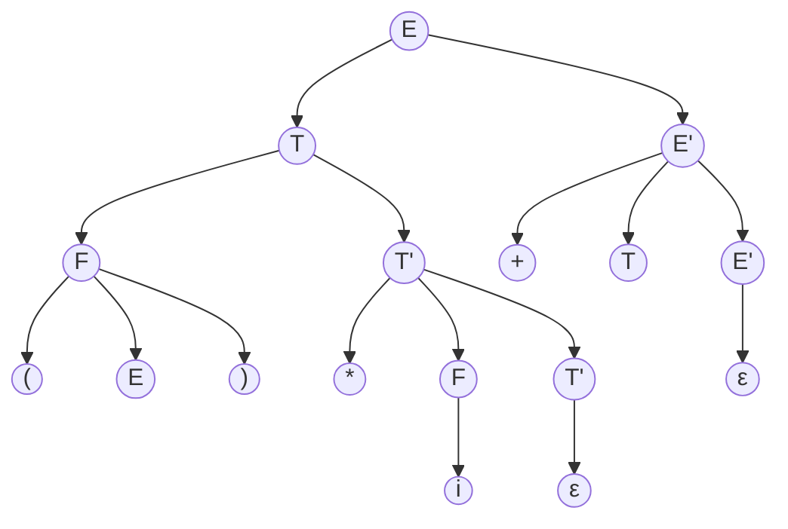

```mermaid
graph TB
0(("E"))
1(("T"))
0 --> 1
2(("E'"))
0 --> 2
3(("F"))
1 --> 3
4(("T'"))
1 --> 4
5(("("))
3 --> 5
6(("E"))
3 --> 6
7((")"))
3 --> 7
8(("*"))
4 --> 8
9(("F"))
4 --> 9
10(("T'"))
4 --> 10
11(("i"))
9 --> 11
12(("ε"))
10 --> 12
13(("+"))
2 --> 13
14(("T"))
2 --> 14
15(("E'"))
2 --> 15
16(("ε"))
15 --> 16
```
