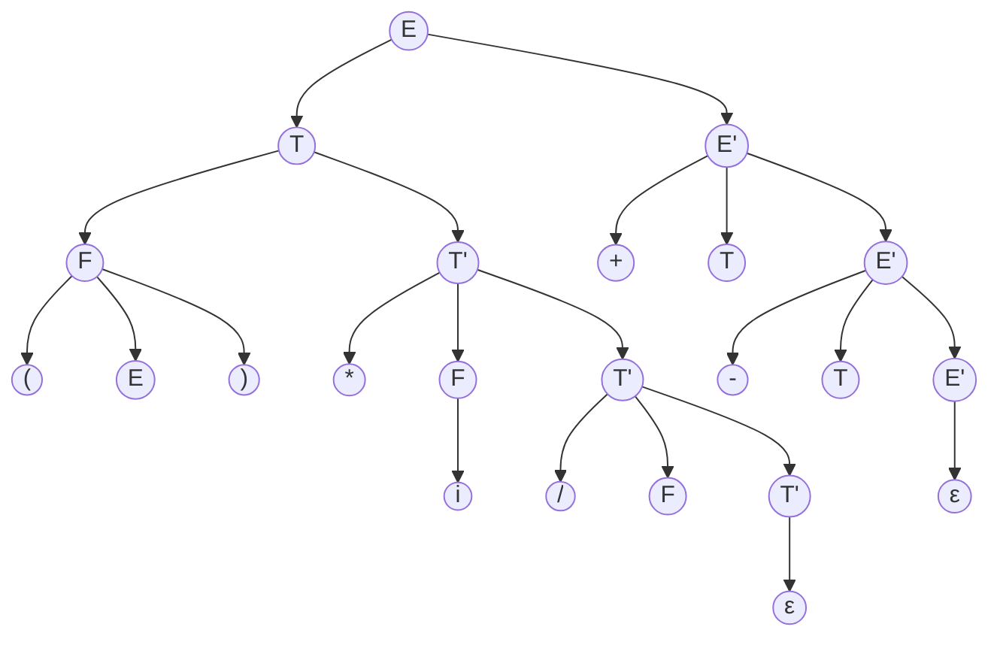

```mermaid
graph TB
17(("E"))
18(("T"))
17 --> 18
19(("E'"))
17 --> 19
20(("F"))
18 --> 20
21(("T'"))
18 --> 21
22(("("))
20 --> 22
23(("E"))
20 --> 23
24((")"))
20 --> 24
25(("*"))
21 --> 25
26(("F"))
21 --> 26
27(("T'"))
21 --> 27
28(("i"))
26 --> 28
29(("/"))
27 --> 29
30(("F"))
27 --> 30
31(("T'"))
27 --> 31
32(("ε"))
31 --> 32
33(("+"))
19 --> 33
34(("T"))
19 --> 34
35(("E'"))
19 --> 35
36(("-"))
35 --> 36
37(("T"))
35 --> 37
38(("E'"))
35 --> 38
39(("ε"))
38 --> 39
```
