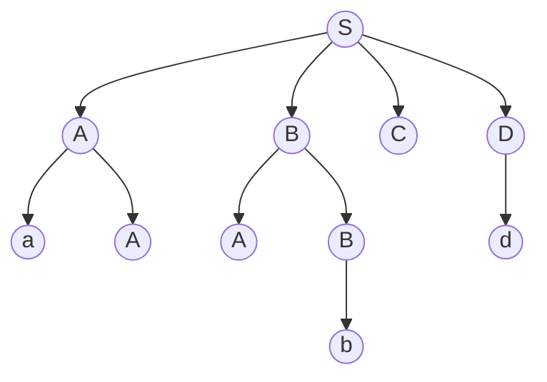

```mermaid
graph TB
0(("S"))
1(("A"))
0 --> 1
2(("B"))
0 --> 2
3(("C"))
0 --> 3
4(("D"))
0 --> 4
5(("a"))
1 --> 5
6(("A"))
1 --> 6
7(("A"))
2 --> 7
8(("B"))
2 --> 8
9(("b"))
8 --> 9
10(("d"))
4 --> 10
```
