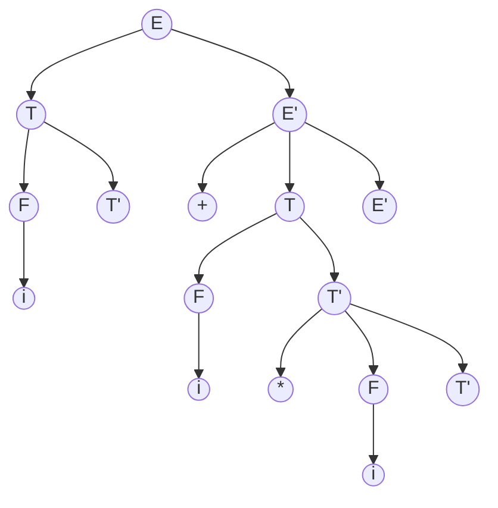

```mermaid
graph TB
1((E))
2((T))
3((F))
4(("i"))
3 --> 4
2 --> 3
5((T'))
2 --> 5
1 --> 2
6((E'))
7(("+"))
6 --> 7
8((T))
9((F))
10(("i"))
9 --> 10
8 --> 9
11((T'))
12(("*"))
11 --> 12
13((F))
14(("i"))
13 --> 14
11 --> 13
15((T'))
11 --> 15
8 --> 11
6 --> 8
16((E'))
6 --> 16
1 --> 6
```
