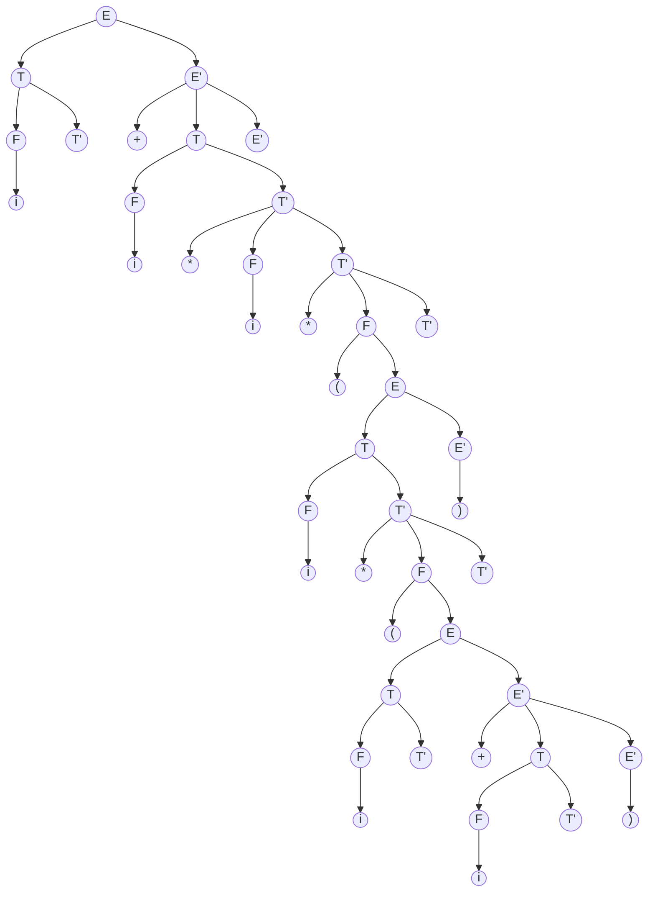

```mermaid
graph TB
1((E))
2((T))
3((F))
4(("i"))
3 --> 4
2 --> 3
5((T'))
2 --> 5
1 --> 2
6((E'))
7(("+"))
6 --> 7
8((T))
9((F))
10(("i"))
9 --> 10
8 --> 9
11((T'))
12(("*"))
11 --> 12
13((F))
14(("i"))
13 --> 14
11 --> 13
15((T'))
16(("*"))
15 --> 16
17((F))
18(("("))
17 --> 18
19((E))
20((T))
21((F))
22(("i"))
21 --> 22
20 --> 21
23((T'))
24(("*"))
23 --> 24
25((F))
26(("("))
25 --> 26
27((E))
28((T))
29((F))
30(("i"))
29 --> 30
28 --> 29
31((T'))
28 --> 31
27 --> 28
32((E'))
33(("+"))
32 --> 33
34((T))
35((F))
36(("i"))
35 --> 36
34 --> 35
37((T'))
34 --> 37
32 --> 34
38((E'))
32 --> 38
27 --> 32
25 --> 27
39((")"))
38 --> 39
23 --> 25
40((T'))
23 --> 40
20 --> 23
19 --> 20
41((E'))
19 --> 41
17 --> 19
42((")"))
41 --> 42
15 --> 17
43((T'))
15 --> 43
11 --> 15
8 --> 11
6 --> 8
44((E'))
6 --> 44
1 --> 6
```
