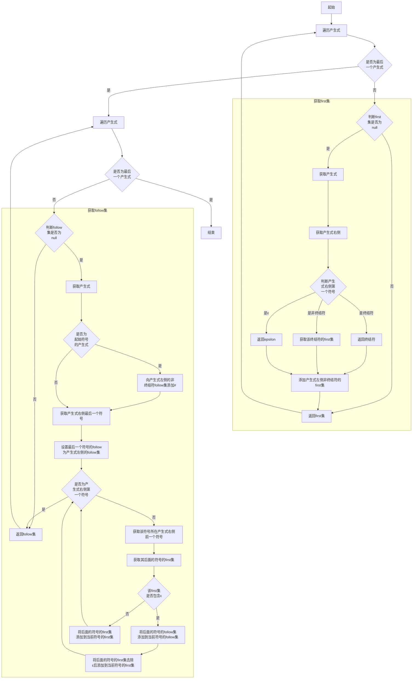

```mermaid
flowchart TB
start[起始]
traverseProductions1[遍历产生式]
theLastProduction1{是否为最后<br>一个产生式}
subgraph getFirst[获取first集]
    firstJudge{判断first<br>集是否为<br>null}
    returnFirst[返回first集]
    firstProduction[获取产生式]
    firstRight[获取产生式右侧]
    firstRightJudge{判断产生<br>式右侧第<br>一个符号}
    isVT[返回终结符]
    isVN[获取该终结符的first集]
    isEpsilon[返回epsilon]
    firstAddFirst[添加产生式左侧非终结符的first集]

    firstJudge --否--> returnFirst
    firstJudge --是--> firstProduction --> firstRight --> firstRightJudge
    firstRightJudge --是终结符--> isVT
    firstRightJudge --是非终结符--> isVN
    firstRightJudge --是ε--> isEpsilon
    isVT & isVN & isEpsilon --> firstAddFirst --> returnFirst
end
traverseProductions2[遍历产生式]
theLastProduction2{是否为最后<br>一个产生式}
subgraph getFollow[获取follow集]
    followJudge{判断follow<br>集是否为<br>null}
    returnFollow[返回follow集]
    followProduction[获取产生式]
    followRightLast[获取产生式右侧最后一个符号]
    startJudge{是否为<br>起始符号<br>的产生式}
    addHash[向产生式左侧的非<br>终结符follow集添加#]
    setLastFollow[设置最后一个符号的follow<br>为产生式左侧的follow集]
    isTheFirst{是否为产<br>生式右侧第<br>一个符号}
    getPrevious[获取该符号所在产生式右侧前一个符号]
    getNextFirst[获取其后面的符号的first集]
    containsEpsilon{该first集<br>是否包含ε}
    addNextFollow[将后面的符号的follow集<br>添加到当前符号的follow集]
    addNextFirstWithoutEpsilon[将后面的符号的first集去除<br>ε后添加到当前符号的first集<br>]
    addNextFirst[将后面的符号的first集<br>添加到当前符号的first集<br>]

    followJudge --是--> followProduction --> startJudge
    followJudge --否--> returnFollow 
    startJudge --是--> addHash --> followRightLast
    startJudge --否--> followRightLast
    followRightLast  --> setLastFollow --> isTheFirst
    isTheFirst --是--> returnFollow
    isTheFirst --否--> getPrevious
    getPrevious --> getNextFirst --> containsEpsilon
    containsEpsilon --是--> addNextFollow --> addNextFirstWithoutEpsilon
    containsEpsilon --否--> addNextFirst
    addNextFirstWithoutEpsilon & addNextFirst --> isTheFirst
end
finish[结束]

start --> traverseProductions1 --> theLastProduction1
theLastProduction1 --是--> traverseProductions2
theLastProduction1 --否--> firstJudge
returnFirst --> traverseProductions1
traverseProductions2 --> theLastProduction2
theLastProduction2 --是--> finish
theLastProduction2 --否--> followJudge
returnFollow --> traverseProductions2
```